# THEC1RCLE Payments — Architecture

> **Audience:** the THEC1RCLE dev team.
> **What this is:** how the payments system is structured and why. For *what to build in which order*, see [Implementation Task Plan](<THEC1RCLE PAYMENTS — IMPLEMENTATION TASK PLAN.md>). For requirements, see [Technical Guide](<THEC1RCLE PAYMENTS — TECHNICAL GUIDE.md>) (guide section numbers are written as plain numbers, e.g. "guide 3.1").
> **Repos:** `BE` = `thecircle_backend/C1RCLE-BACKEND`, `FE` = `thecircle_frontend/C1RCLE-FRONTEND`.
> **Status:** target design. Where today's code differs, the gap is noted and the task ID that closes it is given.

---

## 1. Goals and principles

The payments system takes money from guests for tickets (and later, subscriptions), splits it between the platform, venues, hosts and promoters, pays partners out, refunds guests, and proves at any moment that the books balance.

Ten rules shape every design choice below (guide 1):

| # | Principle | What it means in code |
|---|---|---|
| 1 | The server owns every number | Integer paise, rates in basis points (bps). The UI renders the server quote and never computes a price. |
| 2 | Moving money ≠ accounting for money | Provider adapters move money; the ledger records it. The ledger is the source of truth. |
| 3 | Everything is idempotent and resumable | Idempotency keys on every mutation; deterministic ids; work recorded as steps that can resume. |
| 4 | The webhook is the truth; the browser callback is a convenience | Both paths call the same `confirmPayment`; nothing depends on the browser coming back. |
| 5 | Providers sit behind ports | Razorpay is one adapter; a simulator implements the same ports for tests. |
| 6 | Double-entry ledger | Every posting balances; entries are immutable; corrections are reversals. |
| 7 | Explicit state machines | One `transition()` writes status; illegal transitions are rejected. |
| 8 | Outbox and inbox | A state change and its event commit together; consumers deduplicate. |
| 9 | Correlation id end to end | One id traces a payment through logs, events, journal and audit. |
| 10 | Nothing fails silently | Retry → dead-letter queue → a human. |

---

## 2. System context

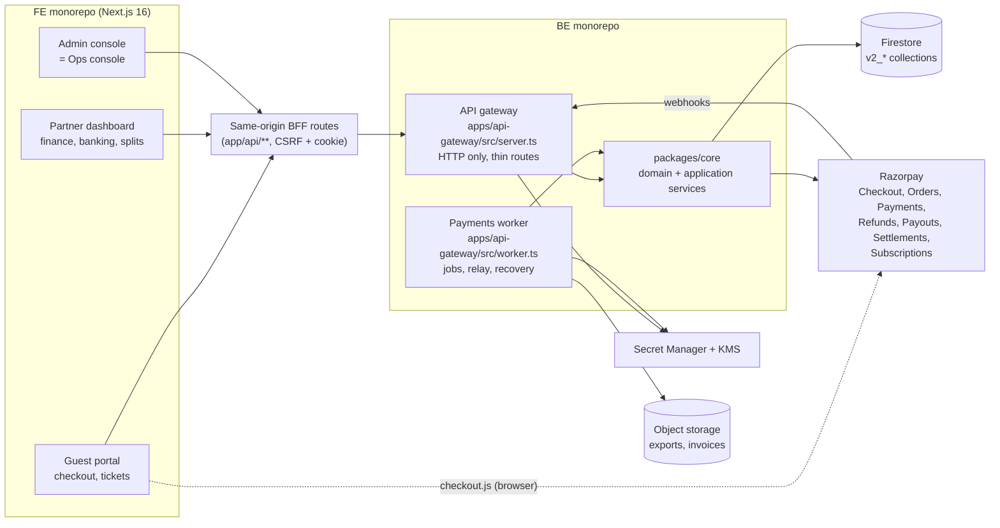

**Two processes, one codebase.** The gateway and the worker are built from the same package (`apps/api-gateway`) and run as two Render services:

- **Gateway** serves HTTP: quotes, holds, attempts, verification, webhooks, dashboards, admin APIs. It never runs long jobs.
- **Worker** runs everything scheduled or asynchronous: the outbox relay, the recovery engine, the release job, reconciliation, invariant checks, provider probes.

Why one package and not `apps/payments-worker`: both need the same config loader (the only place `process.env` may be read), the same composition root (`lib/v2-services.ts`) and the same Razorpay adapters (`lib/payments/*`). The architecture law "nothing depends on an app" would otherwise force those into a new shared package first. Isolation comes from separate processes, a separate entrypoint, and a boundary rule that `routes/**` and `worker/**` never import each other.

**The browser talks to Razorpay only for the Checkout widget.** It receives a provider order id from our server, opens `checkout.js`, and hands the result back to us. Card, UPI and bank details never touch our servers.

---

## 3. Layering inside the backend

The payments design follows the existing BE architecture (`BE/docs/architecture/README.md`). Nothing here is new to the codebase; it is the same hexagonal layering applied to more domains.

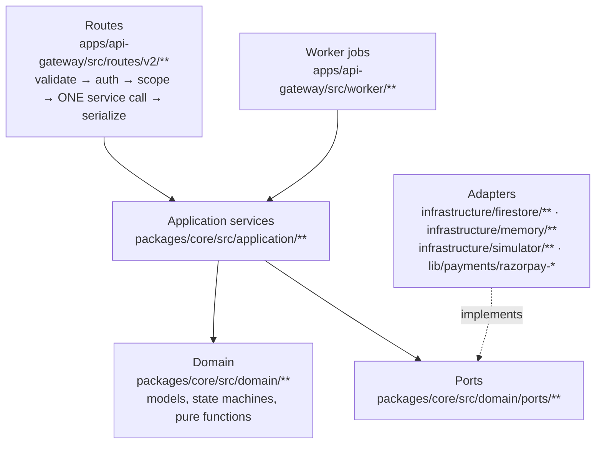

| Layer | May import | Must not |
|---|---|---|
| Routes | Contracts, one application service, plugins | Repositories, Firestore, provider adapters, `process.env` |
| Worker jobs | Application services, scheduler, lease | Routes |
| Application services | Domain, ports, other services' interfaces | Fastify, Firestore, `fetch`, `process.env` |
| Domain | Nothing outside domain | I/O of any kind, clocks, randomness (injected instead) |
| Adapters | Ports, `firebase-admin` (Firestore adapters only), `fetch` (provider adapters only) | Application services |

Enforced by ESLint, `scripts/check-boundaries.mjs`, and the new payment-specific rules in section 2.3 of the task plan.

---

## 4. Services

Each service owns one responsibility and, where it writes data, owns its collections. Other services read those collections only through the owning service or its repository port's read methods.

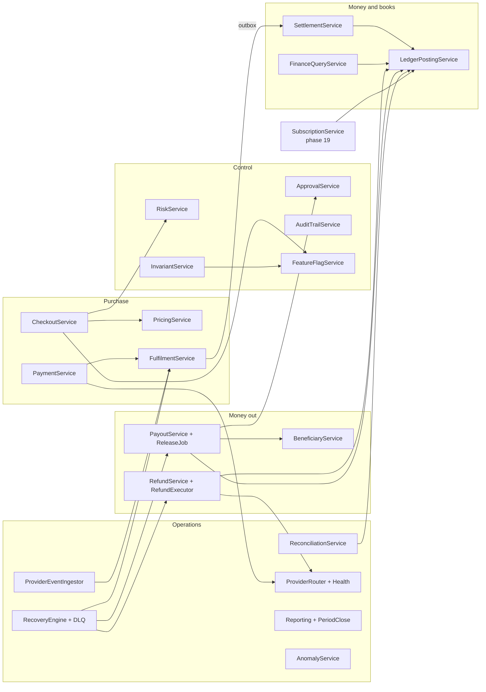

| # | Service | Module (`packages/core/src/application/`) | Responsibility | Owns |
|---|---|---|---|---|
| S1 | PricingService | `pricing/` (exists) | Server quote, fee and GST maths from config bps | — |
| S2 | CheckoutService | `checkout/` (exists, slimmed) | Quote, hold, pre-checkout validation, attendee capture, snapshots | `v2_cart_reservations` |
| S3 | PaymentService | `payments/` | Payment attempts, binding provider order to hold, callback verification, payment state | `v2_payments`, `v2_payment_attempts` |
| S4 | FulfilmentService | `fulfilment/` | `confirmPayment`: order, hold conversion, promo, tickets in one transaction; resume; late capture | `v2_orders`, `v2_entitlements`, `v2_promo_redemptions` |
| S5 | SettlementService | `settlement/` | Runs `computeSettlementLegs()` once per order; event split config | `v2_event_splits` |
| S6 | LedgerPostingService | `ledger/` | **The only writer** of journal entries, lines and ledger legs | `v2_journal_*`, `v2_ledger_legs`, `v2_account_balances` |
| S7 | FinanceQueryService | `finance/` (exists, read-only now) | Balances and dashboard stats derived from the ledger | — |
| S8 | RefundService + RefundExecutor | `finance/refund-service.ts` (exists) + `refunds/` | Approval workflow (exists) → provider refund → reversals | `v2_refund_requests` |
| S9 | BeneficiaryService | `beneficiaries/` (evolves `bank-account-service`) | KYC status, bank details, provider beneficiary, publish gate | `v2_beneficiaries` |
| S10 | PayoutService + ReleaseJob | `payouts/` | Release eligibility, grouping, payout state, provider payout | `v2_payouts`, `v2_payout_settings` |
| S11 | ProviderEventIngestor | `webhooks/` | Verify, store, dedupe and translate provider webhooks | `v2_provider_events` |
| S12 | ReconciliationService | `reconciliation/` | Provider vs bank vs ledger matching, exceptions | `v2_settlement_records`, `v2_recon_*` |
| S13 | ApprovalService | `approvals/` (generalises admin-authority) | Maker-checker | `v2_approval_requests` |
| S14 | AuditTrailService | `audit/` | Hash-chained, append-only audit log | `v2_audit_log` |
| S15 | RiskService, PromoterFraudService | `risk/` | Scoring, decisions, holds | `v2_risk_*`, `v2_identity_links` |
| S16 | FeatureFlagService | `platform/` | Kill switches, automatic trip | `v2_platform_settings` (flags) |
| S17 | ProviderRouter, Health, CircuitBreaker | `providers/` | Choose provider, track health, break circuits | `v2_provider_health_events` |
| S18 | RecoveryEngine, DeadLetterService | `recovery/` | Retry policy, stuck-work repair, DLQ | `v2_recovery_tasks`, `v2_dead_letters` |
| S19 | InvariantService | `invariants/` | Checks I1–I12, breach response | `v2_invariant_runs` |
| S20 | ReportingService, PeriodCloseService | `reporting/` | Reports, exports, month close | `v2_report_runs`, `v2_periods` |
| S21 | AnomalyService | `anomaly/` | Baselines, alerts, reversible protective actions | `v2_anomaly_alerts` |
| S22 | NotificationService | `notifications/` (exists) | Payment notifications from events | `v2_notifications` |
| S23 | SubscriptionService, InvoiceService | `subscriptions/`, `invoicing/` | Plans, subscriptions, invoices (final phase) | `v2_plans`, `v2_subscriptions`, `v2_invoices` |

**Rule of thumb for a new feature:** find the service whose responsibility it falls under. If two services seem to own it, the feature is probably two steps connected by an event.

---

## 5. Ports and adapters

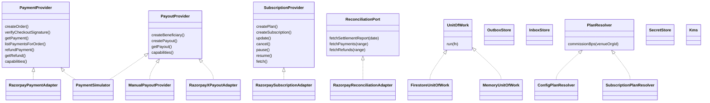

| Port | Production adapter | Test adapter | Notes |
|---|---|---|---|
| `PaymentProvider` | `lib/payments/razorpay-payment-adapter.ts` | `infrastructure/simulator/` | Timeouts, bounded retries, transient vs permanent errors, circuit breaker around every call |
| `PayoutProvider` | `ManualPayoutProvider` first, then RazorpayX (`PAYOUT_RAIL`) | Simulator | Route can replace it if the regulatory decision (DP-08) requires |
| `SubscriptionProvider` | Razorpay Subscriptions | Simulator | Phase 19 |
| `ReconciliationPort` | Razorpay Settlements API | Simulator (generates files with injected mismatches) | |
| `UnitOfWork` | Firestore `runTransaction` | Memory mutex with rollback | See section 8 |
| `PlanResolver` | Config table (`PLAN_COMMISSION_BPS`, all 0 today) | Same | Swapped for the subscription-backed resolver in phase 19, no other change |
| `SecretStore`, `Kms` | GCP Secret Manager, Cloud KMS | Env / in-memory | Phase 15 |

**Capabilities, not assumptions.** Each adapter declares `capabilities()` (methods, partial refunds, payouts, route, currencies, minimum amount, settlement cycle). Features check capabilities, so adding a second provider means writing an adapter, not changing services.

**Canonical events.** Each adapter translates its own webhooks into a `ProviderEvent` (`provider, type, providerEventId, objectIds, amount, currency`) with canonical types such as `payment.captured` or `refund.processed`. Handlers never see a Razorpay payload shape.

**Simulator.** One I/O-free driver implements every port plus a webhook emitter, driven by seeded scenarios (timeout after capture, duplicate or out-of-order webhooks, short settlement, payout returned, outage…). It is the memory-driver default, the contract-test reference, and the engine for chaos tests.

### 5.1 Why we have a simulator

The simulator is a **fake Razorpay inside our own code**. It has the same functions as the real adapter (create order, get payment, refund, payout, emit webhooks, settlement reports) but makes no network calls and moves no money. Services can't tell the difference because both sit behind the same ports. Today's `MemoryPaymentProvider` is a basic version of it; phase 3 of the task plan expands it.

1. **Tests run without Razorpay.** CI has no Razorpay account, keys or internet. Without a fake, no checkout, refund or payout test could run.
2. **It produces the failures that lose money, on demand.** Real Razorpay can't be made to fail in specific ways when you want it to. The simulator can, one line per test:
   - payment succeeds but our server never gets the response (timeout after capture);
   - the same webhook arrives twice, late, out of order, or never;
   - wrong amount or order id, or a forged signature;
   - refund fails, or a payout bounces back from the bank;
   - settlement report short or missing;
   - Razorpay down, or returning rate-limit errors.

   Each scenario ends by checking that the books still balance (invariants I1–I12).
3. **Results are repeatable.** The same scenario gives the same result every time, so a failing test means a real bug, not a network hiccup.
4. **It's fast.** Thousands of payment scenarios run in seconds, with no real checkout and no waiting for webhooks.
5. **It keeps the real adapter honest.** One contract-test suite runs against both the simulator and the Razorpay adapter, so the two must behave the same way.

---

## 6. Data model

### 6.1 Core entities

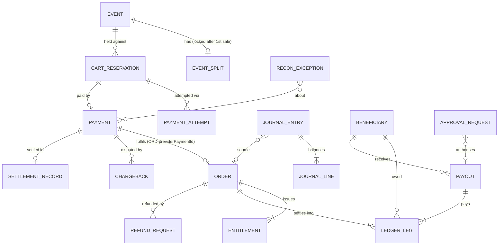

| Entity | Collection | Key fields | Identity / uniqueness |
|---|---|---|---|
| Hold (`CartReservation`) | `v2_cart_reservations` | lines, frozen pricing, `feeRatesSnapshot`, `commissionBpsSnapshot`, `splitSnapshot`, attribution, attendee, `providerOrderId`, status | `HOLD-{idempotencyKey}` |
| Payment | `v2_payments` | provider, `providerOrderId`, `providerPaymentId`, amount, currency, method, status, `refundedPaise` | Unique `provider + providerPaymentId` (I7) |
| Order | `v2_orders` | frozen lines and fees, contact, `fulfilmentSteps`, `settlement` (legs, written once), `refundedPaise`, `refundLock`, `disputed` | `ORD-{providerPaymentId}` |
| Event split | `v2_event_splits` | model (venue-owned / host-owned), `venueBps`, hosts `[{beneficiaryId, shareBps}]`, `lockedAt` | One per event |
| Ledger leg | `v2_ledger_legs` | leg type, beneficiary, amount, state, `releaseAfter`, `payoutId`, holds, `reversalOf` | `orderId + leg + beneficiary` |
| Journal entry / line | `v2_journal_entries`, `v2_journal_lines` | `postingKey`, event type, source, period; lines: account, direction, amount | Unique `postingKey` |
| Beneficiary | `v2_beneficiaries` | owner, KYC status, `bankLast4`, encrypted account number, blind index, provider refs, cooling period | One per owner (default) |
| Payout | `v2_payouts` | beneficiary, event, legs, amount, status, provider payout id, UTR | `payout:{eventId}:{beneficiaryId}` |
| Refund request | `v2_refund_requests` | amount, approvals, status, `providerRefundId`, kind, evidence | `refund:{id}` as provider key |
| Chargeback | `v2_chargebacks` | payment, amount, status, evidence | Provider dispute id |

All money fields are integer paise. All entities are versioned (`version`, compare-and-set on write) and carry `stateHistory` where they have a state machine.

**Not to be confused:** the existing `Dispute` (`v2_disputes`) is a partner challenging a ledger entry or payout amount. A provider chargeback is a different thing and gets its own `Chargeback` entity.

### 6.2 Snapshots: why old orders never change

Everything that affects how an order's money is split is **copied onto the hold at purchase time** and then onto the order:

- fee rates (`CUSTOMER_FEE_PLATFORM_BPS`, `CUSTOMER_FEE_PAYMENT_BPS`, `GST_BPS`)
- `commissionBps` from the venue's plan (via `PlanResolver`)
- the event split
- promoter attribution and commission amount

Settlement reads only the snapshot. Changing a plan, a fee rate or a split affects new purchases only. The split itself is **locked after the first paid order**; changing it afterwards needs a maker-checker override and still only affects future orders.

### 6.3 Collection rules

- All payment collections are **service-account only** in `firestore.rules`: clients can neither read nor write them.
- Journal entries, journal lines and audit records have **no update or delete path** in their repositories.
- Every collection has a memory adapter and a Firestore adapter that pass the same contract-test suite.

---

## 7. Key flows

### 7.1 Paid ticket checkout

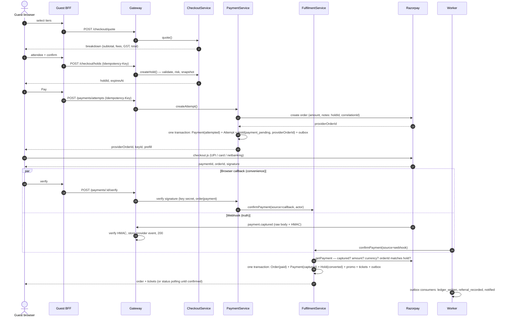

Design points:

- **Both confirmation paths converge** on the provider payment id. Whichever loses the race finds the existing order and **resumes** its first incomplete step rather than returning early.
- **The provider order id is bound to the hold** at attempt time and checked at confirmation. A captured payment for some other order can never fulfil this hold.
- **Ownership** is checked in the service (`actor.userId === hold.userId`), not only in the route.
- **Captured after the hold expired:** if inventory remains, the order is built from the frozen hold; otherwise the payment is auto-refunded and an exception is opened. Captured money always ends in an order or a recorded refund.
- **If the webhook never arrives**, the worker polls Razorpay for holds stuck in `payment_pending` every 5 minutes.

### 7.2 Fulfilment steps

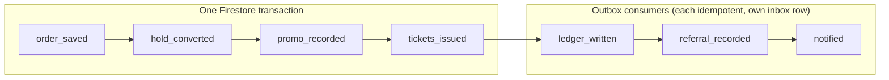

Each step's completion is stored on the order. The recovery engine finds orders with an incomplete step past a threshold and runs that step. A crash at any point therefore delays fulfilment but never loses it.

### 7.3 Refund

```mermaid
sequenceDiagram
  autonumber
  actor A as Admin(s)
  participant RS as RefundService
  participant RE as RefundExecutor
  participant RZ as Razorpay
  participant L as LedgerPostingService

  A->>RS: request refund (amount, reason)
  RS->>RS: lock order, compute approvers needed (0/1/2)
  A->>RS: approve (different admin)
  RS-->>RE: RefundApproved (outbox)
  RE->>RE: check refunds ≤ captured (I5), approved → processing
  RE->>RZ: refund (idempotency key refund:{id})
  RZ-->>RE: refund.processed (webhook)
  RE->>L: post reversal (before payout: cancel held legs; after payout: 1300 recoverable)
  RE->>RE: settle refund, void tickets, update payment/order, release lock, notify guest
```

If `REFUND_EXECUTOR_ENABLED` is off, approved refunds stay `approved` and appear in a "refund manually" list. An operator who refunds in the Razorpay dashboard records the refund id with evidence (`manual` state), and the same ledger effects are posted.

### 7.4 Payout release

```mermaid
sequenceDiagram
  autonumber
  participant E as Event close-out / auto-complete
  participant RJ as ReleaseJob (worker)
  participant L as LedgerPostingService
  participant AP as ApprovalService
  participant PE as PayoutExecutor
  participant PP as PayoutProvider

  E->>RJ: EventCompleted
  RJ->>RJ: wait releaseAfter; select held legs (not refunded, disputed, frozen, risk-held; beneficiary verified)
  RJ->>L: legs → releasable
  RJ->>RJ: group by beneficiary + event; skip below threshold
  RJ->>L: post payoutRequested; legs → payout_requested (I6 checked)
  alt amount above policy threshold
    RJ->>AP: request approval (maker-checker)
    AP-->>PE: PayoutApproved
  else
    RJ-->>PE: PayoutApproved
  end
  PE->>PP: createPayout (key payout:{eventId}:{beneficiaryId})
  PP-->>PE: paid (webhook or operator + UTR)
  PE->>L: post payoutPaid; legs → paid
```

A payout is never marked `paid` without provider confirmation or an operator action with evidence (UTR). A failed payout reverses the request, puts legs back to `releasable`, and retries with backoff before going to the DLQ.

### 7.5 Webhook ingestion

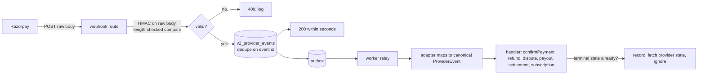

The route does no business work. It verifies, stores, acknowledges. Out-of-order or late events are tolerated because handlers re-fetch the current provider state rather than trusting event order.

---

## 8. Reliability design

### 8.1 Transactions (unit of work)

Firestore transactions require all reads before writes and touch at most 500 documents. Services express a unit of work through a port:

```ts
await uow.run(async (tx) => {
  const hold = await holds.getById(holdId, tx);       // reads first
  // ... domain decisions ...
  await orders.save(order, tx);                       // then writes
  await holds.save(converted, tx);
  await outbox.append(orderPaidEvent, tx);
});
```

`TxContext` already exists on repository ports but today's Firestore adapters ignore it (task 2.4 fixes this for the money-path repositories). Compare-and-set on `version` runs inside the same transaction, so a lost update is impossible.

### 8.2 Outbox and inbox

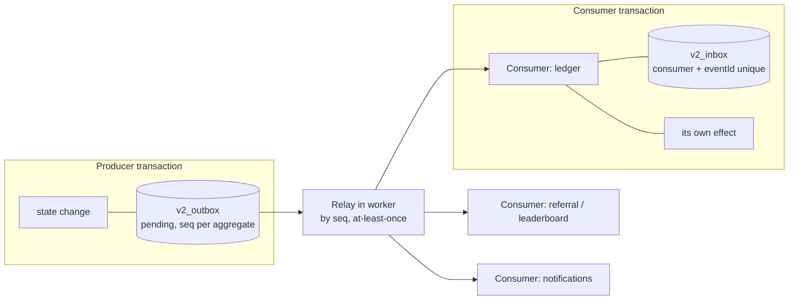

- **Outbox:** the event is written in the same transaction as the state change. A crash after commit cannot lose the event.
- **Relay:** publishes pending events in per-aggregate `seq` order and marks them published. Delivery is at-least-once.
- **Inbox:** each consumer claims `(consumer, eventId)` in the same transaction as its effect. A duplicate delivery changes nothing, which gives an exactly-once *effect*.
- **Events are past-tense facts**, versioned (`PaymentCaptured`, `OrderPaid`, `LegsReleasable`, `PayoutPaid`…). Payloads carry ids and amounts, never bank numbers or personal data.

Today's outbox and inbox are in-memory only (`MemoryOutboxStore`, dedupe sets in `InProcessEventBus`). Task 2.9–2.14 makes them durable.

### 8.3 Idempotency

| Layer | Mechanism |
|---|---|
| HTTP | `Idempotency-Key` header, existing `IdempotencyService` (24 h, request-hash checked) |
| Domain ids | Deterministic: `HOLD-{key}`, `ORD-{providerPaymentId}`, entitlement ids per order/tier/unit |
| Provider calls | Our key passed to the provider where supported (payouts, refunds); attempt reuse on retry |
| Ledger | Unique `postingKey` (`orderId+eventType`, `refundId+leg`, `payoutId+stage`); legs keyed `orderId+leg+beneficiary` |
| Consumers | Inbox `(consumer, eventId)` |
| Recovery | Every retry reuses the original idempotency key |

### 8.4 Recovery engine and DLQ

One engine runs all repair work with one retry policy:

| Task | Trigger | Action |
|---|---|---|
| Stalled fulfilment | Step incomplete past threshold | Run the next step |
| Captured without order | Provider shows captured, no order | `confirmPayment`, else auto-refund |
| Payment / refund / payout stuck | In-flight state past threshold | Fetch provider state, transition |
| Missing webhook | Expected event not seen | Poll provider, replay from event log |
| Outbox stuck | Pending past threshold | Re-publish |
| Journal imbalance / custody breach | Invariant failure | **No auto-fix**, critical DLQ item |

Backoff 1 m, 5 m, 15 m, 1 h, 6 h with jitter and a per-type maximum. Permanent errors (validation, closed account, KYC failure) skip retries. Dead letters are never auto-discarded; any item touching money is P1; replays go through the normal handler so the inbox prevents double effects; bulk replay and discard need a checker.

### 8.5 Worker jobs

| Job | Interval | Phase |
|---|---|---|
| Outbox relay | continuous / seconds | 2 |
| Hold sweep (moved out of `app.ts`) | 5 min | 2 |
| Payments poller / fulfilment repair → Recovery engine | 1–5 min | 4 → 10 |
| Event auto-complete | 15 min | 9 |
| Release job | hourly | 9 |
| Invariants | hourly sample, daily full | 6 |
| Reconciliation | hourly light, daily full by 09:00 IST | 11 |
| Provider probe / canary | 1 min / daily (test account) | 13 |
| Anomaly, SLO windows, report exports | 5–15 min | 14 |

Only one worker instance runs a given job at a time, enforced by a lease document per job (`v2_job_leases`) with an expiry.

---

## 9. State machines

One function, `transition(entity, event, actor)`, is the only writer of `status`. It checks the table, appends to `stateHistory` (`from, to, at, causeEventId, actor, correlationId`) and emits an outbox event, all in the caller's transaction. Tables live in `packages/core/src/domain/state-machines/` as data and a test walks every allowed and disallowed pair.

### Hold

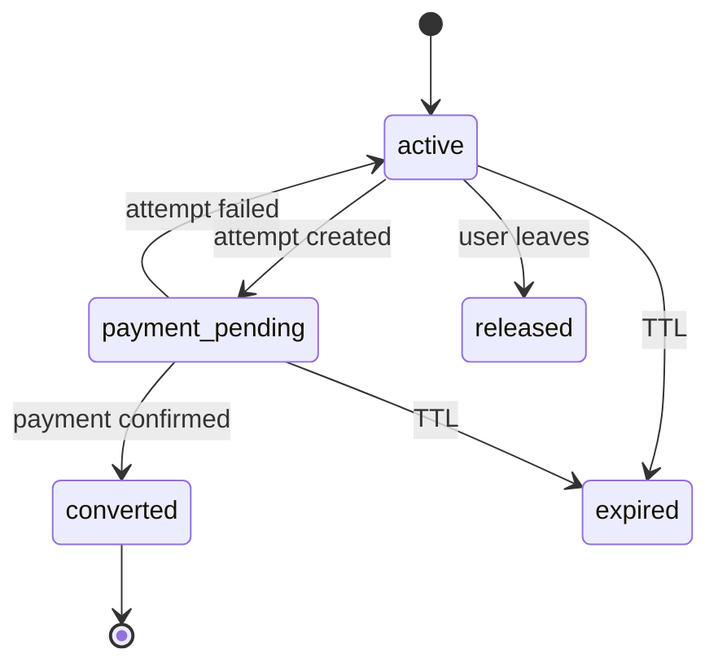

### Payment

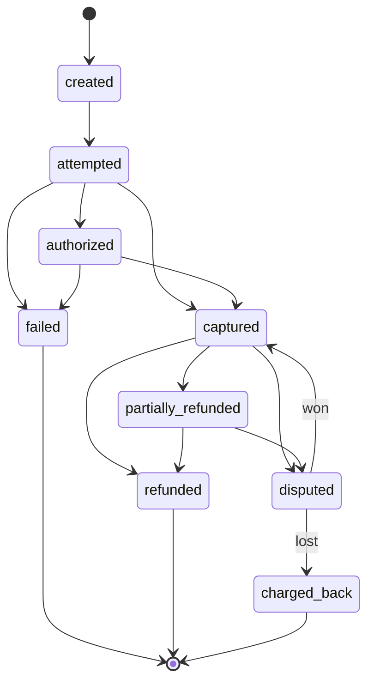

### Order

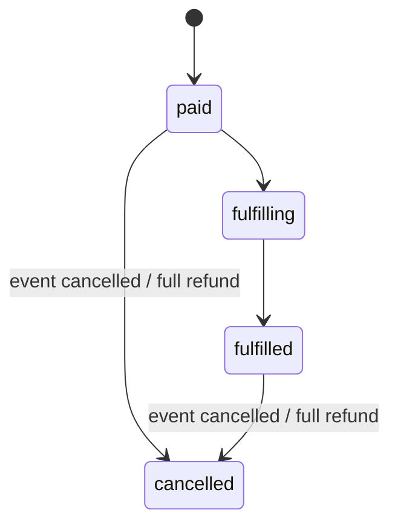

A partial refund keeps the order `paid`/`fulfilled` with `refundedPaise`; the existing refund lock becomes a `refundLock` flag rather than a status so it composes with `fulfilled`.

### Refund

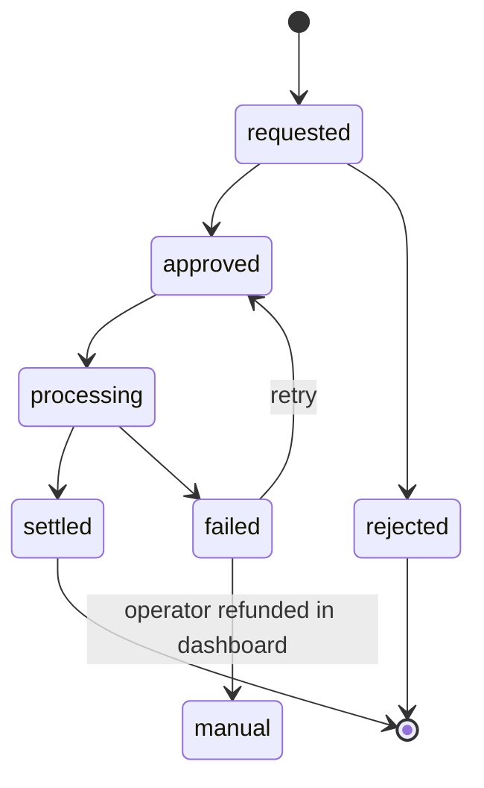

### Payout

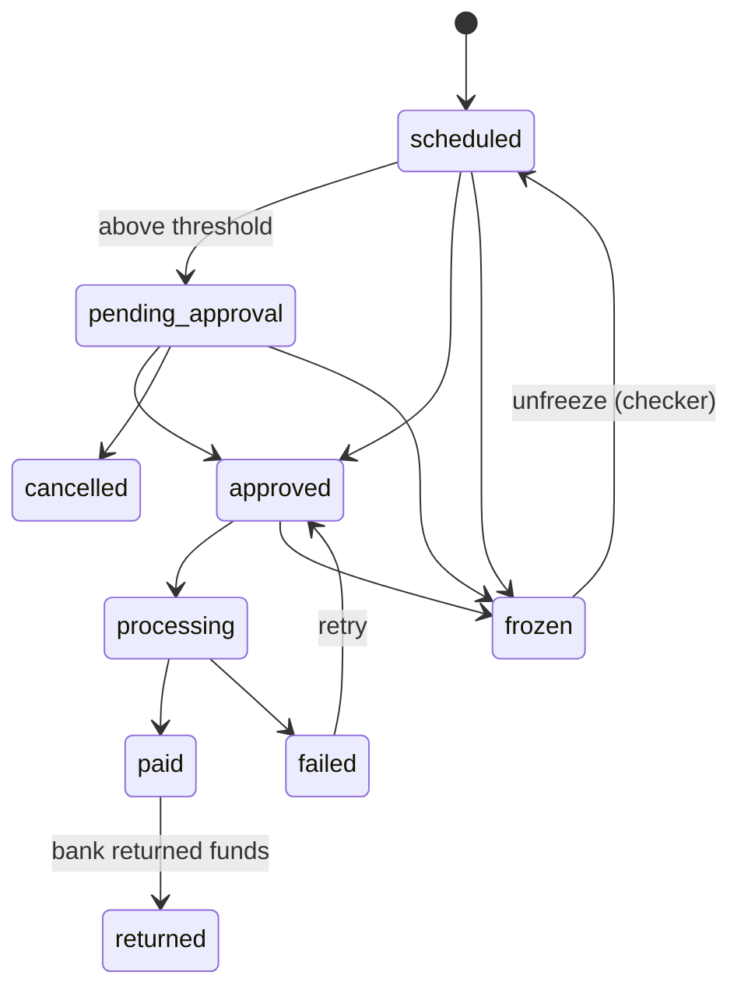

Unfreeze always restores the recorded previous state (existing behaviour of `releasePayout`), never a caller-supplied one.

### Ledger leg

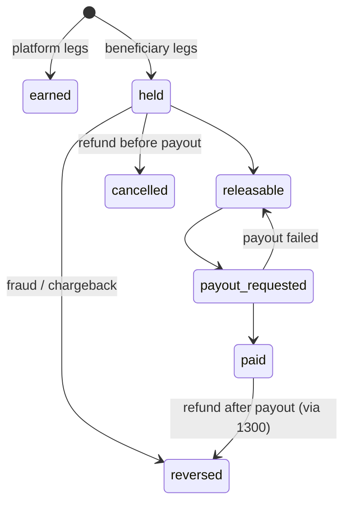

### Subscription (phase 19)

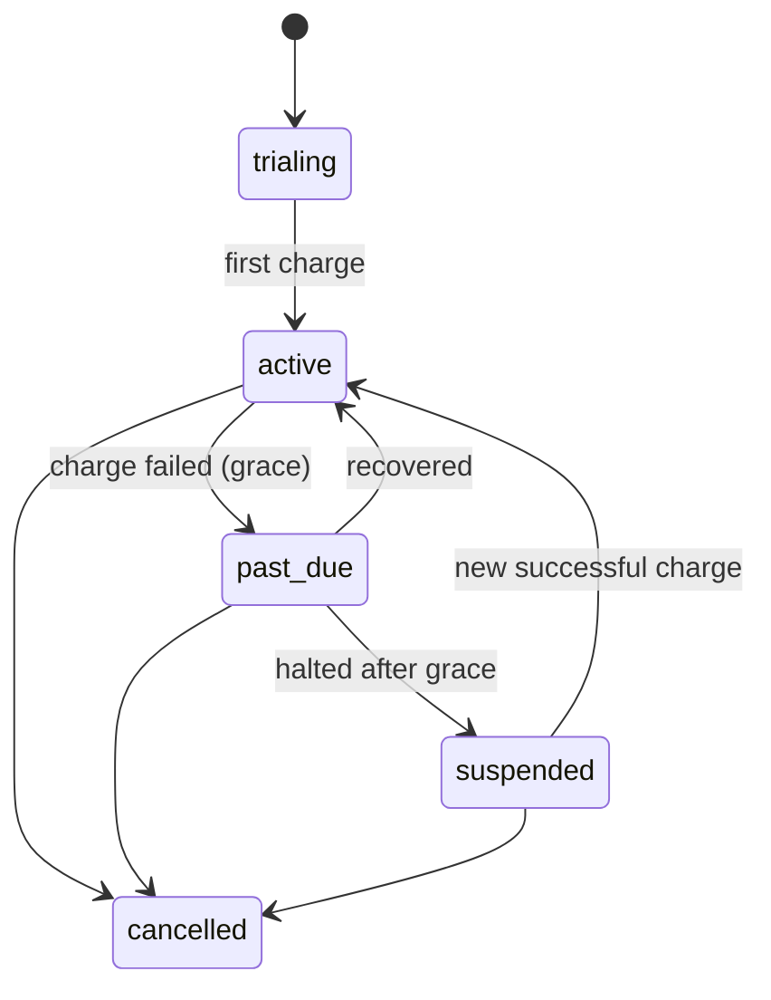

---

## 10. Money design

### 10.1 Pricing (what the guest pays)

```text
subtotal          = Σ unit price × qty
discount          = promo or referral discount (reduces subtotal before fees)
platformFee       = round(discountedSubtotal × CUSTOMER_FEE_PLATFORM_BPS / 10000)   # 500
paymentFee        = round(discountedSubtotal × CUSTOMER_FEE_PAYMENT_BPS / 10000)    # 250
gst               = round((platformFee + paymentFee) × GST_BPS / 10000)            # 1800, fees only
grandTotal        = discountedSubtotal + platformFee + paymentFee + gst
```

₹1,000 of tickets → ₹50 + ₹25 + ₹13.50 → **₹1,088.50**. This is the existing formula in `domain/models/pricing.ts`; the change is that rates come from config bps and are snapshotted on the hold.

### 10.2 Settlement (who gets what)

`computeSettlementLegs()` in `domain/models/settlement.ts` is a pure function, run once per order:

```text
commission    = round(subtotal × commissionBps / 10000)        # plan rate, 0 for now
promoter      = min(promoterAmount, subtotal − commission)       # paid first
distributable = subtotal − commission − promoter
venue         = round(distributable × venueBps / 10000)
hostTotal     = distributable − venue                             # absorbs rounding
hosts         = hostTotal split by shareBps (remainder paisa → first host)
platform fee  = customer fees + GST
```

Worked example (host-owned 80/20, 10% promoter, 0 commission): promoter 100, venue 180, host 720, platform 88.50 → sums to 1,088.50.

> **Changes from today's code.** Today `computeSettlementSplit` takes a plan rate of 15/12/10% on the *grand total including fees*, and the venue share comes straight from the partnership. The new engine charges `commissionBps` (default 0) on the *subtotal*, pays the promoter first, and splits the rest using a per-event split config seeded from the partnership's negotiated rate. See decision DP-01 in the task plan.

### 10.3 Two ledgers, one truth

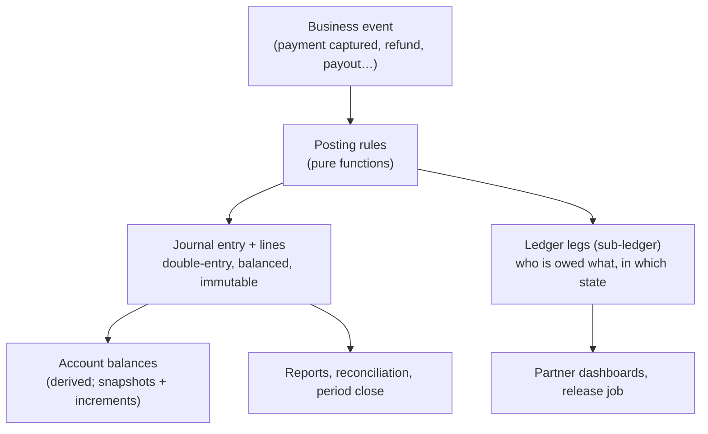

- The **journal** is the book of record: every event posts one balanced entry (debits = credits).
- The **legs** are the beneficiary sub-ledger: what each venue, host and promoter is owed and whether it is held, releasable, requested or paid.
- `LedgerPostingService` writes both in one transaction, so they cannot drift. Invariant I4 checks it anyway.

**Chart of accounts (starter):**

| Code | Account | Type |
|---|---|---|
| 1100 | Gateway receivable (per provider) | Asset |
| 1110 | Bank: collection account | Asset |
| 1120 | Payouts in transit | Asset |
| 1300 | Recoverable from beneficiaries | Asset |
| 1400 | GST input credit | Asset |
| 1500 | Disputed amounts receivable | Asset |
| 2100 / 2110 / 2120 | Venue / Host / Promoter payable | Liability |
| 2200 | GST payable | Liability |
| 4100 / 4110 / 4200 | Commission / Convenience fee / Subscription revenue | Revenue |
| 5100 / 5200 / 5300 | Gateway fees / Chargeback & refund losses / Write-offs | Expense |

**Example posting, payment captured (₹1,088.50):**

| Debit | Credit |
|---|---|
| 1100 Gateway receivable 1,088.50 | 2110 Host 720.00 · 2100 Venue 180.00 · 2120 Promoter 100.00 · 4110 Convenience fee 75.00 · 2200 GST 13.50 |

The full posting table is in guide 3.1 and is implemented as `domain/models/posting-rules.ts`.

### 10.4 Invariants

| ID | Invariant | Enforced | Checked |
|---|---|---|---|
| I1 | Every journal entry balances | Posting service, in transaction | Hourly sample, daily full |
| I2 | Trial balance is zero | — | Daily, period close |
| I3 | Order legs sum to grand total, none negative | Settlement function | On write |
| I4 | Payable balance = sum of unreleased legs | Posting service | Hourly |
| I5 | Refunds ≤ captured | Refund executor, in transaction | On write, daily |
| I6 | Payout ≤ releasable; one payout per key | Release job | On write |
| I7 | One provider payment → at most one order | Unique id | On write |
| I8 | Negative balance only via recorded 1300 | Posting service | Hourly |
| I9 | Bank + gateway receivable ≥ all payables | — | Hourly |
| I10 | Entries, audit, settled payments never modified | Rules + no update path | Daily hash check |
| I11 | Captured order has its entry; refunded order has its reversal | — | Hourly |
| I12 | Closed period receives no entries | Posting service | On write |

**On a breach:** critical alert, automatic trip of `AUTO_PAYOUTS_ENABLED` and `REFUND_EXECUTOR_ENABLED`, a reconciliation exception, and period close blocked. The invariant checker is also the test oracle: every simulator and chaos scenario must end with all invariants passing.

---

## 11. Security design

| Concern | Design |
|---|---|
| Checkout callback | HMAC-SHA256 of `orderId\|paymentId` with the **API key secret**; equal-length check then constant-time compare. (Today's code uses the wrong message and the webhook secret — task 1.1.) |
| Webhooks | HMAC over the exact raw body with the webhook secret; length-checked compare; current and previous secret accepted during rotation |
| Confirmation | Never trust the caller: re-fetch the payment, check captured, amount, currency, provider order id = hold's, and caller = hold owner |
| Secrets | Secret Manager, versioned, per-service identity; nothing in repo, CI logs or client code; startup fails without Razorpay keys outside memory mode |
| Bank data | Envelope encryption (per-record data key wrapped by KMS); only the payout service can unwrap; blind index for duplicate detection; only `bankLast4` leaves the backend |
| Card data | Never stored; only provider-returned attributes (method, network, last 4) |
| Authorisation | RBAC per route; admin roles `support, ops, finance, risk, admin, auditor`; masked data by default, audited reveal with reason |
| Money-out control | Maker-checker: checker ≠ maker, approval bound to `payloadHash`, expiry, executed exactly once. Safety actions (freeze, pause, trip) are single-actor; risk-increasing actions (release, unfreeze, enable payouts) are dual. |
| Audit | Append-only, hash-chained (`hash = sha256(record + prevHash)`), daily root hash exported to a separate project |
| Logs | Structured JSON; signatures, secrets, account numbers redacted; email/phone masked |
| Kill switches | `PAID_CHECKOUT_ENABLED`, `AUTO_PAYOUTS_ENABLED`, `REFUND_EXECUTOR_ENABLED`, `SUBSCRIPTIONS_ENABLED` in `PlatformSettings.featureFlags`; disabling is instant and single-actor, enabling money-out needs a checker |

---

## 12. Observability

**Correlation.** The gateway accepts a valid client `X-Correlation-Id` (UUID) or creates one. It travels through `ActorContext`, logs, outbox envelopes (`correlationId`, `causationId`), provider order `notes` (so webhooks bring it back), journal entries, audit records, risk decisions and exceptions. The Ops console's Payment 360 view rebuilds a payment's whole story from that one id.

**Metrics and alerts.** Payment funnel (quote → hold → attempt → captured), success by method and provider, webhook lag, outbox lag, DLQ depth, refund and payout latency, reconciliation exceptions. SLOs from guide 24 (for example: captured payment to confirmed order p95 under 10 s; 99.99% of captured payments have an order within 15 min). Burn-rate alerts page on-call for money-at-risk; every alert links a runbook.

**Provider health.** Per provider and method: healthy, degraded, unavailable, recovering. A circuit breaker wraps every provider call; when it opens, the affected method is hidden at checkout, payouts pause instead of failing, and the recovery engine keeps polling so captured payments are still confirmed.

---

## 13. Deployment

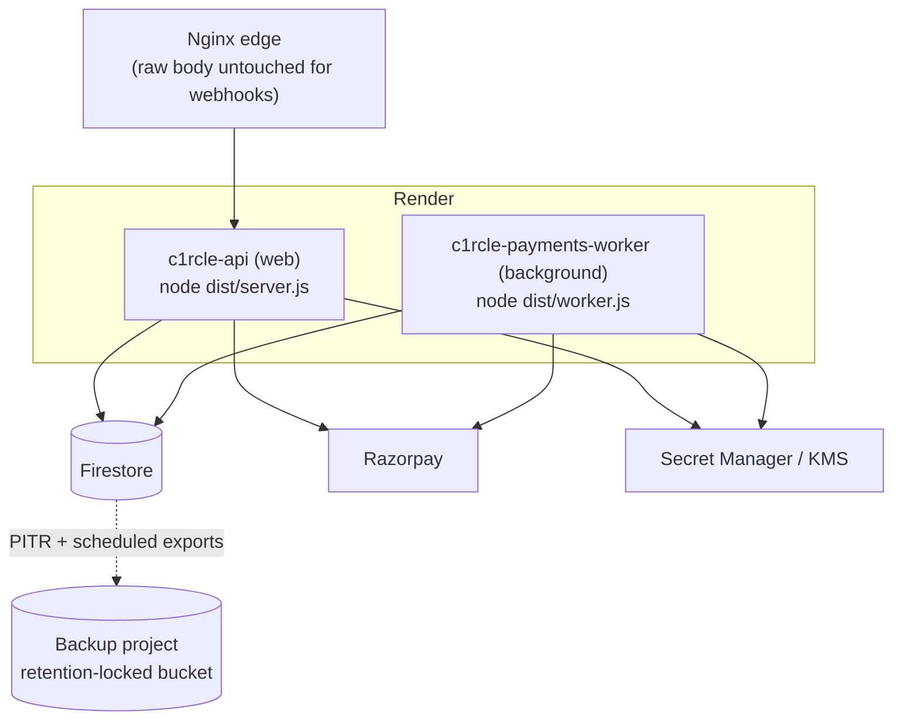

| Environment | Storage | Provider | Notes |
|---|---|---|---|
| Local / CI | `STORAGE_DRIVER=memory` | Simulator | No network; all tests and chaos scenarios |
| Staging | Firestore (staging project) | Razorpay **test** mode | Webhook URL points at staging; simulator control routes available |
| Production | Firestore (prod project) | Razorpay **live** mode | Simulator routes absent (404); flags start off, rolled out per task 18.7 |

In plain words:

- **Local / CI** (your laptop, automated tests): nothing is saved and nothing leaves the machine. The simulator plays Razorpay. Fast, repeatable tests.
- **Staging** (shared test server): the real system with fake money, using Razorpay test cards and UPI ids such as `success@razorpay`. Simulator control routes (`/api/v2/internal/simulator/*`) let a tester deliberately inject a failure into the running system, for example "deliver the next webhook twice" or "bounce the next payout", which Razorpay test mode can't do.
- **Production**: real customers and real money. The simulator control routes are not registered at all (404 by absence), so nobody can fake a payment in the live system.

**Disaster recovery.** Point-in-time recovery plus scheduled exports to a separate project. After any restore: trip payout and refund flags → restore → replay provider events since the restore point → look up every payout and refund at the provider before resending → reconcile and run invariants → re-enable with a checker.

---

## 14. Key decisions

Decisions are recorded in full in `BE/docs/architecture/decisions.md` (D-031 onwards) and listed in section 3 of the task plan. The ones that most shape the architecture:

| Decision | Choice | Why |
|---|---|---|
| Worker placement | Second entrypoint in `apps/api-gateway`, separate Render service | Reuses the single config reader, composition root and adapters without an app-to-app dependency |
| Ledger shape | Double-entry journal **plus** beneficiary legs, written together | Journal proves the books; legs drive payouts and dashboards; one writer keeps them in step |
| Commission | `commissionBps` on subtotal, default 0, from `PlanResolver` (DP-01) | Matches the business rules; plan-based commission becomes config-only later |
| Venue/host split | Per-event split config, seeded from the partnership rate, locked after first sale | Supports multiple hosts and keeps historical orders stable |
| Refund approvals | Keep the existing N-approver workflow, add an executor behind it | Proven logic stays; only money movement is new |
| Dual control | Generalise the existing propose → resolve into maker-checker | One approval mechanism, not two |
| Chargebacks | New `Chargeback` entity, separate from partner `Dispute` | Different actors, lifecycle and accounting |
| Payout rail | Manual first, RazorpayX next, Route if regulation requires (DP-05, DP-08) | Lets payouts launch before the regulatory answer, without locking the design |
| Feature flags | Stored in `PlatformSettings.featureFlags` | Already admin-editable and audited; can be tripped at runtime without a deploy |

---

## 15. Glossary

| Term | Meaning |
|---|---|
| Hold | A short-lived inventory reservation (default 10 min) with frozen pricing |
| Attempt | One provider order created for a hold; a hold can have several if payments fail |
| Leg | One beneficiary's share of one order in the sub-ledger |
| Posting | A balanced journal entry written for a business event |
| Release | Moving held legs to releasable after an event completes |
| Beneficiary | A venue, organisation or individual that can receive payouts |
| Outbox / inbox | Tables that make "state change + event" atomic and consumers idempotent |
| DLQ | Dead-letter queue: work that failed all retries and needs a human |
| Maker-checker | One person requests, a different person approves |
| bps | Basis points; 100 bps = 1% |
| UTR | Bank transfer reference number used to match payouts and settlements |
