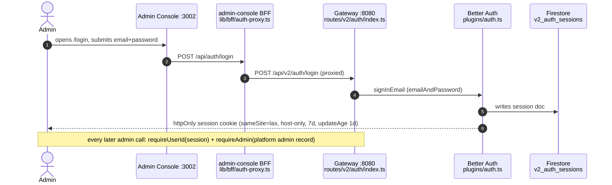
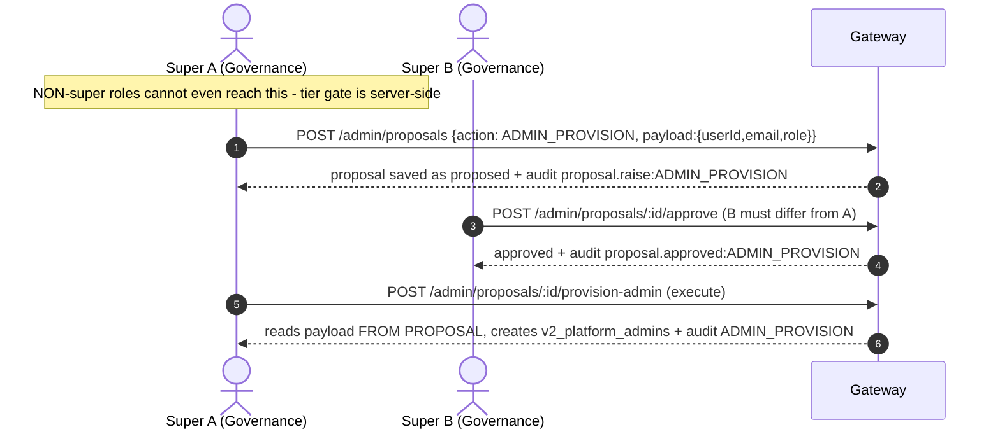
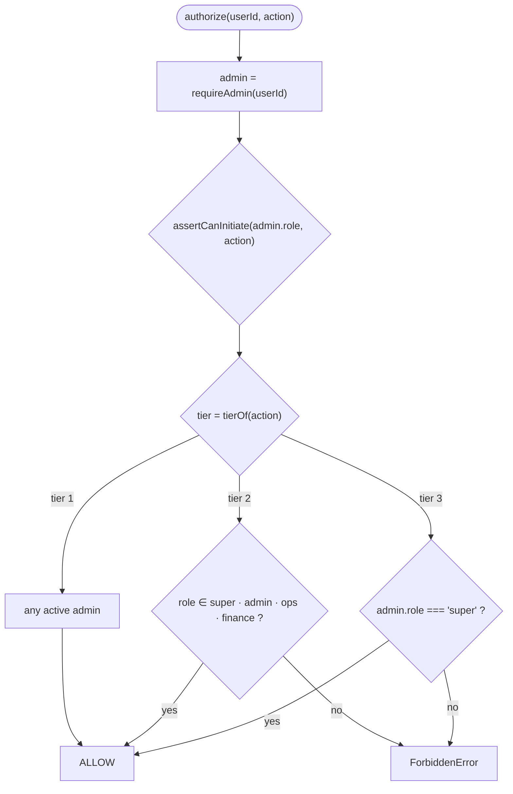
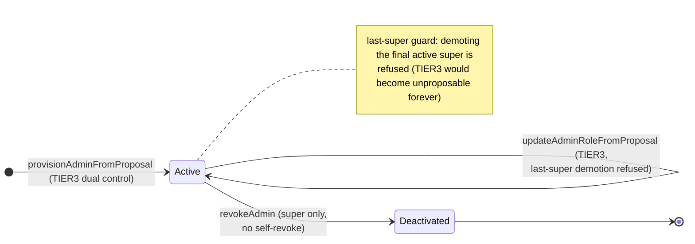

<!--
agent-metadata:
  doc: admin-dashboard/01-auth-access
  department: Platform Governance
  tier: "TIER1 + TIER2 + TIER3"
  purpose: Authentication (Better Auth), RBAC tier gating, admin lifecycle, audit trail.
  binding-code:
    - apps/api-gateway/src/plugins/auth.ts
    - packages/core/src/application/admin/admin-authority-service.ts
    - packages/core/src/domain/models/admin-authority.ts
    - apps/api-gateway/src/routes/v2/auth/{index,otp-routes}.ts
    - apps/api-gateway/src/routes/v2/admin/onboarding-review.ts
  diagrams: [D1-signin-sequence, D2-tier3-double-sign-sequence, D3-authorize-flowchart, D4-admin-lifecycle-state]
  verification:
    - packages/core/src/domain/admin-authority.test.ts
    - apps/api-gateway/src/routes/v2/auth/index.test.ts
    - apps/api-gateway/src/routes/v2/admin/onboarding-review.test.ts
-->

# Admin Dashboard · 01 — Authentication, RBAC Tiers & the Admin Lifecycle

> **Department: Platform Governance** — roles `super`, `admin`.
> Two load-bearing ideas:
> **(1) Platform authority ≠ organization role** — an owner of Venue X is not a
> platform admin; one never implies the other.
> **(2) Three tiers by consequence, not job title** — TIER1 any admin (logged),
> TIER2 senior roles, TIER3 `super` only **and** dual control.

---

## 1. Overview

The admin console is a **platform-privileged** surface, separate from the
partner/guest systems. Authorization is enforced in exactly one place —
`AdminAuthorityService` — so there is no per-route drift.

---

## 2. Business flow E2E

**Diagram D1 — Console sign-in (any admin).**



**Diagram D2 — A TIER3 action (two-man rule, e.g. add an admin).**



Sub-flows:
- **Reject:** second admin `POST …/reject` → `rejected`.
- **Cancel:** only the proposer cancels a still-pending proposal.
- **Revoke (deliberately NOT dual-controlled):** `super` may `POST
  /admin/admins/:id/revoke` directly — removing power stays easy; the wrong
  failure mode is a lockout refusing to remove authority. An admin cannot
  revoke **their own** authority.

---

## 3. Stack

| Layer | File | Responsibility |
|---|---|---|
| Route | `routes/v2/auth/index.ts` | `/signup`, `/login` wrappers around Better Auth |
| Route | `routes/v2/auth/otp-routes.ts` | email OTP intake path |
| Route | `routes/v2/admin/onboarding-review.ts` | proposal raise/approve, `/admin/admins`, revoke, audit reads |
| Plugin | `plugins/auth.ts` | builds Better Auth instance (firestore driver only) |
| Service | `application/admin/admin-authority-service.ts` | requireAdmin / authorize / record / dual control / provisioning |
| Domain | `domain/models/admin-authority.ts` | roles, actions, tiers, proposal FSM, `PlatformAdmin` |
| Store | `v2_auth_users` · `v2_auth_sessions` · `v2_auth_accounts` · `v2_platform_admins` · `v2_admin_audit_logs` | Firestore |

---

## 4. Code logic

### 4.1 `requireAdmin(userId)`
Resolves the `PlatformAdmin` by (auth-user) id. Refuses a **deactivated**
admin with the **same error** as a non-admin — no oracle about who used to
hold power.

### 4.2 `authorize(userId, action)` — tier gate

**Diagram D3 — the authorize decision tree.**



### 4.3 `record(admin, input)` — audit trail
Every authority-gated action appends:
`{ id, adminId, adminRole, action, targetType, targetId, before, after,
reason, ipAddress, userAgent, occurredAt }` — before/after json, reason, and
**epoch-ms `occurredAt`** (the one epoch-ms field in the frozen contract).
Nothing privileged is silent.

### 4.4 Dual control (`propose` / `approve` / `reject` / `cancel` / execute)
- `propose` builds via `proposeAction(...)` (id, action, proposedBy,
  proposerRole, reason, payload) → save → audit `proposal.raise:<ACTION>`.
- `approve`/`reject` funnel through one private `resolve()`: load proposal →
  domain transition (`approveProposal`/`rejectProposal` with `{resolvedBy,
  resolverRole, reason, now}`) — domain **refuses self-approval**
  (resolver === proposer) — → save → audit `proposal.approved|rejected:<ACTION>`.
- **Execute-from-proposal** is the security keystone: `provisionAdminFromProposal`,
  `updateAdminRoleFromProposal`, `adjustCommissionFromProposal` (see
  `02-dual-control-proposals.md`) read parameters from the **approved
  proposal's stored payload**, never from the caller's arguments — an admin
  can't approve one thing and execute another.

### 4.5 Admin lifecycle & lockout guards

**Diagram D4 — PlatformAdmin lifecycle.**



---

## 5. Methods reference

| Method | Purpose | Tier | Idempotent | Audited |
|---|---|---|---|---|
| `requireAdmin(userId)` | resolve active platform admin | — | — | — |
| `authorize(userId, action)` | requireAdmin + tier gate | per action | — | — |
| `record(admin, input)` | append audit row | — | — | writes |
| `listAudit(userId, limit)` | recent audit (any admin) | 1 | — | read |
| `listAuditForTarget(userId, targetId, limit)` | per-target audit | 1 | — | read |
| `propose(userId, {action, reason, payload})` | raise TIER3 proposal | 3 | no (unique id) | `proposal.raise:…` |
| `approve` / `reject` | resolve by second admin | 3 | no | `proposal.approved/rejected:…` |
| `cancel` | cancel own pending proposal | 3 | no | `proposal.cancel:…` |
| `listProposals(userId, status, query)` | proposal desk feed | 1 | — | read |
| `getProposal(userId, proposalId)` | single proposal | 1 | — | read |
| `listAdmins(userId, query)` | admin roster | 1 | — | read |
| `provisionAdminFromProposal` | execute ADMIN_PROVISION | 3 | no | `ADMIN_PROVISION` |
| `updateAdminRoleFromProposal` | execute ADMIN_ROLE_UPDATE | 3 | no | `ADMIN_ROLE_UPDATE` |
| `revokeAdmin(userId, targetUserId)` | deactivate an admin (super only) | 3-ish | no | `ADMIN_REVOKE` |
| `needsDualControl(action)` | is this TIER3? | — | — | — |

**Contract shapes:** `PlatformAdmin` = `{id, email, role, isActive, version, …}`;
proposals = `{id, action, status, proposedBy, proposerRole, reason, payload,
resolution…}`; audit = bare list of `AdminAuditRecord` (`domain/ports/audit.ts`).

---

## 6. Verification

```bash
pnpm --filter core test admin-authority
pnpm --filter api-gateway test auth onboarding-review
# gates
pnpm check && pnpm contract-parity
```

Local E2E: sign in at `:3002/login` (bootstrap first —
`seed:admin`), open **Admins** desk, and confirm a non-super cannot see the
raise-proposal button (server also enforces).