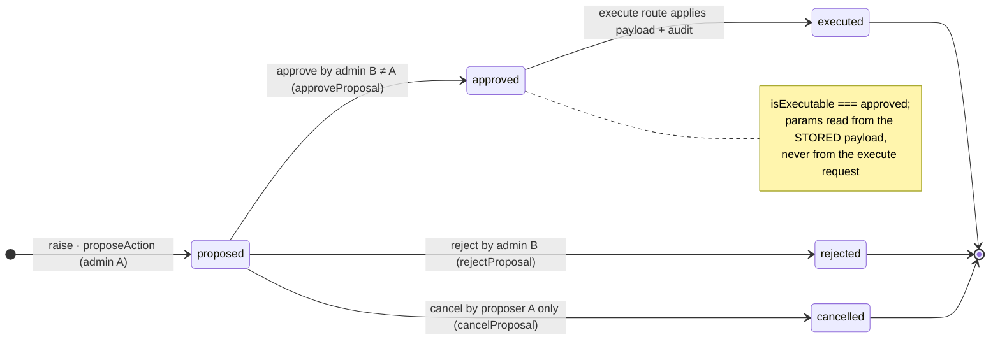
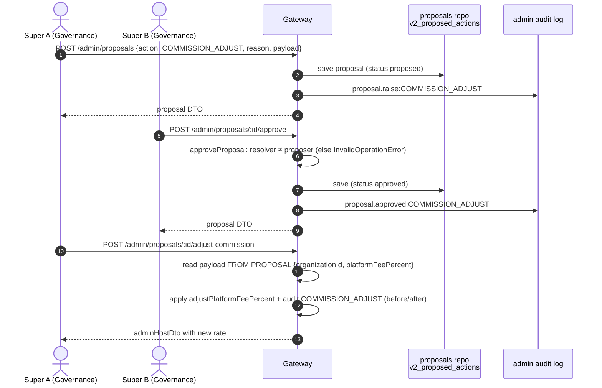

<!--
agent-metadata:
  doc: admin-dashboard/02-dual-control-proposals
  department: Platform Governance
  tier: TIER3
  purpose: TIER3 proposal engine - raise -> approve -> execute, with dual-control FSM and execute-from-proposal security keystone.
  binding-code:
    - packages/core/src/domain/models/admin-authority.ts
    - packages/core/src/application/admin/admin-authority-service.ts
    - apps/api-gateway/src/routes/v2/admin/onboarding-review.ts
    - apps/api-gateway/src/routes/v2/admin/organization-actions.ts
    - apps/api-gateway/src/routes/v2/admin/payouts.ts
  diagrams: [D1-proposal-fsm-state, D2-raise-approve-execute-sequence, D3-execute-from-proposal-flowchart]
  verification:
    - packages/core/src/domain/admin-authority.test.ts
    - apps/api-gateway/src/routes/v2/admin/onboarding-review.test.ts
-->

# Admin Dashboard · 02 — The TIER3 Dual-Control Proposal Engine

> **Department: Platform Governance** — `super` only (TIER3).
> TIER3 actions change **who holds power** or **move money at scale**:
> `ADMIN_PROVISION`, `ADMIN_ROLE_UPDATE`, `COMMISSION_ADJUST`,
> `PAYOUT_FREEZE`, `PAYOUT_RELEASE`. Never single-signer.

---

## 1. Overview

> one admin *proposes* → a **different** admin *approves* → an execute route
> reads its parameters from the **stored proposal payload** and applies them.

The proposal is a versioned aggregate in Firestore (`v2_proposed_actions`,
repository `proposals`).

---

## 2. Business flow E2E

**Diagram D1 — proposal status FSM.**



**Diagram D2 — two-person governance (commission example).**



### Reject / cancel
```
Super B → POST /admin/proposals/:id/reject { reason? }   → rejected
Super A → POST /admin/proposals/:id/cancel               → cancelled (proposer only, pending only)
```

---

## 3. Stack

| Layer | File | Responsibility |
|---|---|---|
| Route | `routes/v2/admin/onboarding-review.ts` | raise/approve, `/admin/admins`, provisioning executes |
| Route | `routes/v2/admin/organization-actions.ts` | `COMMISSION_ADJUST` execute (`/adjust-commission`) |
| Route | `routes/v2/admin/payouts.ts` | `PAYOUT_FREEZE` / `PAYOUT_RELEASE` execute |
| Service | `application/admin/admin-authority-service.ts` | propose/approve/reject/cancel/list/get + provisioning |
| Domain | `domain/models/admin-authority.ts` | FSM + `isExecutable` + `requiresDualControl` |
| Repo | `domain/ports/repositories.ts` → firestore adapter | `proposals` (versioned, compare-and-set) |
| Cross-cut | `lib/v2-idempotency.ts` | every execute POST idempotency-keyed |

---

## 4. Code logic

### 4.1 `propose(userId, command)` (service)
```
admin   = requireAdmin(userId)            // must be an active admin
proposal = proposeAction({ id, action, proposedBy: admin.id,
                           proposerRole: admin.role, reason, payload, now })
proposals.save(proposal)
record({ action: `proposal.raise:${action}`, before: null, after: { action, status } })
```

### 4.2 `approve` / `reject` → shared `resolve()`
```
admin     = requireAdmin(userId)
proposal  = requireProposal(proposalId)
resolved  = apply(proposal, { resolvedBy: admin.id, resolverRole: admin.role,
                              reason, now })          // approveProposal | rejectProposal
proposals.save(resolved)
record({ action: `proposal.${resolved.status}:${proposal.action}`,
         before: { status }, after: { status }, reason: resolved.resolutionReason })
```

### 4.3 Execute-from-proposal — the security keystone

**Diagram D3 — `adjustCommissionFromProposal(userId, proposalId)`.**

```mermaid
flowchart TD
    S(["adjustCommissionFromProposal"]) --> A["authority.authorize(userId, 'COMMISSION_ADJUST')"]
    A -->|super| B["proposal = authority.getProposal(userId, proposalId)"]
    A -->|not super| X1["ForbiddenError"]
    B --> C{proposal.action === 'COMMISSION_ADJUST' ?}
    C -->|no| X2["InvalidOperationError"]
    C -->|yes| D{isExecutable(proposal)?<br/>approved by 2nd admin}
    D -->|no| X3["InvalidOperationError"]
    D -->|yes| E["readCommissionPayload(proposal.payload)<br/>{organizationId, platformFeePercent} · FROM PROPOSAL"]
    E --> F["org = organizations.getById(organizationId)"]
    F --> G{org found ?}
    G -->|no| X4["NotFoundError"]
    G -->|yes| H["adjusted = adjustPlatformFeePercent(org, platformFeePercent, now)<br/>pure domain · int 0-100"]
    H --> I{adjusted !== org ?}
    I -->|yes| J["organizations.save(adjusted)"]
    I -->|no| K["no write · no rewrite"]
    J --> L["record: COMMISSION_ADJUST<br/>before/after platformFeePercent, reason: proposal.reason"]
    K --> L
    L --> M["return org (hostToDto)"]
```

Same shape in `provisionAdminFromProposal` / `updateAdminRoleFromProposal`
(identity read from proposal payload; last-super demotion guard in the role
update). `PAYOUT_FREEZE`/`PAYOUT_RELEASE` mirror it in `payouts.ts`.

### 4.4 Payload readers are validating
`readCommissionPayload` / `readProvisionPayload` / `readRoleUpdatePayload`
re-validate the opaque payload shape; a malformed one fails loudly
(InvalidOperationError) instead of becoming e.g. a `role: undefined` record.

---

## 5. Methods reference

| Method | Purpose | Auth | Idempotent | Audit |
|---|---|---|---|---|
| `propose(userId, {action, reason, payload})` | raise TIER3 proposal | super | unique id per raise | `proposal.raise:…` |
| `approve(userId, proposalId, reason?)` | second admin signs | super | no | `proposal.approved:…` |
| `reject(userId, proposalId, reason?)` | decline | super | no | `proposal.rejected:…` |
| `cancel(userId, proposalId)` | proposer withdraws | super (proposer) | no | `proposal.cancel:…` |
| `listProposals(userId, status, query)` | desk feed | any admin | — | read |
| `getProposal(userId, proposalId)` | detail | any admin | — | read |
| `isExecutable(p)` (domain) | approved by a 2nd admin | pure | — | — |
| `requiresDualControl(action)` | tierOf === 3 | pure | — | — |
| `…FromProposal` executes | apply approved action | super | per action keyed | `ADMIN_*` / `COMMISSION_ADJUST` / `PAYOUT_*` |

**Route surface** (all under `/api/v2`):

| Method | Path | Purpose |
|---|---|---|
| POST | `/admin/proposals` | raise (`action`, `reason`, `payload`) |
| POST | `/admin/proposals/:proposalId/approve` | second-signer approve |
| POST | `/admin/proposals/:proposalId/provision-admin` | execute ADMIN_PROVISION |
| POST | `/admin/proposals/:proposalId/update-admin-role` | execute ADMIN_ROLE_UPDATE |
| POST | `/admin/proposals/:proposalId/adjust-commission` | execute COMMISSION_ADJUST |
| POST | `/admin/proposals/:proposalId/freeze-payout` · `/release-payout` | execute PAYOUT_FREEZE/RELEASE |
| GET | `/admin/admins` · `/admin/proposals` · search | rosters/feed (any admin) |
| POST | `/admin/admins/:adminId/revoke` | super-only direct revocation |

---

## 6. Verification

```bash
pnpm --filter core test admin-authority
pnpm --filter api-gateway test onboarding-review organization-actions
pnpm check && pnpm contract-parity
```

Local E2E: raise with one super, approve with a **different** one (same-account
approval throws by design), execute, and re-check the commissions desk shows the
new rate.