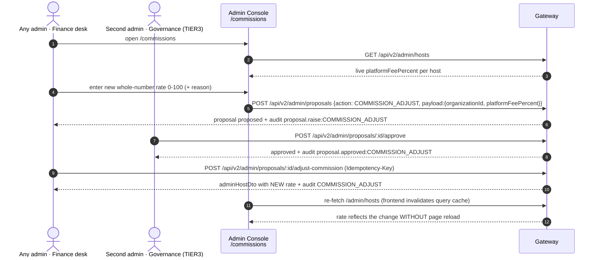
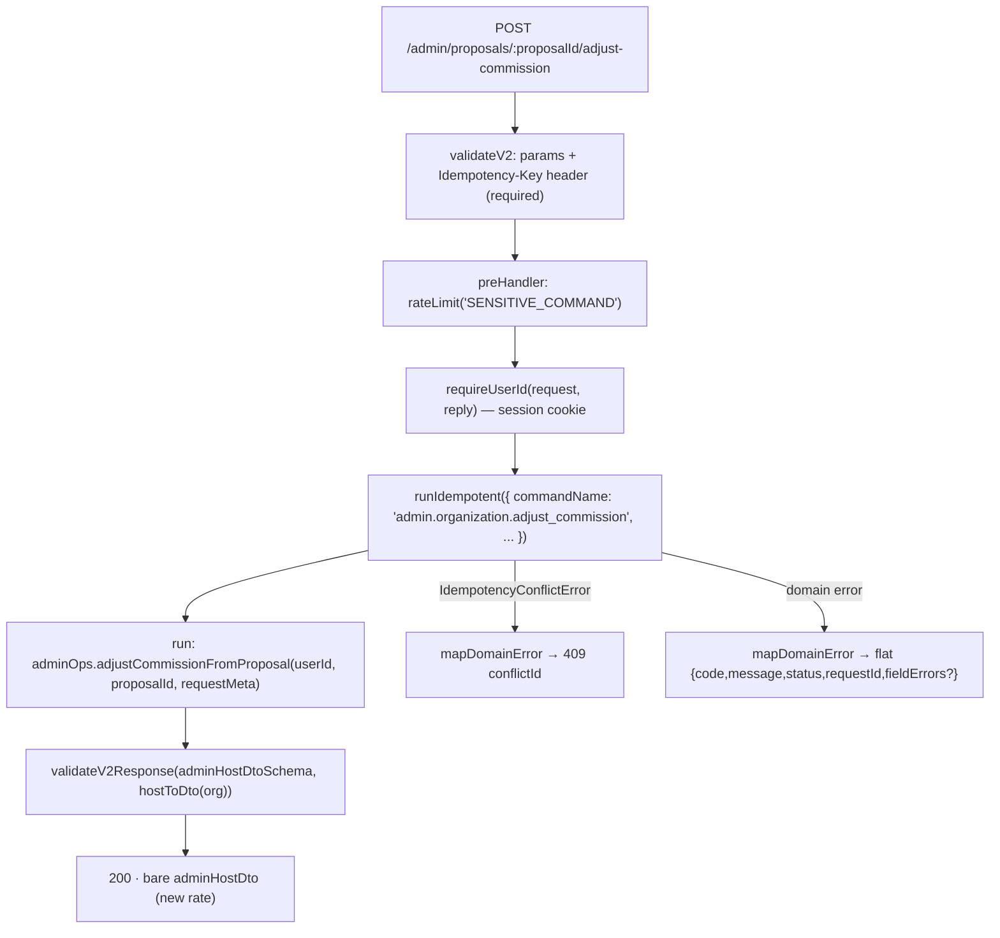
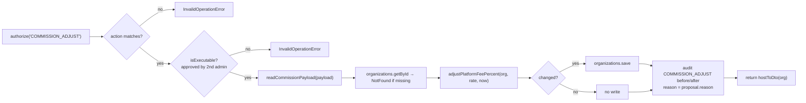

<!--
agent-metadata:
  doc: admin-dashboard/03-commissions
  department: "Finance + Platform Governance"
  tier: TIER3 (change) / TIER1 (read)
  purpose: Commissions desk - live platform fee per host, COMMISSION_ADJUST dual-control change flow.
  binding-code:
    - apps/api-gateway/src/routes/v2/admin/organization-actions.ts
    - apps/api-gateway/src/routes/v2/admin/directory.ts
    - apps/api-gateway/src/routes/v2/admin/onboarding-review.ts
    - packages/core/src/application/admin/admin-ops-service.ts
    - packages/core/src/domain/models/organization.ts
    - packages/core/src/domain/models/admin-authority.ts
  diagrams: [D1-e2e-sequence, D2-execute-route-pipeline-flowchart, D3-adjust-commission-flowchart]
  verification:
    - apps/api-gateway/src/routes/v2/admin/organization-actions.test.ts
-->

# Admin Dashboard · 03 — Commissions Desk (`COMMISSION_ADJUST`)

> **Department: Finance** (raise & view) **⊕ Platform Governance** (approve).
> The desk is a cross-department two-signature flow.

---

## 1. Overview

**What the desk answers:** *"what is each host/organization paying as the
platform commission, and how do we change it safely?"*

- Current rate reads **live** from each `Organization.platformFeePercent` via
  the existing `GET /admin/hosts` directory endpoint (frozen reuse — no new
  list DTO).
- A change is `COMMISSION_ADJUST` — **TIER3, dual control**: proposed by one
  admin, approved by a *different* admin, then executed. Never single-click.
- `platformFeePercent` is an **integer 0–100**; `0` is a legal rate → `??`
  null-fallback semantics, never `||`.

---

## 2. Business flow E2E

**Diagram D1 — the whole flow across departments.**



---

## 3. Stack

| Layer | File | Responsibility |
|---|---|---|
| Route (list) | `admin/directory.ts` | `GET /admin/hosts` → `adminHostDto` incl. `platformFeePercent` |
| Route (raise) | `admin/onboarding-review.ts` | `POST /admin/proposals` (shared proposal desk) |
| Route (execute) | `admin/organization-actions.ts` | `POST /admin/proposals/:proposalId/adjust-commission` |
| Service | `application/admin/admin-ops-service.ts` | `adjustCommissionFromProposal` |
| Domain | `domain/models/organization.ts` | `adjustPlatformFeePercent` (int 0–100, versioned) |
| Domain | `domain/models/admin-authority.ts` | `COMMISSION_ADJUST` ∈ TIER3, dual control |
| Contract | `@c1rcle/contracts/client → adminHostDtoSchema` | response validation |
| Frontend | `C1RCLE-FRONTEND/apps/admin-console/src/app/commissions/page.tsx` + `src/lib/admin/admin-api.ts` | raise form, live table, cache invalidation |

---

## 4. Code logic

### 4.1 Execute route pipeline

**Diagram D2 — `POST /admin/proposals/:proposalId/adjust-commission`.**



### 4.2 The service

**Diagram D3 — `adjustCommissionFromProposal` guards (full detail in
`02-dual-control-proposals.md` D3).**



Key facts: the service returns the **same org object** when the rate is
unchanged (no write, no duplicate audit row); `readCommissionPayload`
validates the opaque payload; the response DTO is
`{ id, ownerId, name, slug, status, platformFeePercent, memberCount,
createdAt, updatedAt }` (`memberCount = org.members.length`).

---

## 5. Methods reference

| Method | Purpose | Auth tier | Idempotent | Audited |
|---|---|---|---|---|
| `listHosts(adminUserId, query)` | live rate table feed | 1 (any admin) | — | — |
| `authority.propose({action:'COMMISSION_ADJUST', …})` | raise change | 3 (super) | no | `proposal.raise:…` |
| `authority.approve(proposalId, …)` | second signature | 3 (super) | no | `proposal.approved:…` |
| `adminOps.adjustCommissionFromProposal(userId, proposalId)` | execute | 3 via `authorize(…)` | yes (`Idempotency-Key`) | `COMMISSION_ADJUST` |
| `domain.adjustPlatformFeePercent(org, rate, now)` | pure FSM transition | — | pure | — |
| `readCommissionPayload(payload)` | validate opaque payload | — | pure | — |

**Wire contract notes**
- Raise body: `{ action: 'COMMISSION_ADJUST', reason, payload: { organizationId,
  platformFeePercent } }`.
- Execute response: bare `adminHostDto` (new rate).
- Errors: flat `{ code, message, status, requestId, fieldErrors? }`; each
  domain failure maps to its documented `code`.
- Percentages only here (integers). Money elsewhere is integer paise.

---

## 6. Verification

```bash
pnpm --filter api-gateway test organization-actions directory
pnpm check && pnpm contract-parity
```

Local E2E proof: raise with admin A, approve with admin B (same-account
approval is refused by the FSM), execute, and confirm `/commissions` shows the
new rate **without a reload** (cache invalidation).