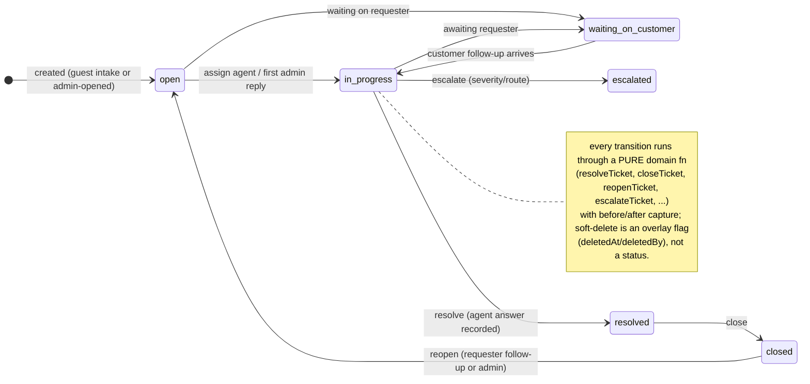
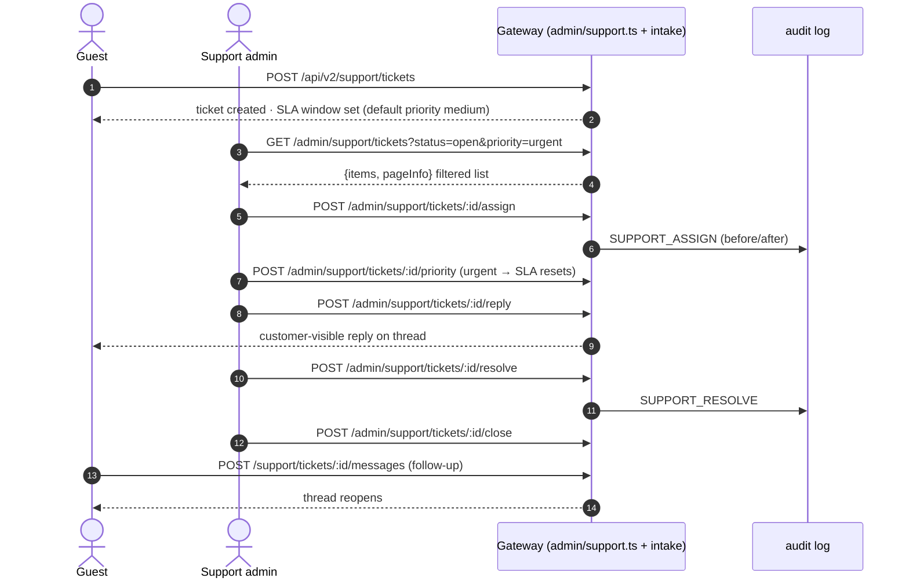
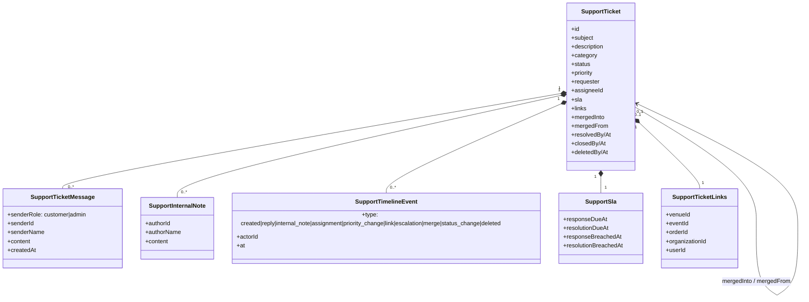

<!--
agent-metadata:
  doc: admin-dashboard/04-support-desk
  department: Customer Support
  tier: "TIER1 (any admin may act, always audited)"
  purpose: Support ticket desk - aggregate model, SLA, merge bookkeeping, every desk mutation.
  binding-code:
    - apps/api-gateway/src/routes/v2/admin/support.ts
    - apps/api-gateway/src/routes/v2/support/intake-routes.ts
    - packages/core/src/application/support/admin-support-service.ts
    - packages/core/src/application/support/support-service.ts
    - packages/core/src/domain/models/support-ticket.ts
  diagrams: [D1-ticket-fsm-state, D2-ticket-lifecycle-sequence, D3-aggregate-class, D4-mutation-pattern-flowchart]
  verification:
    - apps/api-gateway/src/routes/v2/admin/support.test.ts
    - packages/core support-service tests
-->

# Admin Dashboard · 04 — Support Desk (tickets)

> **Department: Customer Support** — every mutation is **TIER1**: any active
> platform admin may act, and every action is logged. No new `AdminAction`
> entry was needed — TIER1 needs no per-role gate, only the audit trail.

---

## 1. Overview

The desk is the admin half of the **`SupportTicket` aggregate** — the v1
desk's `SUPPORT_*` actions **re-homed over a real model**, with three
improvements v1 faked:

1. **Real per-priority SLA** (v1 used hardcoded fake "SLA agents").
2. **Merge bookkeeping** — `mergedInto` on the absorbed ticket **and**
   `mergedFrom` on the primary, so absorbed content is never lost.
3. **Timeline** — every lifecycle event on the ticket: `created`, `reply`,
   `internal_note`, `assignment`, `priority_change`, `link`, `escalation`,
   `merge`, `status_change`, `deleted`.

---

## 2. Business flow E2E

**Diagram D1 — ticket status FSM.**



**Diagram D2 — one ticket's full lifecycle.**



Merge / escalate / note / link / soft-delete / restore are sibling commands in
the same shape (see §5).

**Diagram D3 — the aggregate model.**



---

## 3. Stack

| Layer | File | Responsibility |
|---|---|---|
| Route (desk) | `apps/api-gateway/src/routes/v2/admin/support.ts` | desk HTTP surface |
| Route (intake) | `apps/api-gateway/src/routes/v2/support/intake-routes.ts` | requester/guest side |
| Service | `packages/core/src/application/support/admin-support-service.ts` | every desk mutation |
| Domain | `packages/core/src/domain/models/support-ticket.ts` | aggregate, FSM, SLA, merge |
| Contract | `@c1rcle/contracts/client → supportTicket*Schema` | frozen wire shapes |
| Frontend | `C1RCLE-FRONTEND/apps/admin-console/src/app/support/page.tsx` + `src/lib/admin/admin-api.ts` | master-detail desk |

---

## 4. Code logic

### 4.1 SLA targets (real, per priority; hours)

| priority | response | resolution |
|---|---|---|
| urgent | 1h | 4h |
| high | 4h | 24h |
| medium | 24h | 72h |
| low | 72h | 168h |

`refreshSla` stamps `*BreachedAt` **once** (first breach wins) — rechecking a
breached ticket later re-uses the existing timestamp instead of overwriting it.

### 4.2 requester & merge semantics
- `requester = { userId, email: string|null, organizationId: string|null }`
  — `email` stays null when an admin opens the ticket directly.
- merge: absorbed ticket sets `mergedInto`; primary appends `mergedFrom` —
  walk a merged thread both ways.
- delete is attribution-only (`deletedAt/deletedBy`) — nothing is erased;
  `restore` clears it.

### 4.3 Mutation pattern (every desk command)

**Diagram D4 — the single shape of `AdminSupportService` mutations.**

```mermaid
flowchart TD
    S(["assign / changePriority / reply / note / link / escalate / resolve / close / reopen / merge / delete / restore"]) --> A["requireAdmin(userId) ← THE only gate (TIER1)"]
    A --> B["ticket = repo.getById(ticketId)"]
    B --> C["next = pure domain fn(ticket, args, now)"]
    C --> D["repo.save(next)"]
    D --> E["authority.record: SUPPORT_<ACTION><br/>before/after json + ipAddress + userAgent"]
    E --> F["return serialized DTO"]
    note left of A
        route wraps the call in runIdempotent (per-intent
        Idempotency-Key) - a double click on Resolve can
        never double-fire.
    end note
```

---

## 5. Methods reference

Route surface (all under `/api/v2`):

| Method | Path | Purpose | Idempotent |
|---|---|---|---|
| GET | `/admin/support/tickets` | list + filters + pageInfo | — |
| GET | `/admin/support/tickets/:ticketId` | detail (thread, notes, timeline, SLA) | — |
| POST | `/admin/support/tickets/:ticketId/assign` | assign agent | ✓ |
| POST | `/admin/support/tickets/:ticketId/priority` | change priority (resets SLA) | ✓ |
| POST | `/admin/support/tickets/:ticketId/reply` | customer-visible reply | ✓ |
| POST | `/admin/support/tickets/:ticketId/notes` | internal note | ✓ |
| POST | `/admin/support/tickets/:ticketId/link` | link venue/event/order/org/user | ✓ |
| POST | `/admin/support/tickets/:ticketId/resolve` | resolve | ✓ |
| POST | `/admin/support/tickets/:ticketId/merge` | duplicate → primary | ✓ |
| POST | `/admin/support/tickets/:ticketId/escalate` | escalate severity/route | ✓ |
| POST | `/admin/support/tickets/:ticketId/close` · `…/reopen` | lifecycle | ✓ |
| POST | `/admin/support/tickets/:ticketId/restore` | un-delete | ✓ |
| DELETE | `/admin/support/tickets/:ticketId` | soft delete (attribution) | ✓ |

List filters: `status`, `priority`, `category`, `assigneeUserId`,
`requesterUserId`, `search`, `includeDeleted`. Pagination: `limit`/cursor →
`{ items, pageInfo }`.

Service mapper: `listTickets`, `getTicket`, `sendAdminReply`, `addNote`,
`assign`, `changePriority`, `link`, `escalate`, `resolve`, `close`, `reopen`,
`merge`, `listMergedInto`, `delete`, `restore`.

Audit actions: `SUPPORT_ASSIGN`, `SUPPORT_REPLY`, `SUPPORT_NOTE`,
`SUPPORT_PRIORITY`, `SUPPORT_LINK`, `SUPPORT_ESCALATE`, `SUPPORT_RESOLVE`,
`SUPPORT_CLOSE`, `SUPPORT_REOPEN`, `SUPPORT_MERGE`, `SUPPORT_DELETE`,
`SUPPORT_RESTORE` — always with before/after json.

**Wire notes:** ticket DTO is one flat shape (subject, description, category,
status, priority, requester, assignee, messages, internalNotes, timeline,
links, sla, mergedInto, mergedFrom, resolvedBy/At, closedBy/At, deletedBy/At,
createdAt, updatedAt) — `supportTicketDtoSchema` in
`packages/contracts/src/contracts/phase7.ts`.

---

## 6. Verification

```bash
pnpm --filter core test support
pnpm --filter api-gateway test support
pnpm check && pnpm contract-parity
```

Local E2E: guest submit at `:3000/help` → desk lists it → assign → reply (guest
sees it) → priority → resolve → close → reopen → merge a second ticket into it
→ soft-delete → restore. Reload the desk after each step (persistence is real
Firestore).