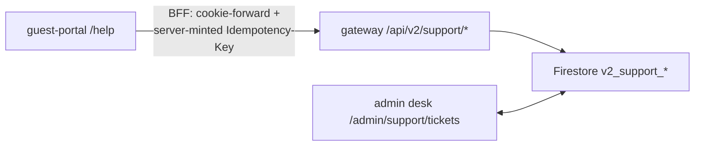
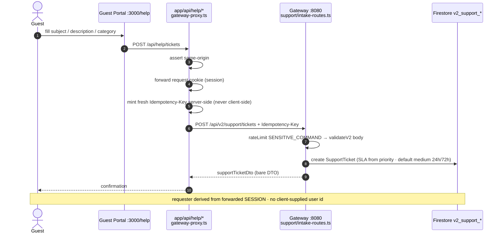
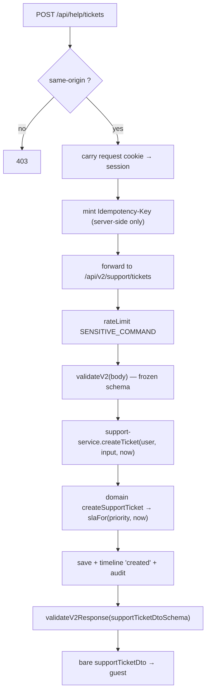
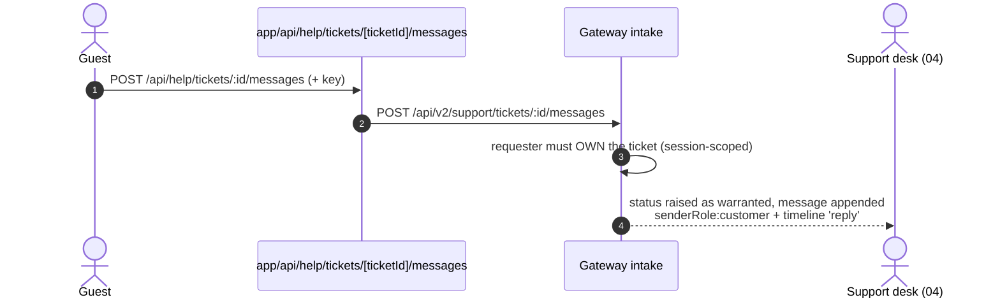

<!--
agent-metadata:
  doc: admin-dashboard/05-support-intake
  department: Guest Experience
  tier: public/requester surface (no platform tier)
  purpose: Guest Help intake - submit / my tickets / follow-up, cookie-forward BFF, server-minted Idempotency-Key.
  binding-code:
    - C1RCLE-FRONTEND/apps/guest-portal/src/app/help/page.tsx
    - C1RCLE-FRONTEND/apps/guest-portal/src/app/help/help-client.tsx
    - C1RCLE-FRONTEND/apps/guest-portal/src/lib/help/gateway-proxy.ts
    - C1RCLE-FRONTEND/apps/guest-portal/src/app/api/help/tickets*/route.ts
    - C1RCLE-FRONTEND/apps/guest-portal/src/proxy.ts (PRIVATE_PREFIXES)
    - C1RCLE-BACKEND/apps/api-gateway/src/routes/v2/support/intake-routes.ts
    - C1RCLE-BACKEND/packages/core/src/application/support/support-service.ts
  diagrams: [D0-one-ticket-object, D1-guest-submit-sequence, D2-bff-pipeline-flowchart, D3-follow-up-sequence]
  verification:
    - C1RCLE-FRONTEND/apps/guest-portal/src/app/help/page.test.tsx (+83 guest tests)
    - C1RCLE-BACKEND support tests
-->

# Admin Dashboard · 05 — Guest Help Intake (frontend surface + BFF)

> **Department: Guest Experience** — the public/requester side of the Support
> ticket aggregate. Admin half: `04-support-desk.md`.

---

## 1. Overview

Guests get a real **Help** surface: submit a ticket, list **my tickets**, open
one, and reply on the thread. This is not a form that emails people — it writes
a real `SupportTicket` into the same store the admin desk reads, so a guest
request and the ops follow-up are **one object**:

**Diagram D0 — one ticket object across both surfaces.**



- **Backend surface is live** (intake routes registered in the route manifest;
  `support-service.ts` tests pass; contract schemas in `@c1rcle/contracts`).
- **Guest-portal is a working shell**: UI + BFF wiring complete and green in
  the gates. Full guest→gateway **login/session wiring on the guest origin is
  a deferred workstream** — the BFF forwards the host-scoped session cookie
  exactly like `requireGuestSession`, so the flow works the moment that wiring
  lands (or right now when a localhost session already exists).

---

## 2. Business flow E2E

**Diagram D1 — guest submits a ticket.**



**Diagram D2 — BFF pipeline (thin, per boundary rules).**



**Diagram D3 — guest follow-up on their own thread.**



My-tickets reads: `GET /api/help/tickets` and `GET /api/help/tickets/:ticketId`
(own threads only).

---

## 3. Stack

| Layer | File (guest-portal unless noted) | Responsibility |
|---|---|---|
| Page | `apps/guest-portal/src/app/help/page.tsx` | server shell |
| Client | `apps/guest-portal/src/app/help/help-client.tsx` | submit / my-tickets / thread+reply UI via `@c1rcle/api-client` at `window.location.origin` |
| BFF | `apps/guest-portal/src/lib/help/gateway-proxy.ts` | cookie-forward + key minting |
| BFF routes | `app/api/help/tickets/route.ts`, `[ticketId]/route.ts`, `[ticketId]/messages/route.ts` | POST/GET ↔ gateway |
| Auth/nav | `apps/guest-portal/src/proxy.ts` + `PRIVATE_PREFIXES` + `DesktopNavLinks.tsx` | `/help` private route |
| Gateway | `C1RCLE-BACKEND/apps/api-gateway/src/routes/v2/support/intake-routes.ts` | `/support/tickets`, `/:ticketId`, `/:ticketId/messages` |
| Service | `C1RCLE-BACKEND/packages/core/src/application/support/support-service.ts` | requester-side creation/lookup/reply |
| Domain | `C1RCLE-BACKEND/packages/core/src/domain/models/support-ticket.ts` | aggregate + SLA (default `medium`) |
| Contract | `@c1rcle/contracts → supportTicket*Schema` | frozen, mirrored both repos |

---

## 4. Code logic

- **Identity & privacy:** requester derived from the **gateway session cookie**
  forwarded by the BFF — the gateway's auth layer derives the actor from the
  session; **no client-supplied user id is ever trusted**.
  `requester.email` is null unless the session verifies it
  (model: `email: string|null`, `organizationId: string|null`).
- **Key minting (BFF, server-side):** per-POST, inside the same-origin Next
  route, forwarded as the `Idempotency-Key` header into the gateway's
  `SENSITIVE_COMMAND` pipeline; `runIdempotent` replays the stored result on
  retry. Never generated in the browser (a client could otherwise sign
  arbitrary commands).
- **Thin-wire:** pipeline in D2 is validate → actor → one service call →
  serialize; no Firebase Admin in the runtime route.

---

## 5. Methods reference (gateway intake surface)

| Method | Path (`/api/v2`) | Purpose | Idempotent |
|---|---|---|---|
| POST | `/support/tickets` | create ticket (requester session) | ✓ |
| GET | `/support/tickets` | my tickets (requester-owned) | — |
| GET | `/support/tickets/:ticketId` | own-thread detail | — |
| POST | `/support/tickets/:ticketId/messages` | guest follow-up on own thread | ✓ |

**Frontend BFF mirror (`/api/help`):** `POST|GET tickets`,
`GET tickets/[ticketId]`, `POST tickets/[ticketId]/messages`. The 4 routes,
nav (`/help`), `PRIVATE_PREFIXES`, and `page.test.tsx` are the gate surface.

**Wire notes:** same frozen shapes as the admin desk; the guest subset never
exposes `internalNotes`. **Deferred (do not build):** full guest→gateway
login/session BFF wiring on the guest origin.

---

## 6. Verification

```bash
# frontend
pnpm --filter @c1rcle/app-guest-portal lint typecheck test build
# backend
pnpm --filter api-gateway test support
pnpm check && pnpm contract-parity
```

Local E2E: submit at `:3000/help` → confirm the ticket appears in
`:3002/support` → desk replies → guest thread shows the reply → guest
follows up → desk sees the reopen.