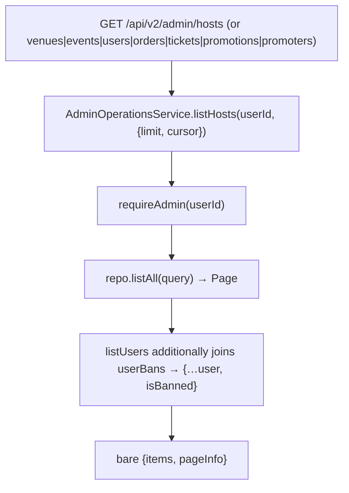
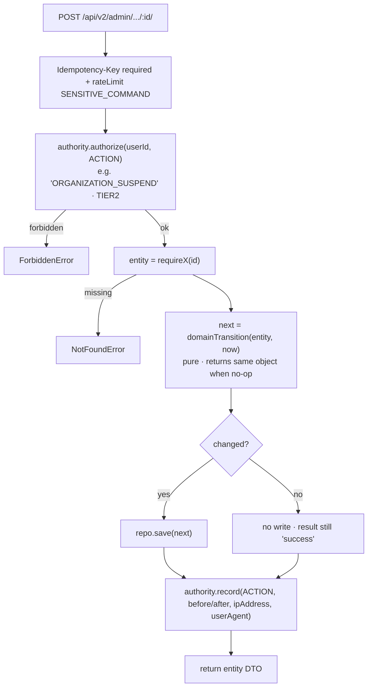
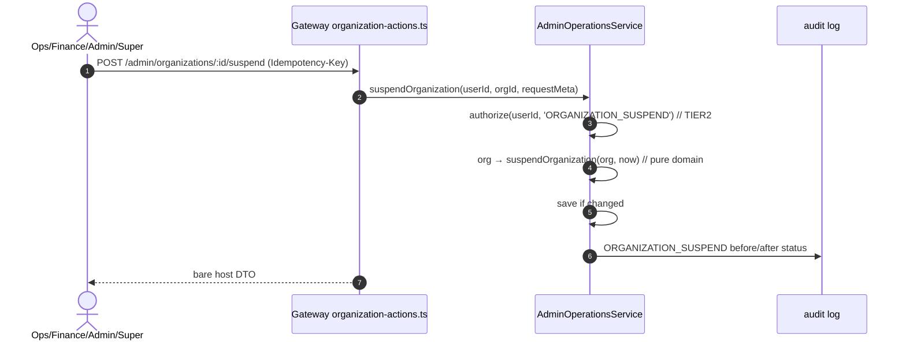
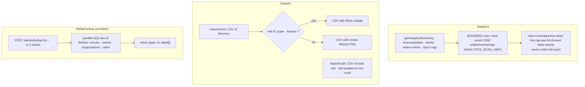

<!--
agent-metadata:
  doc: admin-dashboard/06-directory-operations
  department: "Operations + Finance (money views)"
  tier: "reads TIER1 · direct commands TIER2 · analytics/export TIER1"
  purpose: Directory read desks, direct TIER2 commands, platform settings, analytics summary, exports, global lookup.
  binding-code:
    - apps/api-gateway/src/routes/v2/admin/{directory,analytics,settings,user-actions,venue-actions,event-actions,organization-actions,promoters,orders,tickets,promotions,refunds,payouts,disputes}.ts
    - packages/core/src/application/admin/admin-ops-service.ts
    - packages/core/src/domain/models/{organization,venue,event,user-ban,event-catalog}.ts
  diagrams: [D1-read-list-flowchart, D2-direct-command-flowchart, D3-suspend-org-sequence, D4-analytics-export-flowchart]
  verification:
    - apps/api-gateway/src/routes/v2/admin/*.test.ts
-->

# Admin Dashboard · 06 — Directory, Read Desks & Direct (TIER2) Operations

> **Department: Operations** (and Finance for the money views) — the
> platform-wide "state" surface and the direct-command desk.
> Rule of thumb in `AdminOperationsService`: **reads → requireAdmin; direct
> commands → `authorize(action)`; every mutation → `record` with before/after.**

---

## 1. Overview

Two surface kinds:

- **Read desks** — platform-wide, any admin may open: venues, events, hosts
  (organizations), users, orders, tickets (entitlements), promotions,
  promoter assignments, plus analytics summary and CSV exports.
- **Direct commands** — TIER2 actions executed directly by a senior admin
  (`super`/`admin`/`ops`/`finance`), reversible but costly. TIER3 stays inside
  the dual-control engine (`02-dual-control-proposals.md`).

---

## 2. Business flow E2E

**Diagram D1 — read a directory page (one shape for every list).**



**Diagram D2 — direct command pattern (all TIER2 actions).**



Repeated commands are idempotent: no-op still returns success but **does not
rewrite the row** and **does not spam the audit trail**.

**Diagram D3 — worked example: suspend an organization.**



### X — exports & analytics

**Diagram D4 — analytics & export flows (PII-aware).**



---

## 3. Stack

| Layer | File | Responsibility |
|---|---|---|
| Route (reads) | `admin/directory.ts` | `/admin/{venues,events,hosts,users,lookup}` |
| Route (reads) | `admin/orders.ts` · `tickets.ts` · `promotions.ts` · `promoters.ts` | money/entitlement/catalog read desks |
| Route (commands) | `admin/organization-actions.ts` · `venue-actions.ts` · `event-actions.ts` · `user-actions.ts` · `promoters.ts` | direct TIER2 commands |
| Route (settings) | `admin/settings.ts` | platform settings get/update |
| Service | `application/admin/admin-ops-service.ts` | everything above |
| Domain | `domain/models/{organization,venue,event,user-ban,event-catalog}.ts` | pure transitions |
| Repo | `domain/ports/repositories.ts` → adapters | firestore/memory |

---

## 4. Code logic

- **Read list pattern** (D1): one method shape for every list desk
  (`listVenues` … `listPromoterAssignments`); `listUsers` joins
  `userBans.getByUserId` → `{...user, isBanned}`.
- **Direct command pattern** (D2): authorize → require → pure transition →
  save-if-changed → record. No-ops stay "success" but never rewrite and never
  double-audit.
- **The three interesting ones:**
  - `banUser` writes into `userBans` (independent of the read-only directory) —
    banning an id not in the directory succeeds with a synthetic view shape
    rather than 404 (a ban is a first-class record).
  - `updatePlatformSettings` is a **merge-patch** over the singleton settings
    doc (`platformFeeRate`, refund thresholds, maintenanceMode), audited
    before/after.
  - `resolveTargetNames` resolves audit target ids → display names with the
    **same email redaction rule** as `exportUsers` (only super/finance may
    resolve a `platform_user` email) — closes v1's "CSV redacts but audit
    doesn't" hole.

---

## 5. Methods reference

| Method | Tier | Idempotent | Audited | Notes |
|---|---|---|---|---|
| `listVenues` / `listEvents` / `listHosts` / `listUsers` | 1 | — | — | paged reads |
| `listOrders` / `listTickets` / `listPromotions` / `listPromoterAssignments` | 1 | — | — | paged reads |
| `suspendVenue` / `reinstateVenue` | 2 | ✓ | `VENUE_SUSPEND/REINSTATE` | direct |
| `suspendOrganization` / `reinstateOrganization` | 2 | ✓ | `ORGANIZATION_SUSPEND/REINSTATE` | direct |
| `pauseEvent` / `resumeEvent` / `forceCompleteEvent` | 1 | ✓ | `EVENT_PAUSE/RESUME/FORCE_PAUSE` | TIER1 · merely logged |
| `banUser` / `unbanUser` | 2 | ✓ | `USER_BAN/UNBAN` | first-class record |
| `suspendPromoter` / `reinstatePromoter` | 2 | ✓ | `PROMOTER_SUSPEND/REINSTATE` | iterates assignment rows |
| `getPlatformSettings` / `updatePlatformSettings` | 1 | ✓(update) | `PLATFORM_SETTINGS_UPDATE` | merge-patch singleton |
| `getAnalyticsSummary` | 1 | — | — | bounded scan 1000 · `truncated` flag |
| `exportUsers` | 1 | — | `ADMIN_EXPORT` | PII redaction super/finance only |
| `exportAudit` | 1 | — | `ADMIN_EXPORT` | self-auditing |
| `globalLookup` | 1 | — | — | ≥3 chars · parallel doc-id fetch |
| `resolveTargetNames` | 1 | — | — | PII-aware |

**Route table** (all under `/api/v2`):

| Method | Path | Purpose |
|---|---|---|
| GET | `/admin/venues` · `/admin/events` · `/admin/hosts` · `/admin/users` | directory pages |
| GET | `/admin/orders` · `/admin/tickets` · `/admin/promotions` · `/admin/promoters` | money/entitlement/catalog reads |
| GET/POST | `/admin/lookup` | global omnibox |
| POST | `/admin/venues/:venueId/suspend` · `/reinstate` | venue actions |
| POST | `/admin/organizations/:organizationId/suspend` · `/reinstate` | org actions |
| POST | `/admin/events/:eventId/pause` · `/resume` · `/force-complete` | event actions |
| POST | `/admin/users/:userId/ban` · `/unban` | user actions |
| POST | `/admin/promoters/:promoterId/suspend` · `/reinstate` | promoter actions |
| GET/PATCH | `/admin/settings` | platform settings |
| GET | `/admin/analytics` | summary |
| GET | `/admin/audit` | audit trail read (any admin) |

**Deferred (on the frozen do-not-build list):** invite-by-email (verified
blocker), ledger viewer, security dashboard, raw logs viewer, elevated-risk
gate, announcements, `WEBHOOK_RETRY`, role narrowing (7→5 confirmed),
per-role read matrix.

---

## 6. Verification

```bash
pnpm --filter api-gateway test directory venue-actions event-actions user-actions promoters orders tickets settings analytics
pnpm --filter core test finance admin-ops
pnpm check && pnpm contract-parity
```

Local E2E: open each directory desk, run one suspend→reinstate round-trip on a
throwaway org, flip a user's ban, check settings merge-patch persists, and
confirm the analytics summary returns `truncated:false` on the small real
dataset.