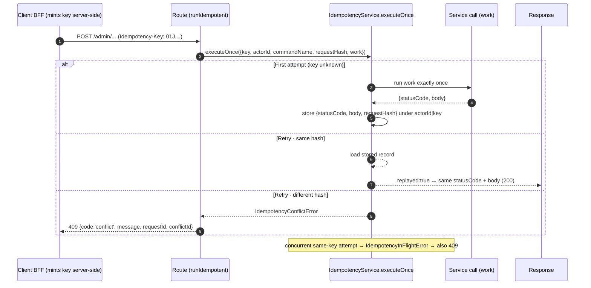
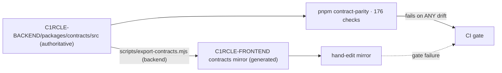

<!--
agent-metadata:
  doc: admin-dashboard/07-idempotency-contract
  department: Cross-cutting (all departments)
  tier: all mutation routes
  purpose: Idempotency-Key infrastructure (runIdempotent / executeOnce) and the frozen wire contract conventions.
  binding-code:
    - apps/api-gateway/src/lib/v2-idempotency.ts
    - packages/core/src/application/idempotency/idempotency-service.ts
    - packages/core/src/domain/errors.ts
    - packages/contracts/src/**
  diagrams: [D1-executeonce-sequence, D2-runidempotent-flowchart, D3-contract-ownership-graph]
  verification:
    - packages/core/src/application/idempotency/idempotency-service.test.ts
    - pnpm contract-parity (176 checks)
-->

# Admin Dashboard · 07 — Idempotency-Key Infrastructure & the Frozen Wire Contract

> **Cross-cutting (all departments)** — every admin **mutation** rides this
> infrastructure; every admin **response** obeys these shapes.

---

## 1. Overview

Two rules protect against the real-world failure modes of a browser clicking
twice, a proxy retrying a timed-out POST, or a phantom carrier retry:

1. **One intent → one key → one effect.** Mutating admin routes require an
   `Idempotency-Key` header. The service call runs **exactly once per
   (actor, key)**; retries replay the stored result — a duplicate "Resolve
   ticket" or "Adjust commission" click can never double-fire.
2. **Deterministic request identity.** A retry that reorders JSON or changes
   nothing else still matches the first attempt (stable-key digest).

The key is **minted per user intent** — on the *frontend's BFF*, server-side,
per POST (`05-support-intake.md §4.2`) — never generated in the browser.

---

## 2. Business flow E2E

**Diagram D1 — the three paths through `executeOnce`.**



---

## 3. Stack

| Layer | File | Responsibility |
|---|---|---|
| Route helper | `apps/api-gateway/src/lib/v2-idempotency.ts` | `runIdempotent` · `canonicalRequestHash` · `stableStringify` · `isIdempotencyConflict` |
| Engine | `packages/core/src/application/idempotency/idempotency-service.ts` | `executeOnce` — store/replay/reuse-check, in-flight race guard |
| Domain | `packages/core/src/domain/errors.ts` | `IdempotencyConflictError` · `IdempotencyInFlightError` → 409 |
| Adapters | `domain/ports/repositories.ts` → firestore/memory | `idempotencyRecords` (keyed `actorId|key`) |
| Contract | `@c1rcle/contracts → idempotencyKeySchema` | header shape · `conflict` error shape |
| Usage | every admin mutation route (`support.ts`, `organization-actions.ts`, `user-actions.ts`, `venue-actions.ts`, `event-actions.ts`, `promoters.ts`, `refunds.ts`, `payouts.ts`, …) | wraps the ONE service call |

---

## 4. Code logic

**Diagram D2 — `runIdempotent` decision tree.**

```mermaid
flowchart TD
    R(["runIdempotent(options)"]) --> K{"idempotencyKey header present ?"}
    K -->|no| DIRECT["run() directly · idempotency is a correctness bonus,<br/>never a server-side expectation"]
    K -->|yes, REQUIRED route| H["canonicalRequestHash = stableStringify({method, url, path, body})"]
    H --> E["executeOnce({key, actorId, commandName, requestHash, work})"]
    E --> S{stored record for actor|key?}
    S -->|no| RUN["run work · persist {statusCode, body, requestHash}"]
    RUN --> OK["200 first result"]
    S -->|yes| C{same requestHash?}
    C -->|yes| REP["REPLAY stored result · replayed:true"]
    C -->|no| CON["IdempotencyConflictError → 409 conflictId"]
    E -.concurrent same key.-> INF["IdempotencyInFlightError → 409"]
```

- `canonicalRequestHash`: `method + url-path + path params + validated body`
  run through `stableStringify` (recursively sorted object keys). The body is
  **already zod-parsed** at this point, so field ordering is canonical before
  hashing.
- `executeOnce` makes a retry **identical to the first success** — same status,
  same body, no second side effect, no new audit row.
- Why every admin mutation is keyed: ticket actions are *state transitions*,
  not pure reads — a double-click would otherwise run `resolveTicket` twice
  (already-resolved domain error at best). Replay-safe keys turn retries into
  no-ops.

---

## 5. Frozen wire contract — conventions the admin surface never breaks

| Rule | Shape | Notes |
|---|---|---|
| Single resource | **bare DTO** (no envelope) | e.g. `adminHostDto`, `supportTicketDtoSchema` |
| Collections | **`{ items, pageInfo }`** | `pageInfo`: `hasMore` / `nextCursor` |
| Errors | **flat** `{ code, message, status, requestId, fieldErrors? }` | via `mapDomainError`; never stack traces |
| Domain error codes | stable `code` string | e.g. `conflict`, `not_found`, `unauthorized`, `forbidden`, `invalid_operation` |
| Money | **integer paise** | percentages are integers 0–100 |
| Timestamps | ISO-8601 strings | **one exception:** `AdminAuditRecord.occurredAt` = epoch ms |
| Idempotency | `Idempotency-Key` on required mutation routes | one per user intent · 409 on reuse mismatch |
| Versioning | `If-Match: <version>` on the 5 versioned PATCH/PUT routes | optimistic concurrency |
| Auth | session cookie (httpOnly, sameSite=lax, host-only) | `requireUserId` + `requireAdmin` |
| Actor | never client-supplied user id | from session; proposal payload from the approved proposal |
| Role | **never** a `role` in a request body | roles live server-side only |
| Envelope | `{ ok, data, error, meta }` is legacy Phase-5 | admin surface uses the v2 shapes above |

**Diagram D3 — contract ownership & generation (never hand-edit the mirror).**



Security notes (ref `docs/threat-model.md`): the 409 reuse check keys by
**actor** — another user's identical key can't replay your command.
`Idempotency-Key` is opaque; safety never depends on its secrecy (dedupe id,
not a credential).

---

## 6. Verification

```bash
# engine unit tests (hermetic, memory driver)
pnpm --filter core test idempotency
# route-level idempotency behaviour
pnpm --filter api-gateway test support organization-actions user-actions
# full gate + contract parity
pnpm check && pnpm contract-parity
```