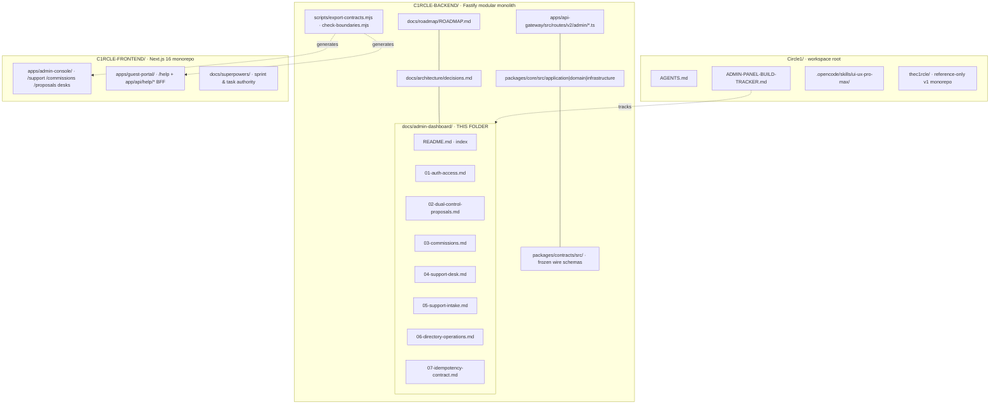
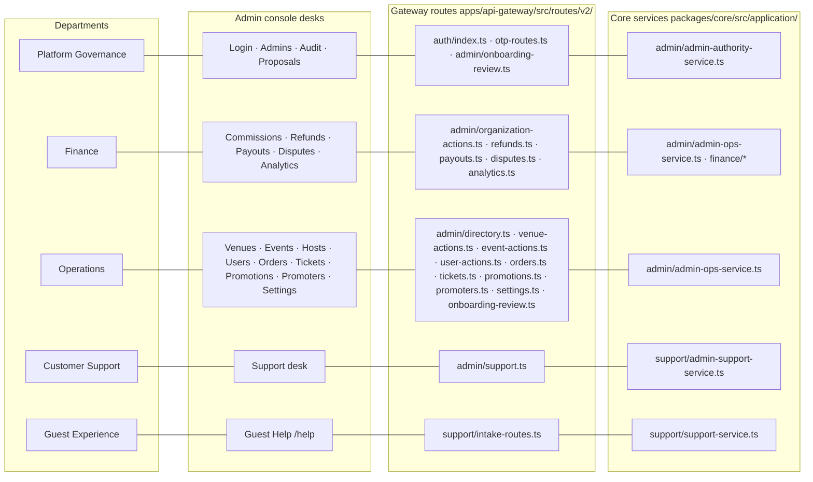

<!--
agent-metadata:
  doc: admin-dashboard/README
  kind: index
  department: all
  purpose: Dept map, tier model, repo structure, diagram inventory, agent-readability conventions, verification gates.
  diagrams: [D1-repo-structure, D2-dept-map, D3-tier-model]
  agent-readability: Mermaid (flowchart/sequence/state/class) + tables; every doc H1->H2 skeleton; metadata block above.
-->

# C1RCLE V2 — Admin Dashboard · Department Documentation (Index)

> **Living documentation** for the platform admin surface of the API gateway
> (`C1RCLE-BACKEND`). Every desk in the Admin Console maps to a **department**,
> a **route file**, a **core service**, and a **contract**.
> Verified against live code 2026-09-21, real Firestore `thec1rcle-india`.
> Binding authority: `docs/architecture/decisions.md` → live code.
> Wire contract **FROZEN**; the frontend mirror is generated
> (`scripts/export-contracts.mjs`), never hand-edited.

---

## 1. Repository structure — with every doc (diagrammed)

**Diagram D1 — repo tree, including this doc folder.**



Each doc file is one pull-request-sized unit; each carries its own diagrams
and metadata block (see §6).

---

## 2. The departments and their desks

**Diagram D2 — department → desks → route files → core services.**



| Dept | Platform roles | Console desks | Route files (src/routes/v2/) | Core service (packages/core/src/application/) |
|---|---|---|---|---|
| **Platform Governance** | `super`, `admin` | Login/Auth, Admins, Audit, Proposals | `auth/index.ts`, `otp-routes.ts`, `admin/onboarding-review.ts` | `admin/admin-authority-service.ts` |
| **Finance** | `finance`, `admin`, `super` | Commissions, Refunds, Payouts, Disputes, Analytics | `admin/organization-actions.ts`, `refunds.ts`, `payouts.ts`, `disputes.ts`, `analytics.ts` | `admin/admin-ops-service.ts`, `finance/*` |
| **Operations** | `ops`, `admin`, `finance`, `super` | Venues, Events, Hosts, Users, Orders, Tickets, Promotions, Promoters, Settings | `admin/directory.ts`, `venue-actions.ts`, `event-actions.ts`, `user-actions.ts`, `orders.ts`, `tickets.ts`, `promotions.ts`, `promoters.ts`, `settings.ts`, `onboarding-review.ts` | `admin/admin-ops-service.ts` |
| **Customer Support** | any active admin (TIER1) | Support desk | `admin/support.ts` | `support/admin-support-service.ts` |
| **Guest Experience** | — (guest/requester) | Guest Help intake (guest-portal) | `support/intake-routes.ts` (+ frontend BFF `app/api/help/*`) | `support/support-service.ts` |
| **Cross-cutting** | all | every mutation POST/PATCH/DELETE | all admin mutation routes | `idempotency/idempotency-service.ts`, `lib/v2-idempotency.ts` |

> **Authority rule (non-negotiable):** a platform admin is keyed by the Better
> Auth user id and is **never** inferred from an organization role. Every admin
> action passes `AdminAuthorityService.requireAdmin` → `authorize` (tier) →
> `record` (audit). No exceptions.

---

## 3. The tier model — one picture

**Diagram D3 — TIER1 / TIER2 / TIER3 (dual control).**

```mermaid
flowchart TD
    A["AdminAuthorityService.authorize(userId, action)"] --> B{tierOf(action)}
    B -->|"TIER1"| C1["Any active admin may act · merely logged, always audited"]
    B -->|"TIER2"| C2{role in super · admin · ops · finance?}
    B -->|"TIER3 · requiresDualControl"| C3{{role === super ?}}
    C2 -->|yes| D["ALLOW"]
    C2 -->|no| E["ForbiddenError"]
    C3 -->|yes via 2 admins| D
    C3 -->|no| E
    C1 --> D

    subgraph T1["TIER1 actions"]
        L1["EVENT_PAUSE · EVENT_RESUME · EVENT_FORCE_PAUSE"]
        L2["Every Support-desk mutation (SUPPORT_*)"]
    end
    subgraph T2["TIER2 actions"]
        M1["ONBOARDING_APPROVE · VENUE_SUSPEND/REINSTATE · ORGANIZATION_SUSPEND/REINSTATE"]
        M2["PROMOTER_SUSPEND/REINSTATE · FINANCIAL_REFUND · PAYOUT_BATCH_RUN · DISPUTE_RESOLVE · USER_BAN/UNBAN"]
    end
    subgraph T3["TIER3 actions · super only · dual control"]
        N1["ADMIN_PROVISION · ADMIN_ROLE_UPDATE · COMMISSION_ADJUST · PAYOUT_FREEZE · PAYOUT_RELEASE"]
    end
    C1 -.-> T1
    C2 -.-> T2
    C3 -.-> T3
```

Domain source: `packages/core/src/domain/models/admin-authority.ts`
(`tierOf`, `canInitiate`, `requiresDualControl`, `assertCanInitiate`).

---

## 4. How to read each doc

Every service doc follows the same H1→H2 skeleton (agent-greppable):

| Section | Contents |
|---|---|
| `## 1. Overview` | Department, tier, why the desk exists |
| `## 2. Business flow E2E` | **Mermaid sequence diagram** + numbered human walkthrough |
| `## 3. Stack` | Layer table (route → service → domain → contract → frontend) |
| `## 4. Code logic` | **Mermaid flowcharts/state diagrams** + explanations |
| `## 5. Methods reference` | Machine-readable tables: method/path, purpose, tier, idempotent, audited |
| `## 6. Verification` | Unit/E2E commands and local click-through hints |

| Doc | Service |
|---|---|
| [`01-auth-access.md`](01-auth-access.md) | Authentication, RBAC tiers, admin lifecycle, audit trail |
| [`02-dual-control-proposals.md`](02-dual-control-proposals.md) | TIER3 proposal engine (raise → approve → execute) |
| [`03-commissions.md`](03-commissions.md) | Commissions desk — `COMMISSION_ADJUST` end-to-end |
| [`04-support-desk.md`](04-support-desk.md) | Support ticket desk — lifecycle, SLA, merge |
| [`05-support-intake.md`](05-support-intake.md) | Guest Help intake + cookie-forward BFF |
| [`06-directory-operations.md`](06-directory-operations.md) | Directory reads, direct TIER2 commands, analytics, exports, lookup |
| [`07-idempotency-contract.md`](07-idempotency-contract.md) | Idempotency-Key + frozen wire contract conventions |

---

## 5. Diagram inventory

Every Mermaid block has an ID (caption) so agents and humans can address it.

| Doc | Diagrams (D1…) |
|---|---|
| `README.md` | D1 repo structure · D2 dept map · D3 tier model |
| `01-auth-access.md` | D1 sign-in sequence · D2 TIER3 double-sign sequence · D3 authorize flowchart · D4 admin lifecycle state |
| `02-dual-control-proposals.md` | D1 proposal FSM state · D2 raise→approve→execute sequence · D3 execute-from-proposal flowchart |
| `03-commissions.md` | D1 E2E sequence · D2 execute route pipeline flowchart · D3 adjustCommissionFromProposal flowchart |
| `04-support-desk.md` | D1 ticket FSM state · D2 ticket lifecycle sequence · D3 aggregate class diagram · D4 mutation pattern flowchart |
| `05-support-intake.md` | D0 one-ticket-object · D1 guest submit sequence · D2 BFF pipeline flowchart · D3 follow-up sequence |
| `06-directory-operations.md` | D1 read-list flowchart · D2 direct-command flowchart · D3 suspend-org sequence · D4 analytics/export flow |
| `07-idempotency-contract.md` | D1 executeOnce sequence (3 paths) · D2 runIdempotent flowchart · D3 contract ownership graph |

---

## 6. Agent-readability conventions (applies to every file in this folder)

1. **Metadata block** — each file opens with an `<!-- agent-metadata: … -->`
   comment: `doc`, `department`, `tier`, `purpose`, `diagrams`. YAML-ish,
   render-invisible, grep-parseable.
2. **Mermaid, not ASCII** — all diagrams are fenced ` ```mermaid ` blocks
   (GitHub renders; agents parse). No ASCII-art boxes in prose.
3. **One skeleton** — the H1→H2 sections in §4 are identical order everywhere.
4. **Tables for facts** — routes, methods, tiers, DTOs are always tables
   (`| a | b |`), never prose lists.
5. **IDs on diagrams** — `**Diagram Dn — <caption>**` immediately above each
   block; captions are also listed in each file's metadata.
6. **Paths, not prose** — every code touchpoint is a repo-relative path.

---

## 7. Stack summary (world-class bits)

- **Gateway**: Fastify 5, TypeScript (ESM), `tsx watch` dev.
- **Auth**: Better Auth 1.x (`better-auth` + `better-auth-firestore`) —
  httpOnly session cookie (`sameSite=lax`, host-only, 7-day expiry, 1-day
  updateAge), `bearer()` plugin, email/password; built only when
  `STORAGE_DRIVER=firestore` (`plugins/auth.ts`).
- **Frozen wire contract** (`@c1rcle/contracts`): single → bare DTO; list →
  `{ items, pageInfo }`; errors → flat `{ code, message, status, requestId,
  fieldErrors? }`; money = integer paise; `AdminAuditRecord.occurredAt` =
  epoch ms (the one epoch-ms field); `Idempotency-Key` per intent; `If-Match`
  on versioned PATCH/PUT; never a `role` in a request body.
- **Boundaries (mechanically enforced)**: `packages/core` never imports
  Fastify / `process.env` / `firebase-admin`; route files never call
  `.collection()`/`.doc()`; `scripts/check-boundaries.mjs` + `pnpm check`
  gate every change.
- **Storage drivers**: `STORAGE_DRIVER=memory` (hermetic tests/CI) vs
  `firestore` (dev + prod, real `thec1rcle-india`, `v2_*` collections).

---

## 8. Verification gates

```bash
# backend (from C1RCLE-BACKEND)
pnpm check                    # format → lint → typecheck → boundaries → test → build
pnpm contract-parity          # 176 frontend-mirror checks

# frontend (from C1RCLE-FRONTEND)
pnpm --filter @c1rcle/app-admin-console lint typecheck test build
pnpm --filter @c1rcle/app-guest-portal  lint typecheck test build
```

Local E2E click-through runs against real Firestore (`thec1rcle-india`); each
service doc's §6 has the walkthrough.