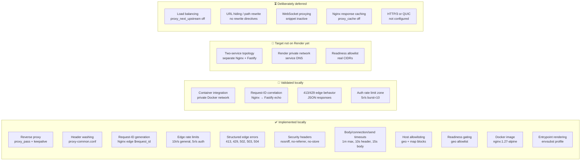
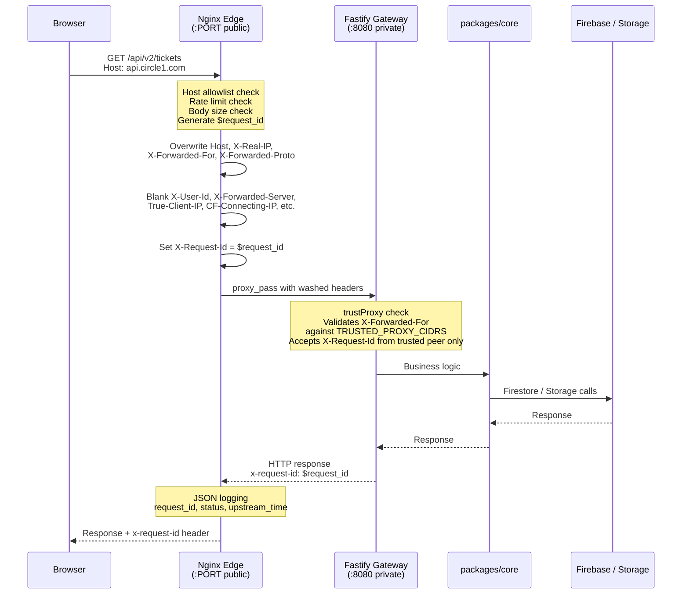
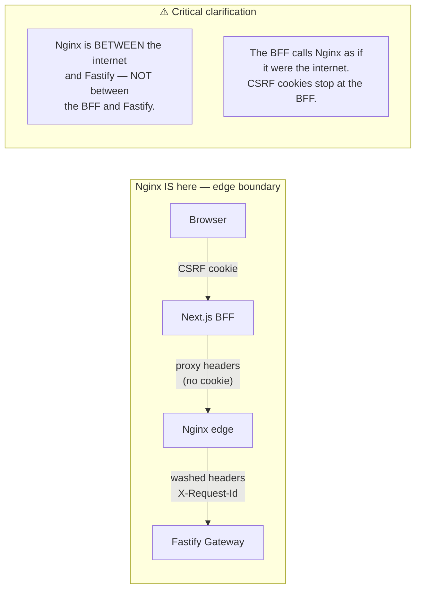

# C1RCLE Nginx Edge Documentation

> **Last verified:** `a908dbe` — 2026-09-10 — run `bash docs/nginx/regenerate.sh` to refresh

Nginx is the edge reverse-proxy boundary sitting in front of the Fastify API
gateway. It is **not** a second application layer — it does not make auth
decisions, write Firestore, or retry API requests. Its job is to:

- Wash forwarded headers so only trusted values reach Fastify
- Generate and correlate request IDs for end-to-end tracing
- Apply edge rate limits before traffic hits application code
- Return structured JSON errors for 413/429/502/503/504
- Terminate TLS in the production profile
- Serve as the single public listener while Fastify stays private

---

## Status Matrix



## Topology: Current vs Interim vs Target

```mermaid
graph TD
  subgraph Current["Current Live Render (interim sidecar)"]
    direction LR
    Browser1[Browser / Client] -->|HTTPS| RenderEdge1[Render TLS termination]
    RenderEdge1 -->|HTTP :PORT| Nginx1[Nginx public listener]
    Nginx1 -->|loopback| Fastify1[Fastify same container]
    Fastify1 --> Firebase1[Firebase / Firestore]
  end

  subgraph Interim["Interim plan (sidecar, budget tier — see sidecar-deployment.md)"]
    direction LR
    Browser3[Browser / Client] -->|HTTPS| RenderEdge3[Render TLS termination]
    RenderEdge3 -->|HTTP :PORT| Nginx3["Nginx (same container)<br/>public 0.0.0.0:$PORT"]
    Nginx3 -->|"loopback only"| Fastify3["Fastify (same container)<br/>127.0.0.1:8081"]
    Fastify3 --> Firebase3[Firebase / Firestore]
  end

  subgraph Target["Target (two-service, needs paid Render plan, local-validated)"]
    direction LR
    Browser2[Browser / Client] -->|HTTPS| RenderEdge2[Render TLS termination]
    RenderEdge2 -->|HTTP :PORT| Nginx2[Nginx container<br/>public listener]
    Nginx2 -->|HTTP :8080<br/>private service DNS| Fastify2[Fastify container<br/>private, no host port]
    Fastify2 --> Firebase2[Firebase / Firestore]
  end

  style Current fill:#fee,stroke:#f66
  style Interim fill:#fff0e0,stroke:#c90
  style Target fill:#efe,stroke:#6a6
```



## Request Flow Through Nginx



## Where Nginx Sits (and Where It Does Not)



**Nginx is not between the Next.js BFF and the Fastify gateway.** The BFF
makes server-side API calls through Nginx just like any other client. The
CSRF/cookie boundary is at the BFF; by the time a request reaches Nginx,
it is an HTTP request with standard proxy headers — no cookies for Nginx
to care about.

## File Navigation

| Document | What It Covers |
|---|---|
| [`sota-architecture.md`](./sota-architecture.md) | Definitive full-edge blueprint: invariants, target topology, BFF two-URL model, config map |
| [`architecture.md`](./architecture.md) | Full topology diagrams, container layout, trusted-proxy boundary, BFF relationship |
| [`reverse-proxy.md`](./reverse-proxy.md) | Header washing, smuggling prevention, request-ID lifecycle, proxy-common.conf |
| [`load-balancing.md`](./load-balancing.md) | Load balancing status: NOT implemented, dependency tree, what's needed |
| [`url-hiding-rerouting.md`](./url-hiding-rerouting.md) | URL hiding / path rewriting status: NOT implemented, gap analysis |
| [`config-reference.md`](./config-reference.md) | Every file in deploy/nginx/ explained with include hierarchy diagram |
| [`deployment.md`](./deployment.md) | Render two-service + full-edge topology, env contract, step-by-step rollout |
| [`sidecar-deployment.md`](./sidecar-deployment.md) | **Interim budget-tier topology, in current use** — nginx + Fastify in one Render Web Service (Render Private Service is a paid tier), the decision record for why, and the exact bidirectional switch procedure to/from the real two-service topology |
| [`migration-plan.md`](./migration-plan.md) | Step-by-step path from Vercel BFFs to the private full-edge network |
| [`integration-checklist.md`](./integration-checklist.md) | Backend ↔ frontend concerns, env vars, CSRF, rate-limit tuning, CORS |
| [`issues-and-gaps.md`](./issues-and-gaps.md) | All open items, blockers, deferred work, known limitations |

## Related Operations Docs

| Document | Path |
|---|---|
| Nginx design doc | [`../operations/nginx.md`](../operations/nginx.md) |
| Implementation status | [`../operations/nginx-implementation-status.md`](../operations/nginx-implementation-status.md) |
| Deployment boundary | [`../operations/deployment.md`](../operations/deployment.md) |
| Staging env contract | [`../operations/staging-environment-contract.md`](../operations/staging-environment-contract.md) |
| Render staging topology | [`../operations/render-staging.md`](../operations/render-staging.md) |
| Staging checklist | [`../operations/staging-checklist.md`](../operations/staging-checklist.md) |
| Rollback procedure | [`../operations/rollback.md`](../operations/rollback.md) |

## Config Source Files

All nginx config lives under `deploy/nginx/` in the repository:

```
deploy/nginx/
├── nginx.conf                          # Global: worker, logging, compression, timeouts
├── conf.d/
│   └── api.conf                        # Local HTTP profile (dev only)
├── snippets/
│   ├── api-locations.conf              # Health, readiness, version, API routing, edge errors
│   ├── proxy-common.conf               # API header forwarding + smuggling prevention
│   ├── proxy-bff-common.conf           # BFF passthrough (preserves cache, washes identity headers)
│   ├── rate-limits.conf                # Edge rate limit zones
│   ├── security-headers.conf           # API-safe security headers (incl. no-store)
│   ├── security-headers-bff.conf       # BFF-safe headers (nosniff + no-referrer only)
│   ├── tls-common.conf                 # http-context TLS policy (production full-edge)
│   └── websocket.conf                  # Inactive WebSocket policy
├── templates/
│   ├── staging.conf.template           # HTTP-only staging API edge (envsubst rendered)
│   ├── production.conf.template        # HTTPS production API edge (envsubst rendered)
│   ├── staging-edge.conf.template      # full-edge staging: API + guest/partner/admin BFF blocks
│   └── production-edge.conf.template   # full-edge production: HTTPS + HSTS + redirect
└── tests/
    └── run-local-validation.sh         # Local container validation
```

Topology selection: `NGINX_TOPOLOGY=api-only` (default, unchanged behavior) or
`full-edge` (adds BFF server blocks; see
[`sota-architecture.md`](./sota-architecture.md) and
[`deployment.md`](./deployment.md)).

## For AI Agents Reading This

- **Source of truth:** The actual files under `deploy/nginx/` and
  `apps/api-gateway/src/` — not these docs. Cross-check before acting.
- **Freshness:** Run `bash docs/nginx/regenerate.sh` to verify all files
  against the current staging commit. If the commit in `_freshness.json`
  does not match `git rev-parse HEAD`, these docs may be stale.
- **No implicit knowledge:** Every fact here is derived from the codebase.
  If something is not documented, it is either not implemented or not known.
- **Diagrams render on GitHub:** All Mermaid blocks render natively on
  github.com. For local viewing use a Mermaid preview extension.
