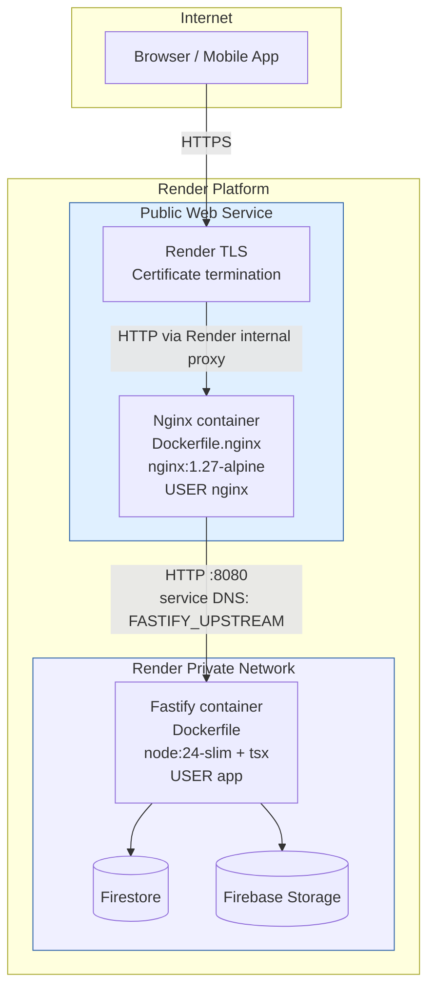
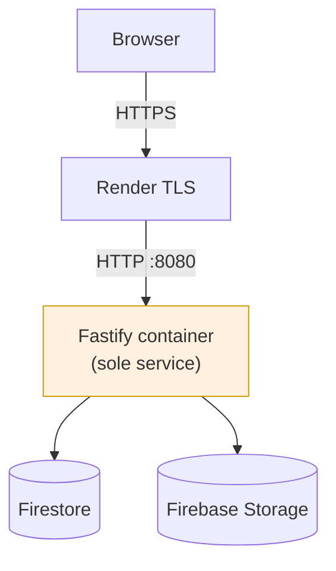
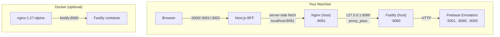
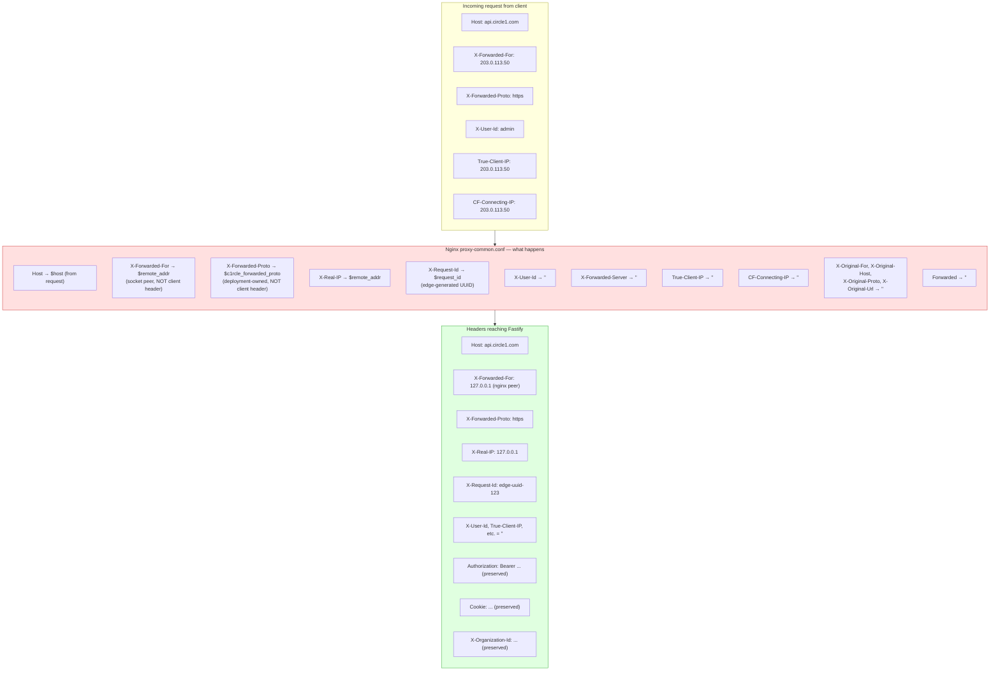
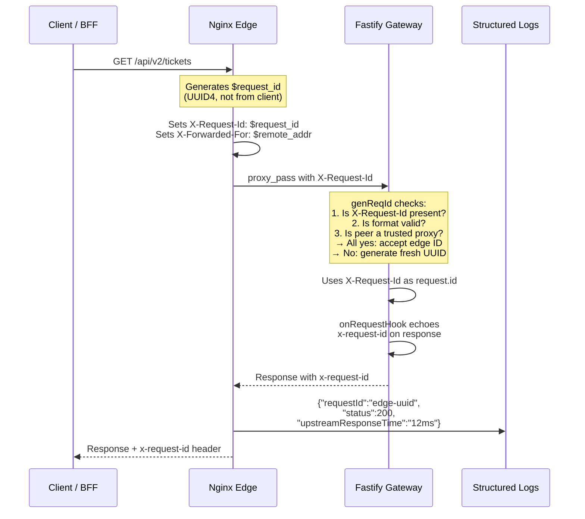
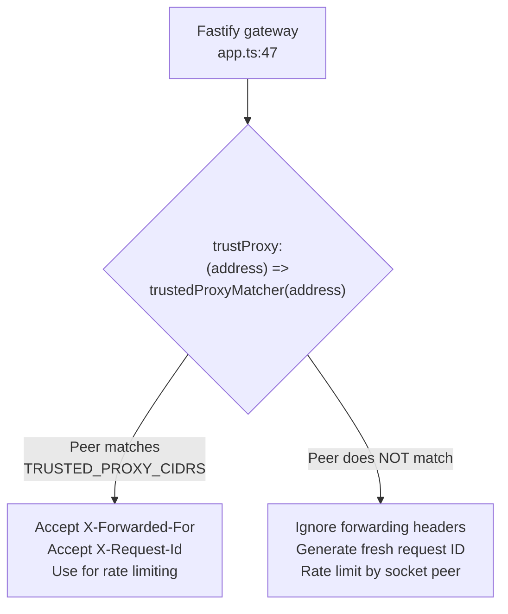
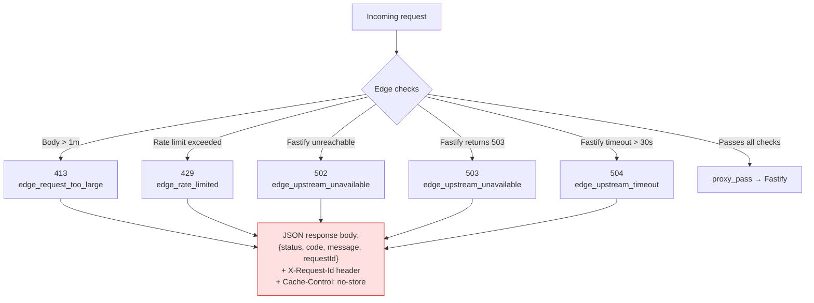
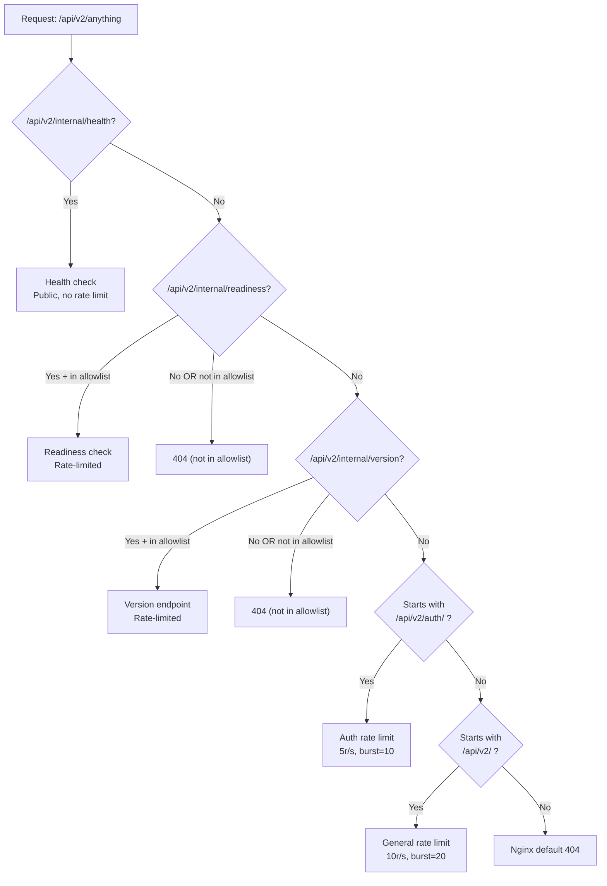

# Architecture

> **Last verified:** `69687f7` — 2026-09-09 — run `bash docs/nginx/regenerate.sh` to refresh

This document describes the full nginx architecture: where it sits, what it
touches, and what it deliberately does not touch.

---

## Container Layout

### Target: Two-Service Private Network

**Key facts:**
- Nginx runs as a **Web Service** (public) on Render
- Fastify runs as a **Private Service** (not publicly accessible)
- Fastify port `8080` is **never** host-mapped — only reachable via private
  service DNS (`FASTIFY_UPSTREAM`)
- Render reserves private-network port `10000` — Fastify uses `8080`
- Both containers are on the same private Docker network

### Current: Single-Service (Live on Render)

This is the current live topology. Nginx exists in the codebase and is
locally validated, but the live Render service has not been rewired yet.
See [`../operations/nginx-implementation-status.md`](../operations/nginx-implementation-status.md).

---

## Local Development Topology

**Local development** uses the host-installed Nginx profile:
- `deploy/nginx/conf.d/api.conf` — hardcoded `127.0.0.1:8080` upstream
- Nginx listens on `:8081`
- No TLS, no template rendering, no envsubst
- Readiness allowlist is open (`geo default 1`)

---

## The Trusted-Proxy Boundary

The most important security property of the nginx layer: **Nginx overwrites
all identity headers** so Fastify only sees values it trusts.

### What Nginx Overwrites (trust boundary)

| Header | Nginx sets to | Source |
|---|---|---|
| `Host` | `$host` | Client request Host header |
| `X-Real-IP` | `$remote_addr` | Socket peer address |
| `X-Forwarded-For` | `$remote_addr` | Socket peer address (NOT appended) |
| `X-Forwarded-Proto` | `$c1rcle_forwarded_proto` | Deployment-owned map, NOT client header |
| `X-Forwarded-Host` | `$host` | Client request Host header |
| `X-Request-Id` | `$request_id` | Nginx-generated edge UUID |

### What Nginx Blanks (prevents spoofing)

| Header | Set to |
|---|---|
| `X-User-Id` | `""` |
| `X-Forwarded-Server` | `""` |
| `X-Forwarded-Port` | `""` |
| `X-Forwarded-Ssl` | `""` |
| `Forwarded` | `""` |
| `X-Original-For` | `""` |
| `X-Original-Host` | `""` |
| `X-Original-Proto` | `""` |
| `X-Original-Url` | `""` |
| `X-Client-IP` | `""` |
| `True-Client-IP` | `""` |
| `CF-Connecting-IP` | `""` |

### What Nginx Preserves (application contract)

| Header | Reason |
|---|---|
| `Authorization` | Bearer token for Better Auth |
| `Cookie` | Session cookies (BFF passes them) |
| `X-Organization-Id` | Multi-tenant scope |
| `Idempotency-Key` | Mutation deduplication |
| `If-Match` | ETag/optimistic concurrency |
| `X-Client-Request-Id` | Client-side request correlation |
| `Content-Type` | Request body format |
| `Content-Length` | Request body size |

---

## Request-ID Lifecycle

**Key properties:**
- Nginx is the **authoritative generator** of request IDs
- Fastify only accepts an incoming `X-Request-Id` if the socket peer is a
  configured trusted proxy (CIDR match via `TRUSTED_PROXY_CIDRS`)
- Client-provided `X-Request-Id` values are **ignored** for non-trusted peers
- Request IDs appear in: Nginx JSON logs, Fastify error envelopes, response
  headers

---

## Fastify's Trust Configuration

Nginx does not make the trusted-proxy decision for Fastify. Fastify has its
own `trustProxy` setting that checks the socket peer against
`TRUSTED_PROXY_CIDRS`.

**Configuration:** `apps/api-gateway/src/config/index.ts` — `TRUSTED_PROXY_CIDRS`
env var, comma-separated CIDR list. `/0` (unrestricted) is rejected at cold start.

**Default for local dev:** `127.0.0.1,::1` — the localhost peers (Nginx and
Fastify run on the same machine).

**Required for staging:** The actual Nginx container's private IP range on the
Render private network.

---

## Edge Error Response Flow

When Nginx itself generates an error (before or instead of proxying to Fastify),
it returns structured JSON:

All edge errors include:
- `X-Request-Id` header (the Nginx-generated edge ID)
- `Cache-Control: no-store`
- Security headers (nosniff, no-referrer)
- JSON body with `status`, `code`, `message`, `requestId`

---

## Location Matching Order

Nginx evaluates locations in this order (first match wins):

**Three tiers of routing:**
1. **Exact matches** (`location =`): health, readiness, version — highest priority
2. **Prefix match with priority** (`location ^~`): `/api/v2/auth/` catches auth
   routes before the general `/api/v2/` prefix
3. **General prefix** (`location ^~`): `/api/v2/` catches everything else

**Security note:** `/api/v2/internal/readiness` and `/api/v2/internal/version`
return `404` when the requesting IP is not in `NGINX_READINESS_TOKEN`.
This prevents internal deployment metadata from being publicly visible.
