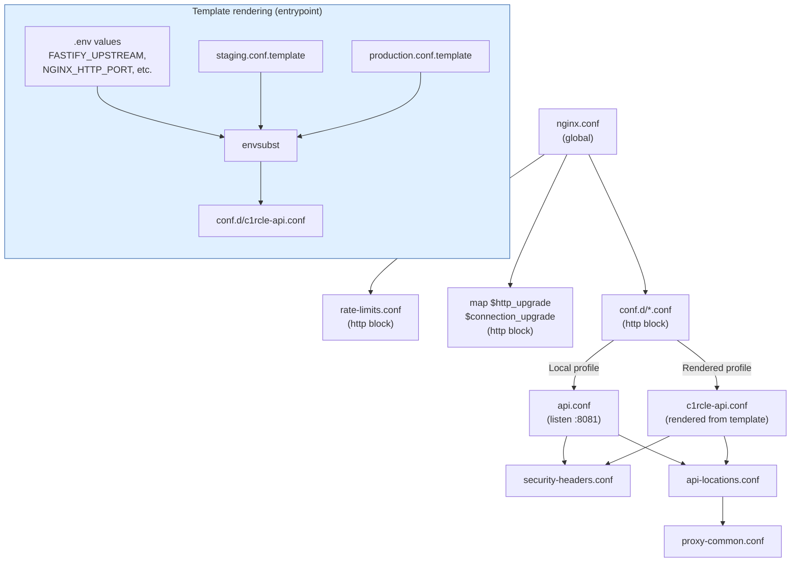
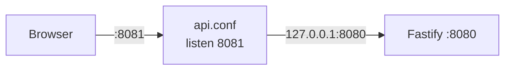
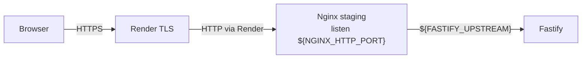
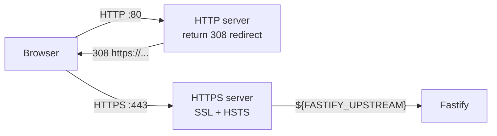
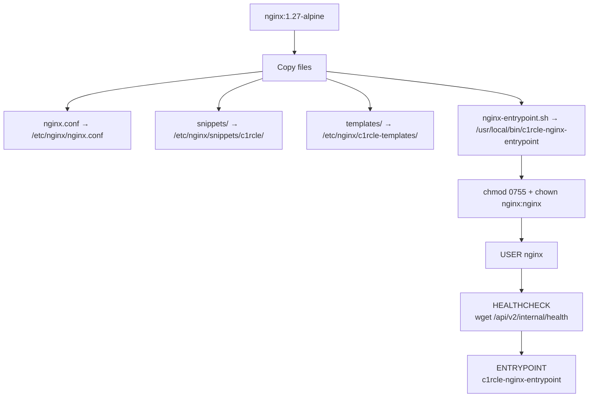
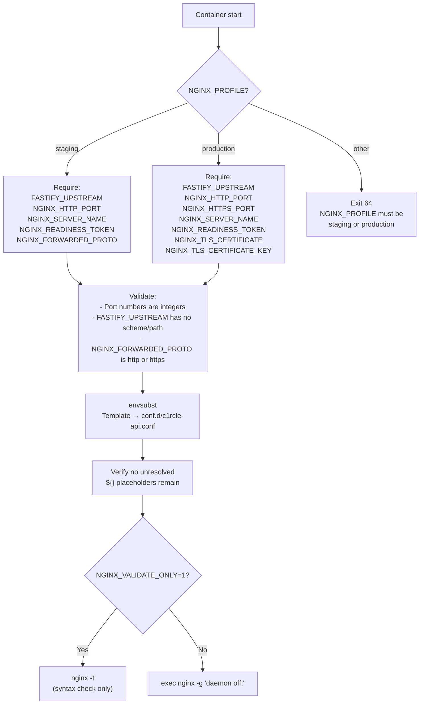

# Configuration Reference

> **Last verified:** `a908dbe` — 2026-09-10 — run `bash docs/nginx/regenerate.sh` to refresh

This document maps every file under `deploy/nginx/` to its purpose, explains
the include hierarchy, and documents the entrypoint rendering pipeline.

---

## Include Hierarchy



**Resolution order:**
1. `nginx.conf` loads `rate-limits.conf` in the `http` block
2. `nginx.conf` loads `conf.d/*.conf` — either the local `api.conf` or a
   rendered `c1rcle-api.conf` from the entrypoint
3. Each server block in the loaded conf includes `security-headers.conf`
   and `api-locations.conf`
4. `api-locations.conf` includes `proxy-common.conf` for each `proxy_pass`

---

## File-by-File Reference

### `nginx.conf` — Global Configuration

**Path:** `deploy/nginx/nginx.conf`

**Purpose:** Worker process configuration, logging format, compression, timeouts,
and the rate-limit zone declarations. This file is never rendered by envsubst —
it is copied verbatim into the Docker image.

| Directive | Value | Why |
|---|---|---|
| `worker_processes auto` | One worker per CPU core | Standard for multi-core |
| `pid /tmp/nginx.pid` | Non-root pid file location | Container runs as `USER nginx` |
| `worker_connections 1024` | Max concurrent connections per worker | Conservative starting point |
| `server_tokens off` | Hide Nginx version | Security — prevent version fingerprinting |
| `log_format c1rcle_json` | JSON structured logging | Machine-parseable, no query string or body logged |
| `client_header_timeout 10s` | Max time for headers | Prevent slow-client attacks |
| `client_body_timeout 15s` | Max gap between body chunks | Prevent slow-body attacks |
| `large_client_header_buffers 4 8k` | 4 buffers × 8KB = 32KB max headers | Accommodate large cookies |
| `send_timeout 30s` | Max time to send response | Prevent slow-download attacks |
| `keepalive_timeout 65s` | Idle connection timeout | Reasonable default |
| `gzip on` | Enable compression | Reduce response sizes |
| `gzip_comp_level 5` | Moderate compression | Balance CPU vs ratio |
| `gzip_min_length 1024` | Don't compress tiny responses | Overhead not worth it |
| `gzip_types` | json, js, problem+json, css, plain, xml | API response types |

**What it includes:**
- `snippets/c1rcle/rate-limits.conf` — rate-limit zone declarations
- `conf.d/*.conf` — the active server profile (local or rendered)

---

### `conf.d/api.conf` — Local HTTP Profile

**Path:** `deploy/nginx/conf.d/api.conf`

**Purpose:** Host-installed Nginx profile for local development. Hardcoded to
`127.0.0.1:8080`, listens on `:8081`, no TLS, open readiness allowlist.



| Setting | Value | Notes |
|---|---|---|
| `upstream c1rcle_fastify` | `127.0.0.1:8080` | Hardcoded for local |
| `listen` | `8081` | Non-default to avoid port conflicts |
| `server_name` | `localhost` | Only accepts localhost |
| `client_max_body_size` | `1m` | Same as production |
| `c1rcle_readiness_allowed` | `geo default 1` | Open for local testing |
| `c1rcle_host_allowed` | `localhost → 1, default 0` | Only allows localhost |

---

### `templates/staging.conf.template` — HTTP-Only Staging

**Path:** `deploy/nginx/templates/staging.conf.template`

**Purpose:** Rendered at container start by `nginx-entrypoint.sh`. All values
are injected via `envsubst`. No TLS — Render handles TLS termination.

**Variables substituted:**
- `${FASTIFY_UPSTREAM}` — private Fastify service DNS (e.g., `fastify:8080`)
- `${NGINX_HTTP_PORT}` — public listener (Render injects `PORT`)
- `${NGINX_SERVER_NAME}` — verified staging hostname
- `${NGINX_FORWARDED_PROTO}` — must be `https` for Render
- `${NGINX_READINESS_TOKEN}` — shared secret, required in the `X-Readiness-Token` header to reach `/readiness` and `/version`



**Key difference from production:** `NGINX_FORWARDED_PROTO` is set explicitly
to `https` because Render terminates TLS externally. Nginx does not trust
the client's `X-Forwarded-Proto` header — it uses the deployment-owned value.

---

### `templates/production.conf.template` — HTTPS Production

**Path:** `deploy/nginx/templates/production.conf.template`

**Purpose:** Full HTTPS profile with Nginx-owned TLS. Requires certificate
and key files. Includes HTTP→HTTPS redirect and HSTS.

**Additional variables:**
- `${NGINX_HTTPS_PORT}` — HTTPS listener
- `${NGINX_TLS_CERTIFICATE}` — path to certificate file
- `${NGINX_TLS_CERTIFICATE_KEY}` — path to private key file



**Security properties:**
- `ssl_protocols TLSv1.2 TLSv1.3` — no older protocols
- `ssl_session_cache shared:SSL:10m` — session resumption
- `Strict-Transport-Security max-age=31536000` — 1-year HSTS
- HTTP→HTTPS redirect on port 80

---

### `snippets/proxy-common.conf` — Header Forwarding

**Path:** `deploy/nginx/snippets/proxy-common.conf`

**Purpose:** Included by every `proxy_pass` in `api-locations.conf`. Sets all
forwarded headers, blanks spoofable headers, and configures proxy behavior.

**See:** [`reverse-proxy.md`](./reverse-proxy.md) for the full header analysis.

**Key directives:**
- `proxy_http_version 1.1` + `Connection ""` — keepalive support
- `proxy_set_header` — 24 header directives (overwrite + preserve + blank)
- `proxy_request_buffering on` — buffer body before forwarding
- `proxy_cache off` — never cache
- `proxy_next_upstream off` — no retries (deliberate)
- Timeouts: connect 5s, send 30s, read 30s

---

### `snippets/api-locations.conf` — Routing and Error Pages

**Path:** `deploy/nginx/snippets/api-locations.conf`

**Purpose:** Defines all location blocks (health, readiness, version, auth,
general API), the non-API structured 404 catch-all, and the structured error
page responses.

**See:** [`architecture.md`](./architecture.md) for the location matching order.

**Includes:** `proxy-common.conf` via `include` in each `proxy_pass` location.

---

### `snippets/rate-limits.conf` — Rate Limit Zones

**Path:** `deploy/nginx/snippets/rate-limits.conf`

**Purpose:** Declares three rate-limit zones in the `http` block. These are
shared across all server blocks.

| Zone | Type | Rate | Key | Size |
|---|---|---|---|---|
| `c1rcle_edge_general` | `limit_req_zone` | 10r/s | `$binary_remote_addr` | 10m |
| `c1rcle_edge_auth` | `limit_req_zone` | 5r/s | `$binary_remote_addr` | 10m |
| `c1rcle_edge_connections` | `limit_conn_zone` | per-IP | `$binary_remote_addr` | 10m |

**10m zone size** ≈ 160,000 unique IPs per zone.

---

### `snippets/security-headers.conf` — Security Headers

**Path:** `deploy/nginx/snippets/security-headers.conf`

**Purpose:** Adds safe security headers to all responses. Intentionally
minimal for an API (no CSP, no X-Frame-Options — those are for HTML pages).

| Header | Value | Why |
|---|---|---|
| `X-Content-Type-Options` | `nosniff` | Prevent MIME sniffing |
| `Referrer-Policy` | `no-referrer` | Don't leak API paths |
| `Cache-Control` | `no-store` | API responses must not be cached |

**HSTS is NOT here** — it is only in the production HTTPS template, because
it should only be set when TLS is verified.

---

### `snippets/websocket.conf` — Inactive WebSocket Policy

**Path:** `deploy/nginx/snippets/websocket.conf`

**Purpose:** Prepared for future WebSocket routes. Currently **not included**
by any server block.

```nginx
proxy_http_version 1.1;
proxy_set_header Upgrade $http_upgrade;
proxy_set_header Connection $connection_upgrade;
proxy_buffering off;
proxy_read_timeout 3600s;  # 1 hour
proxy_send_timeout 30s;
```

**When to enable:** Only when an actual WebSocket route exists and has been
reviewed for security (authentication, connection limits, message validation).

---

### `Dockerfile.nginx` — Docker Image

**Path:** `deploy/docker/Dockerfile.nginx`

**Purpose:** Builds the nginx Docker image from `nginx:1.27-alpine`.



**Build command:** `docker build -f deploy/docker/Dockerfile.nginx -t c1rcle-nginx:local .`

**Key properties:**
- Runs as non-root `nginx` user (security best practice)
- `HEALTHCHECK` verifies Nginx can proxy to Fastify
- Entrypoint renders config from templates at container start
- Pinned image digest for reproducibility

---

### `nginx-entrypoint.sh` — Container Entrypoint

**Path:** `deploy/docker/nginx-entrypoint.sh`

**Purpose:** Renders the nginx config from a template at container start.
Validates required environment variables. Never substitutes arbitrary Nginx
variables like `$host` or `$request_uri`.



**Port fallback:** If `NGINX_HTTP_PORT` is not set but `PORT` is (Render
injects `PORT` for Web Services), `NGINX_HTTP_PORT` is set to `PORT`.

**Safety:** The entrypoint validates that `FASTIFY_UPSTREAM` contains no
scheme, path, query string, or spaces — preventing misconfigured upstreams
from being silently accepted.
