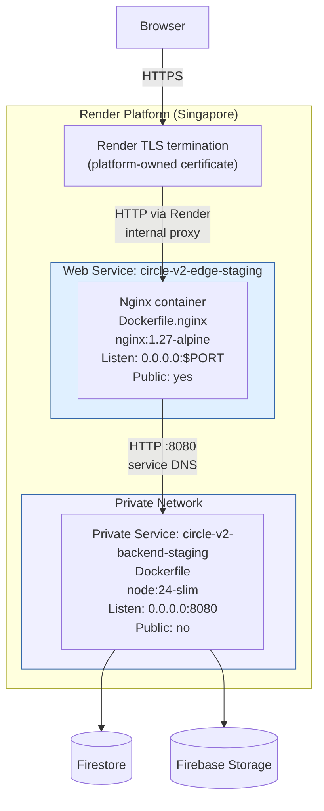
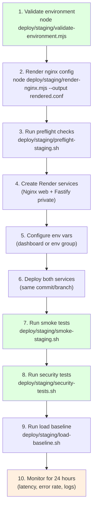
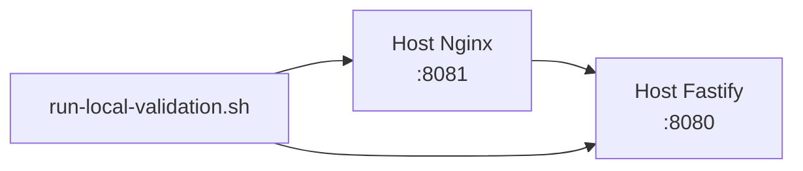
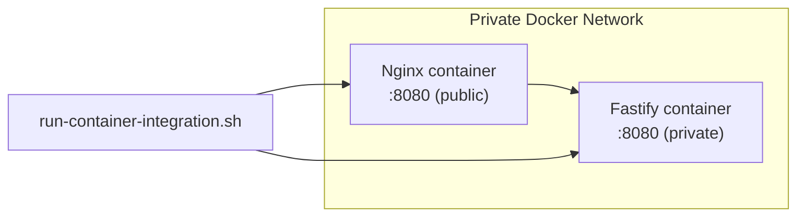
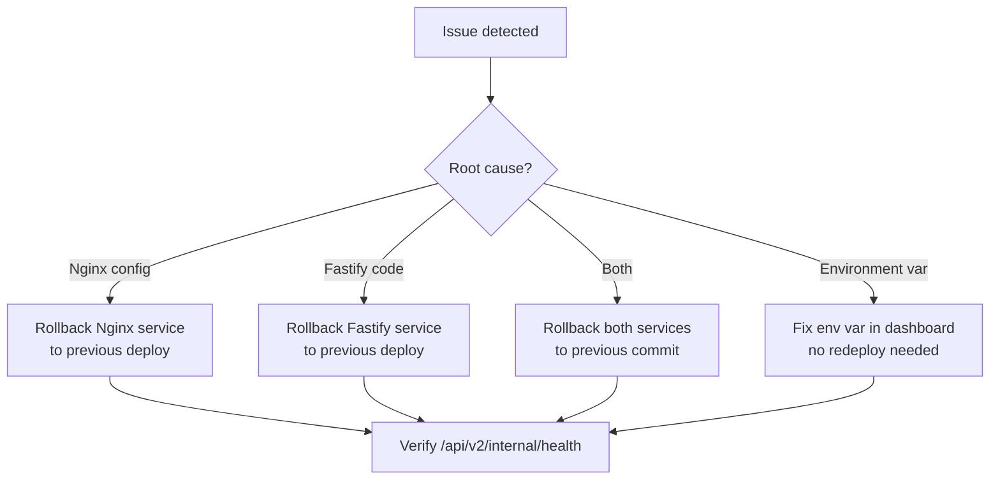

# Deployment Guide

> **Last verified:** `69687f7` — 2026-09-09 — run `bash docs/nginx/regenerate.sh` to refresh

This document covers how to deploy the two-service Nginx + Fastify topology
on Render, and how to validate it locally before pushing.

---

## Render Two-Service Topology



### Service Comparison

| Setting | Nginx Edge (Public) | Fastify Backend (Private) |
|---|---|---|
| **Render name** | `circle-v2-edge-staging` | `circle-v2-backend-staging` |
| **Type** | Web Service | Private Service |
| **Runtime** | Docker | Docker |
| **Dockerfile** | `deploy/docker/Dockerfile.nginx` | `./Dockerfile` |
| **Build context** | Repository root | Repository root |
| **Region** | Singapore | Singapore |
| **Public exposure** | Yes | None |
| **Listener** | `0.0.0.0:$PORT` (Render-injected) | `0.0.0.0:8080` |
| **Health check** | `/api/v2/internal/health` | TCP check only |
| **TLS** | Render-owned | None (private HTTP) |

---

## Environment Variables

### Nginx Edge Service

| Variable | Value | Source |
|---|---|---|
| `NGINX_PROFILE` | `staging` | Dashboard |
| `FASTIFY_UPSTREAM` | `circle-v2-backend-staging:8080` | Dashboard (private DNS) |
| `NGINX_HTTP_PORT` | (omit — Render injects `PORT`) | Render platform |
| `NGINX_SERVER_NAME` | `staging-api.circle1.com` | Dashboard |
| `NGINX_FORWARDED_PROTO` | `https` | Dashboard |
| `NGINX_READINESS_ALLOWLIST_LINES` | `10.0.0.0/8 1;` (actual CIDRs) | Dashboard |

### Fastify Backend Service

| Variable | Value | Source |
|---|---|---|
| `NODE_ENV` | `staging` | Dashboard |
| `PORT` | `8080` | Dashboard |
| `HOST` | `0.0.0.0` | Dashboard |
| `STORAGE_DRIVER` | `firestore` | Dashboard |
| `FIRESTORE_PROJECT_ID` | (secret) | Dashboard |
| `FIREBASE_CLIENT_EMAIL` | (secret) | Dashboard |
| `FIREBASE_PRIVATE_KEY` | (secret) | Dashboard |
| `FIREBASE_STORAGE_BUCKET` | (secret) | Dashboard |
| `BETTER_AUTH_SECRET` | (secret) | Dashboard |
| `BETTER_AUTH_URL` | `https://staging-api.circle1.com` | Dashboard |
| `PUBLIC_API_URL` | `https://staging-api.circle1.com` | Dashboard |
| `ALLOWED_ORIGINS` | `https://staging.circle1.com` | Dashboard |
| `TRUSTED_PROXY_CIDRS` | (Nginx private IP range) | Dashboard |
| `LOG_LEVEL` | `info` | Dashboard |

---

## Step-by-Step Deployment



### Step 1: Validate Environment

```bash
node deploy/staging/validate-environment.mjs
```

This checks:
- All required env vars are set
- No development defaults in staging values
- No CIDR `/0` (unrestricted trust)
- No localhost or example values
- Port numbers are valid integers
- `FASTIFY_UPSTREAM` has no scheme or path

### Step 2: Render Nginx Config

```bash
node deploy/staging/render-nginx.mjs --output rendered.conf
```

Renders `staging.conf.template` with `envsubst` using the validated values.
Preserve `rendered.conf` as a deployment artifact.

### Step 3: Run Preflight Checks

```bash
deploy/staging/preflight-staging.sh
```

Checks:
- Environment validation
- Config render is clean (no unresolved `${}` placeholders)
- DNS resolution for `NGINX_SERVER_NAME`
- Direct Fastify health check (bypassing Nginx)
- Public health check through Nginx
- Readiness endpoint from allowed CIDR

### Step 4: Create Render Services

1. **Fastify (Private Service):**
   - Dashboard → New → Private Service
   - Dockerfile: `./Dockerfile`
   - Branch: staging
   - Region: Singapore
   - No public port

2. **Nginx (Web Service):**
   - Dashboard → New → Web Service
   - Dockerfile: `deploy/docker/Dockerfile.nginx`
   - Branch: staging
   - Region: Singapore
   - Health check path: `/api/v2/internal/health`

### Step 5: Configure Environment

Set all env vars in each service's dashboard. Use Render env groups if
managing multiple environments.

### Step 6: Deploy

Push to the staging branch. Both services auto-deploy if `autoDeploy` is
enabled. Ensure both are on the **same commit**.

### Step 7: Run Smoke Tests

```bash
deploy/staging/smoke-staging.sh
```

Ordered functional checks:
- Health endpoint returns 200
- Readiness endpoint returns 200 (from allowed CIDR)
- Version endpoint returns commit info
- Auth rate limiting returns 429 after burst
- General API routing works through Nginx

### Step 8: Run Security Tests

```bash
deploy/staging/security-tests.sh
```

Checks:
- Host allowlisting (unknown host → 444)
- Readiness from disallowed IP → 404
- Security headers present (nosniff, no-referrer, no-store)
- Smuggling headers blanked (X-User-Id, True-Client-IP, etc.)
- Body size limit (413 on > 1m)
- TLS behavior (if nginx TLS mode)

### Step 9: Run Load Baseline

```bash
deploy/staging/load-baseline.sh --duration 60 --rps 50
```

Measures p50/p95/p99 latency under load. Start conservative and increase
gradually.

### Step 10: Monitor

Watch for 24 hours:
- Latency percentiles (should not regress)
- Error rate (502/503/504 from Nginx edge)
- Nginx access logs (JSON format)
- Fastify application logs
- Certificate expiry (if Nginx-owned TLS)

---

## Local Validation

Before pushing to Render, validate locally:

```bash
# Option 1: Host-process validation
bash deploy/nginx/tests/run-local-validation.sh

# Option 2: Docker container validation
bash deploy/staging/tests/run-container-integration.sh
```

### Host-Process Validation



- Requires Nginx installed on host
- Requires Fastify running on `:8080`
- Tests config syntax, proxy behavior, request-ID, rate limits

### Container Integration



- Builds both Docker images
- Creates isolated private network
- Fastify is NOT host-mapped (only reachable through Nginx)
- Tests real container topology

---

## Rollback Procedure

If staging breaks:



**Render rollback:** Dashboard → Service → Events → click "Rollback" on
the last successful deploy.

**Do not** rollback one service without the other if the commit included
changes to both. Both must be on compatible versions.
