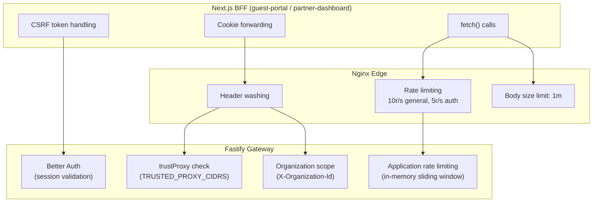
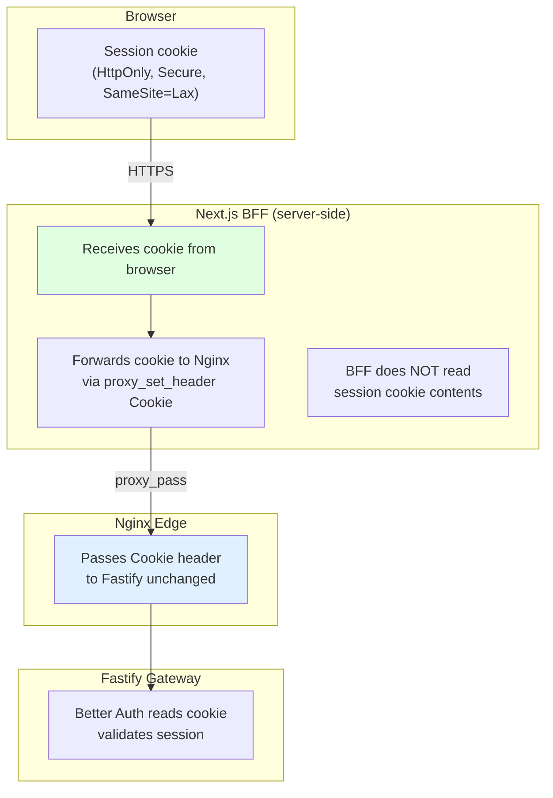
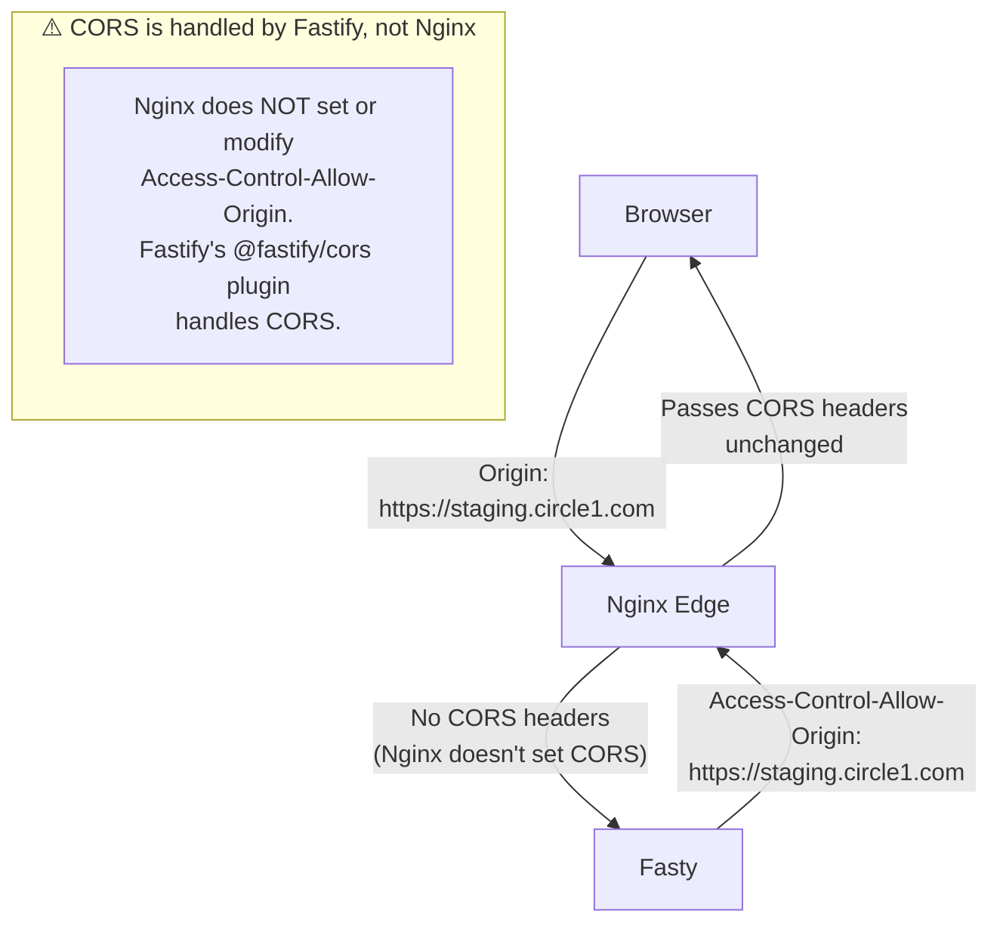
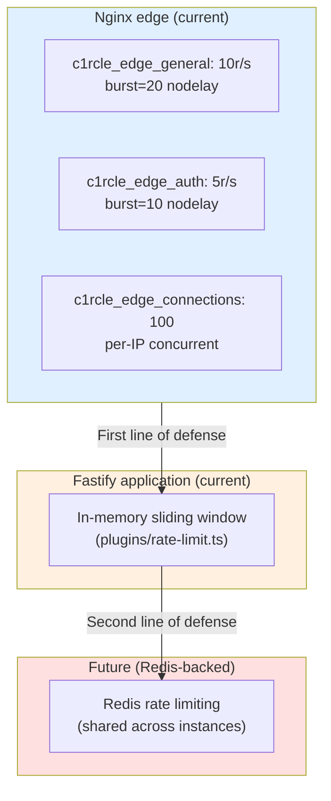
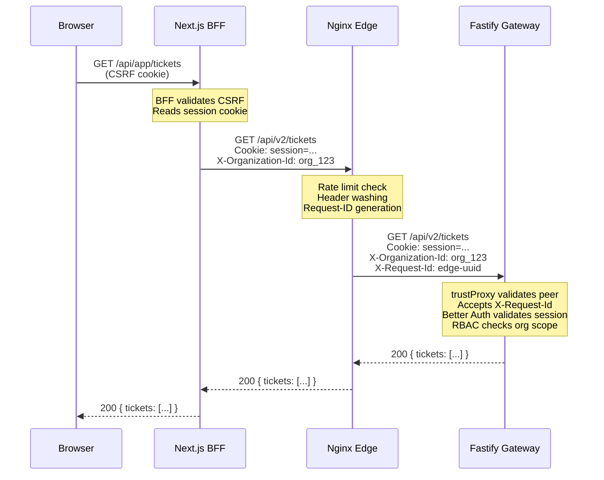
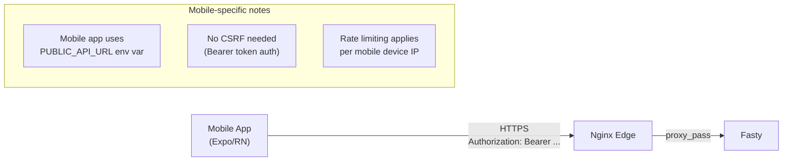

# Integration Checklist

> **Last verified:** `69687f7` — 2026-09-09 — run `bash docs/nginx/regenerate.sh` to refresh

This document covers backend ↔ frontend integration concerns when nginx is
in the picture. Use this as a checklist when wiring the Next.js BFF or
mobile app through the nginx edge.

---

## Env Var Dependencies



---

## CSRF and Cookie Boundary



**Key insight:** The BFF makes server-side HTTP requests to Nginx. The
browser's session cookie is forwarded through the entire chain. Nginx
passes it through unchanged (it is in the "preserve" list in
`proxy-common.conf`).

**What the BFF needs:**
- `NEXT_PUBLIC_API_URL` or equivalent — pointing to the Nginx public URL
  (not Fastify directly)
- CSRF token handling — the BFF generates and validates CSRF tokens for
  browser requests; server-side API calls through Nginx don't need CSRF

---

## CORS Configuration



**Nginx does not interfere with CORS.** The `@fastify/cors` plugin in
Fastify handles all CORS headers. Nginx passes them through unchanged.

**What must be configured:**
- `ALLOWED_ORIGINS` in Fastify env — explicit HTTPS origins, no wildcards
- `BETTER_AUTH_TRUSTED_ORIGINS` — must match allowed origins

---

## Rate Limit Tuning



**Two layers of rate limiting exist:**
1. **Nginx edge:** IP-based, applies before request reaches Fastify
2. **Fastify application:** IP-based or user-based, applied in middleware

**Tuning guidance:**
- Start with Nginx limits as-is (10r/s general, 5r/s auth)
- Monitor 429 rates in Nginx logs after deployment
- Increase only if legitimate traffic is being blocked
- Auth limits should be stricter (login attempts are expensive)

---

## Environment Variable Checklist

### BFF (Next.js)

| Variable | Value | Notes |
|---|---|---|
| `NEXT_PUBLIC_API_URL` | `https://staging-api.circle1.com` | Points to Nginx, not Fastify directly |
| `NEXT_PUBLIC_BASE_URL` | `https://staging.circle1.com` | BFF's own public URL |
| `ALLOWED_ORIGINS` | `https://staging.circle1.com` | Browser origin for CORS |

### Fastify Gateway

| Variable | Value | Notes |
|---|---|---|
| `TRUSTED_PROXY_CIDRS` | (Nginx private IP) | Must match Nginx container's actual IP |
| `ALLOWED_ORIGINS` | `https://staging.circle1.com` | CORS origins |
| `BETTER_AUTH_URL` | `https://staging-api.circle1.com` | Public API URL for auth redirects |
| `PUBLIC_API_URL` | `https://staging-api.circle1.com` | Public API URL |
| `PORT` | `8080` | Private listener, not public |

### Nginx Edge

| Variable | Value | Notes |
|---|---|---|
| `NGINX_PROFILE` | `staging` | |
| `FASTIFY_UPSTREAM` | `circle-v2-backend-staging:8080` | Private service DNS |
| `NGINX_SERVER_NAME` | `staging-api.circle1.com` | Verified hostname |
| `NGINX_FORWARDED_PROTO` | `https` | Render terminates TLS externally |
| `NGINX_READINESS_TOKEN` | 32+ byte random secret | Required in `X-Readiness-Token` header to reach `/readiness`, `/version` |

---

## BFF-to-Nginx Fetch Calls

The BFF makes server-side HTTP requests to Nginx. These requests bypass
the browser entirely.



**Important:** The BFF does NOT add `X-Request-Id` to its server-side
calls. Nginx generates one. The BFF's browser-facing request ID (if any)
is separate from the server-side Nginx request ID.

---

## Mobile App Integration

The mobile app calls Nginx directly (no BFF).



**Mobile-specific considerations:**
- Mobile uses `Authorization: Bearer` tokens, not cookies
- No CSRF protection needed (Bearer tokens are not auto-sent by browsers)
- Rate limiting applies per device IP (cellular IPs are shared — may need
  higher limits for mobile)
- `PUBLIC_API_URL` must point to Nginx, not Fastify directly

---

## Verification Commands

After deployment, verify the integration:

```bash
# Health check through Nginx
curl -s https://staging-api.circle1.com/api/v2/internal/health

# Verify request-ID is present in response
curl -sI https://staging-api.circle1.com/api/v2/internal/health | grep x-request-id

# Verify CORS headers
curl -sI -H "Origin: https://staging.circle1.com" \
  https://staging-api.circle1.com/api/v2/internal/health | grep access-control

# Verify smuggling headers are blanked
curl -s -H "X-User-Id: admin" \
  https://staging-api.circle1.com/api/v2/internal/version

# Verify rate limiting (should get 429 after burst)
for i in $(seq 1 25); do
  curl -s -o /dev/null -w "%{http_code}\n" \
    https://staging-api.circle1.com/api/v2/tickets
done
```
