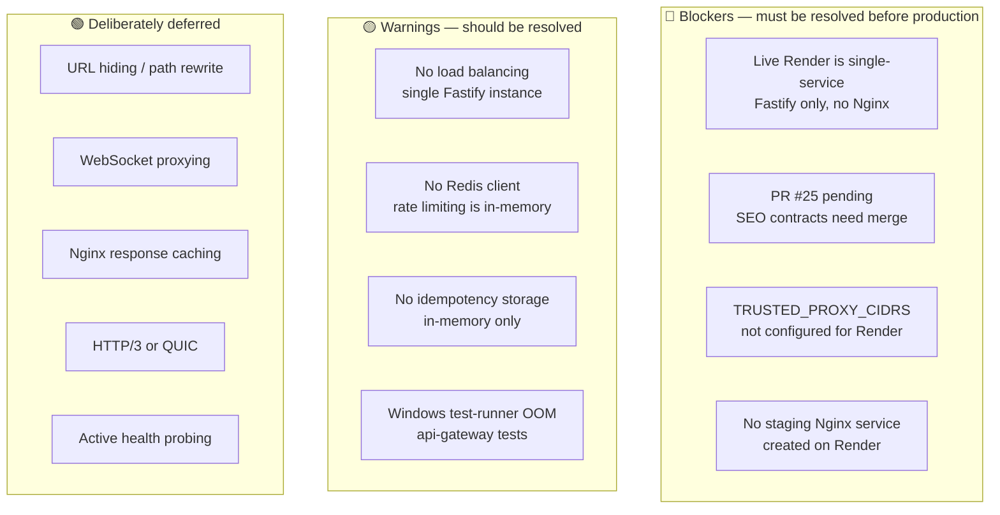
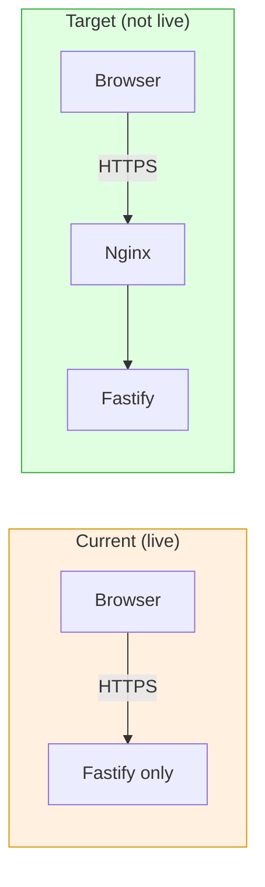
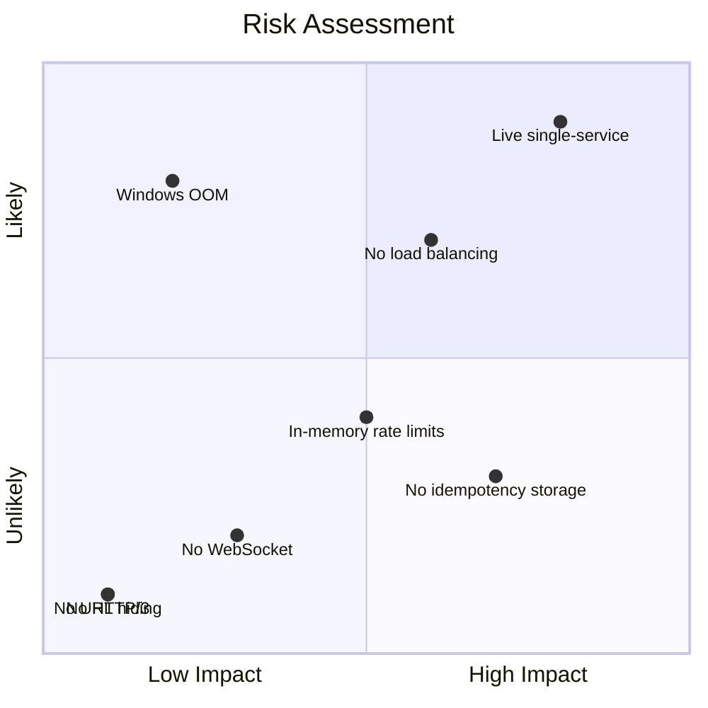

# Issues and Gaps

> **Last verified:** `69687f7` — 2026-09-09 — run `bash docs/nginx/regenerate.sh` to refresh

This document tracks all open items, blockers, deferred work, and known
limitations related to the nginx edge layer.

---

## Current Blockers

---

## Detailed Issue List

### 🔴 Blockers

#### 1. Live Render is Single-Service

**Status:** Not deployed
**Impact:** Nginx exists in codebase and is locally validated, but the live
service at `circle-v2-backend.onrender.com` is still Fastify-only.

**What's needed:**
- Create `circle-v2-edge-staging` Web Service on Render
- Create `circle-v2-backend-staging` Private Service on Render
- Configure env vars per [`deployment.md`](./deployment.md)
- Both services on same commit
- Verify with preflight + smoke + security scripts

#### 2. PR #25 Pending

**Status:** Created, awaiting CI + review
**Impact:** SEO public data contracts from `codex/most-updated-unified` not
yet merged to staging.

**What's needed:**
- CI checks pass (CI OK + Security OK)
- Code review + merge
- Frontend contracts already synced (commit `12715e9` on `codex/partner-v3-rebuild`)

#### 3. TRUSTED_PROXY_CIDRS Not Configured

**Status:** Not set for Render deployment
**Impact:** Fastify will not trust Nginx's forwarded headers. X-Forwarded-For
and X-Request-Id will be ignored.

**What's needed:**
- Determine Nginx container's private IP on Render
- Set `TRUSTED_PROXY_CIDRS` to that CIDR in Fastify env
- Verify `trustProxy` check passes (check Fastify logs for trust errors)

#### 4. No Staging Nginx Service on Render

**Status:** Not created
**Impact:** Cannot test two-service topology on staging

**What's needed:**
- Create the service in Render dashboard
- Set all env vars per the staging contract
- Deploy and verify

---

### 🟡 Warnings

#### 5. No Load Balancing

**Status:** Deliberately deferred
**Impact:** Single Fastify instance handles all traffic. No horizontal scaling.

**When to revisit:** After measuring traffic exceeds single-instance capacity
AND Redis + idempotency are proven. See [`load-balancing.md`](./load-balancing.md).

#### 6. No Redis Client

**Status:** `REDIS_URL` configured but unused
**Impact:** Rate limiting uses in-memory sliding window. Does not persist
across restarts. Not shared across instances.

**When to revisit:** Before enabling load balancing. Redis is required for
shared rate limiting and session storage.

#### 7. Idempotency In-Memory Only

**Status:** Idempotency key header preserved by Nginx, but Fastify stores
in-memory Map
**Impact:** Duplicate prevention lost on restart. Not shared across instances.

**When to revisit:** Before enabling load balancing. Move to Firestore-backed
idempotency storage.

#### 8. Windows Test-Runner OOM

**Status:** Known issue, not blocking
**Impact:** `npx vitest run --project api-gateway` OOMs on Windows. Tests
pass individually and on Linux CI.

**Workaround:** Use `--no-verify` on pre-push hook, run tests individually.
Not a code issue — Windows memory management limitation.

---

### 🟢 Deliberately Deferred

#### 9. URL Hiding / Path Rewrite

**Status:** Not implemented
**Impact:** External URLs show `/api/v2/` prefix. Not a security issue —
the prefix is part of the API contract.

**When to revisit:** If external API consumers (third parties) need cleaner
URLs. See [`url-hiding-rerouting.md`](./url-hiding-rerouting.md).

#### 10. WebSocket Proxying

**Status:** Snippet prepared (`websocket.conf`) but not included
**Impact:** No WebSocket routes exist. When they do, the snippet needs
review and activation.

**When to revisit:** When a WebSocket route is added to Fastify. The snippet
must be reviewed for authentication, connection limits, and message validation.

#### 11. Nginx Response Caching

**Status:** Explicitly disabled (`proxy_cache off`)
**Impact:** No edge caching. Application-level caching is Fastify's
responsibility.

**When to revisit:** If specific read-only endpoints need edge caching
(e.g., public data that changes infrequently). Would require `proxy_cache_path`
and cache zone configuration.

#### 12. HTTP/3 or QUIC

**Status:** Not configured
**Impact:** Only HTTP/1.1 and HTTP/2 supported. HTTP/3 requires Nginx 1.25+
and specific compile options.

**When to revisit:** When browser support justifies the complexity. Not
critical for API-only traffic.

#### 13. Active Health Probing

**Status:** Not implemented
**Impact:** Nginx cannot proactively detect unhealthy Fastify instances.
Relies on passive detection (connection errors, timeouts).

**When to revisit:** Before enabling load balancing. Would need Nginx Plus
or a third-party module for active `health_check` directive.

---

## Known Limitations

| Limitation | Impact | Workaround |
|---|---|---|
| No HSTS in staging | Browsers don't enforce HTTPS | Production template has HSTS |
| No WebSocket support | Real-time features need polling | Add WebSocket route + activate snippet |
| No edge caching | Every request hits Fastify | Acceptable for dynamic API |
| Single upstream | No horizontal scaling | Measured and deliberate |
| `client_max_body_size 1m` | Large uploads rejected | Increase if needed for file uploads |
| No HTTP/2 push | Cannot push related resources | Not relevant for API-only |
| Readiness gated by IP | Cannot test from arbitrary IPs | Add your IP to allowlist |

---

## Stale or Missing Documentation

| Document | Status | Notes |
|---|---|---|
| `docs/operations/nginx.md` | ✅ Current | Matches codebase state |
| `docs/operations/nginx-implementation-status.md` | ✅ Current | Matches codebase state |
| `docs/operations/deployment.md` | ✅ Current | Matches codebase state |
| `docs/operations/staging-environment-contract.md` | ✅ Current | Matches codebase state |
| `docs/operations/render-staging.md` | ✅ Current | Matches codebase state |
| `docs/nginx/*` (this directory) | ✅ Fresh | Verified against `69687f7` |

---

## Risk Assessment

**Highest priority:** Live Render rewiring (blocker #1) — everything else
depends on having a working two-service staging environment.
