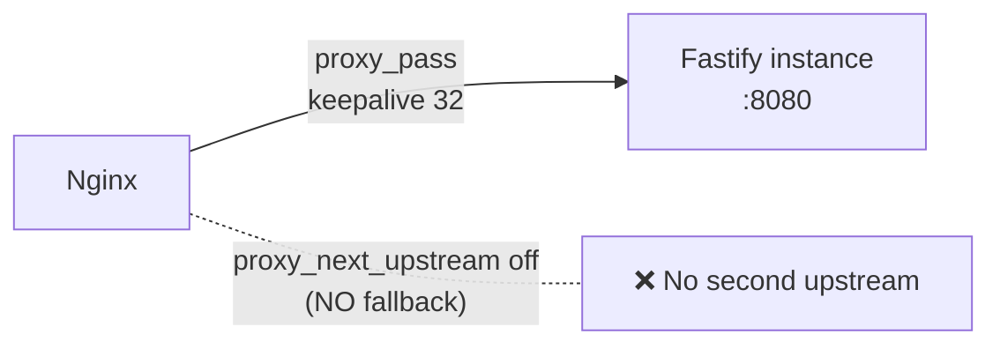
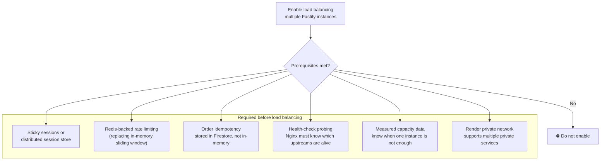
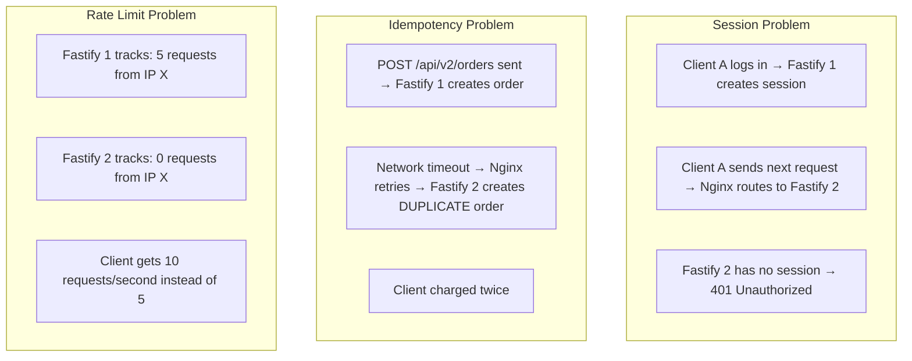
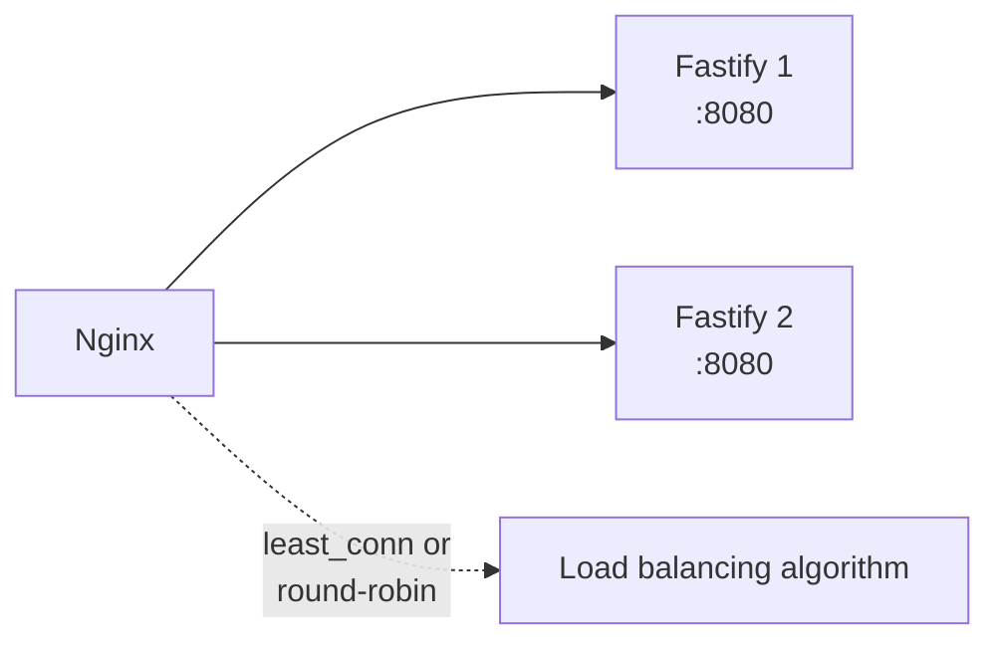
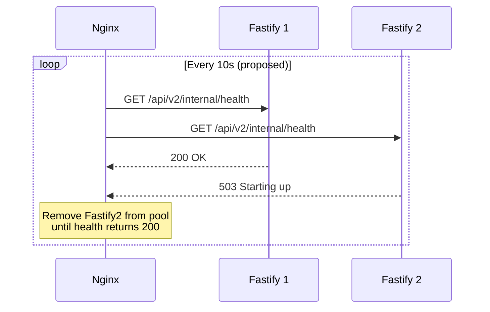
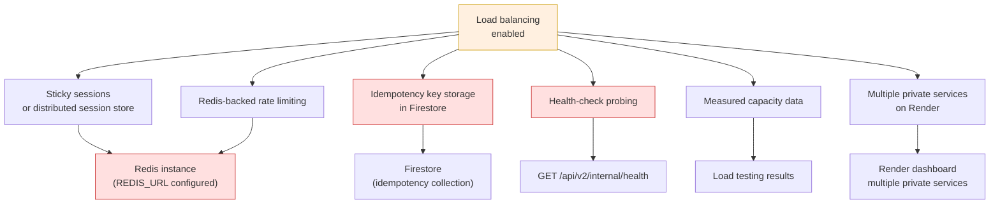

# Load Balancing

> **Last verified:** `69687f7` — 2026-09-09 — run `bash docs/nginx/regenerate.sh` to refresh

## Status: NOT Implemented

Load balancing is **deliberately not enabled**. Nginx currently proxies to
a single Fastify upstream. This is a conscious engineering decision, not an
omission.

---

## Current State: Single Upstream

```nginx
# deploy/nginx/snippets/proxy-common.conf
proxy_next_upstream off;
```

```nginx
# deploy/nginx/conf.d/api.conf (local)
upstream c1rcle_fastify {
    server 127.0.0.1:8080;
    keepalive 32;
}
```



**What `proxy_next_upstream off` means:**
- If Fastify returns an error or times out, Nginx does **not** retry on
  another upstream
- The client receives the error directly (502/503/504 JSON from Nginx)
- This is the correct default for a gateway that handles mutations

---

## Why Deliberately Deferred



### Specific Risks of Enabling Too Early



---

## What Would Change to Enable Load Balancing

### Current (single upstream)

```nginx
upstream c1rcle_fastify {
    server fastify-1:8080;
    keepalive 32;
}
```

### Target (multiple upstreams — NOT yet implemented)

```nginx
upstream c1rcle_fastify {
    # Round-robin is the default; least_conn is an option
    # least_conn;
    server fastify-1:8080;
    server fastify-2:8080;
    keepalive 32;
}
```



**Additional changes required:**
1. `proxy_next_upstream` must remain `off` for mutation routes (POST, PUT,
   PATCH, DELETE) — retries on mutations create duplicates
2. `proxy_next_upstream error timeout` could be safe for read-only routes
   (GET) only — but requires application-level idempotency proof first
3. Nginx `health` or `match` blocks needed to probe Fastify health and
   exclude unhealthy upstreams

---

## Readiness Probing (Planned)



**Not yet implemented.** The `/api/v2/internal/health` endpoint exists in
Fastify and is accessible through Nginx. But Nginx's passive health checks
(`max_fails`, `fail_timeout`) are not configured, and active health probes
(`health_check` directive) require Nginx Plus or a third-party module.

---

## Dependency Tree



**Current status of each dependency:**

| Dependency | Status | What exists |
|---|---|---|
| Sticky sessions | ❌ Not implemented | Fastify uses in-memory sessions |
| Redis | ⚠️ Configured but unused | `REDIS_URL` in env, no active Redis client |
| Idempotency | ⚠️ In-memory only | `Idempotency-Key` header preserved by Nginx, but Fastify stores in-memory |
| Health probing | ⚠️ Endpoint exists, no probing | `/api/v2/internal/health` works, Nginx doesn't probe it |
| Capacity data | ❌ No load tests run | No production traffic data |
| Multiple services | ❌ Not configured on Render | Single `circle-v2-backend` service |

---

## Decision: When to Revisit

Enable load balancing when ALL of these are true:

1. **Measured traffic exceeds one Fastify instance capacity**
   - Run `deploy/staging/load-baseline.sh` against the staging environment
   - Confirm p99 latency > 500ms or CPU > 70% on a single instance

2. **Sessions are not in-memory**
   - Migrate to Redis-backed session store or JWT-only sessions
   - Verify session persistence across Fastify restarts

3. **Idempotency is Firestore-backed**
   - Move idempotency key storage from in-memory Map to Firestore
   - Verify duplicate prevention across instances

4. **Redis is proven in staging**
   - `REDIS_URL` is configured and a Redis instance is running
   - Rate limiting uses Redis instead of in-memory sliding window

5. **Render supports it**
   - Multiple private services can be created on the same private network
   - `FASTIFY_UPSTREAM` is updated to include multiple addresses (or use
     a service mesh/DNS round-robin)

**Do not enable load balancing based on assumption alone.** The default
single-upstream configuration is safe and correct for the current state
of the application.
