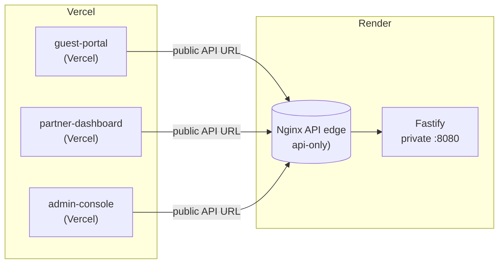
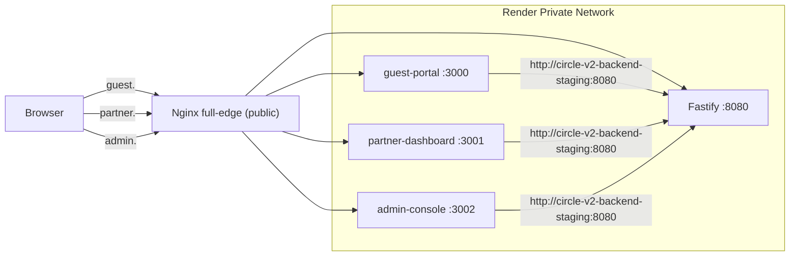
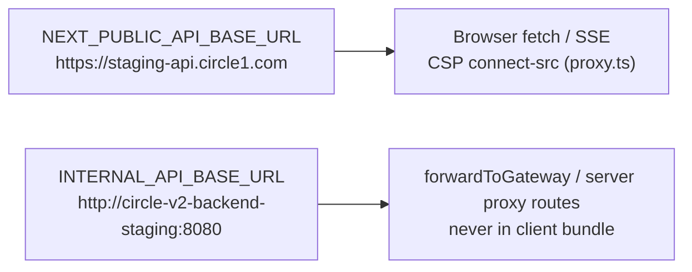
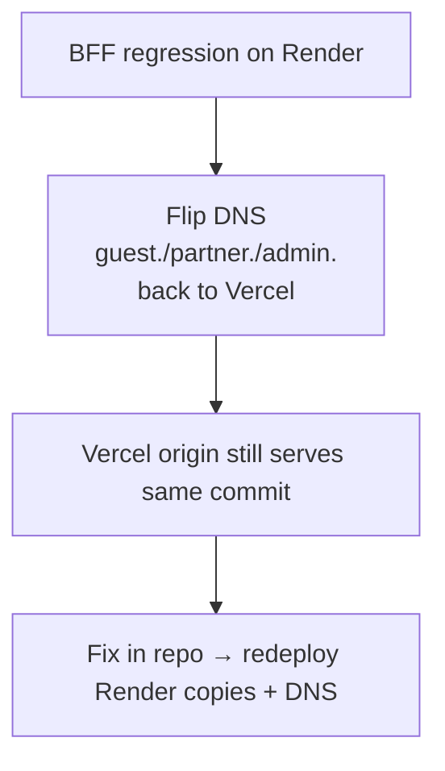

# Migration Plan — Toward the Full-Edge SOTA Topology

> **Status:** Plan. Companion to [`sota-architecture.md`](./sota-architecture.md)
> (the "what") and [`deployment.md`](./deployment.md) (the "how to run it").
> **Last verified:** `69687f7` — 2026-09-09 — run `bash docs/nginx/regenerate.sh` to refresh

Goal: get every Circle1 web app behind the single public Nginx edge, with all
Backend/BFF traffic private, with zero user-visible URL changes and a clean
rollback at every step.

Guiding rules (from `sota-architecture.md`):

- SOTA-3 — no backend URL visible to users/logs
- SOTA-5 — two BFF API base URLs: `NEXT_PUBLIC_API_BASE_URL` (browser) vs
  `INTERNAL_API_BASE_URL` (server-side)
- SOTA-8 — templates embed no environment (all values at container start)
- BFF apps deploy as private Render services behind their own Nginx block

---

## 0. Where We Are Today

- Web apps run on Vercel; only the Fastify backend already lives behind Nginx.
- BFFs call Fastify through the **public** API URL (e.g. `https://staging-api.circle1.com`).
- The `full-edge` nginx profile already exists in this repo but is not deployed.

## 1. Target (End State)

Differences from today: three more server blocks in the Nginx edge, three BFF
containers moved off Vercel into the Render private network, and BFF → Fastify
hops switched from a public URL to `INTERNAL_API_BASE_URL`.

---

## 2. BFF Env Model (the "two base URLs" work)

Applied per app in `C1RCLE-FRONTEND/apps/{guest-portal,partner-dashboard,admin-console}`.

### Server-side call sites to repoint

| Area | Today | After |
|---|---|---|
| `partner-dashboard` `src/lib/bff/auth-proxy.ts` `forwardToGateway()` | `NEXT_PUBLIC_API_BASE_URL` | `INTERNAL_API_BASE_URL` |
| `apps/*/app/api/proxy`-style BFF routes (server code) | public URL | `INTERNAL_API_BASE_URL` |
| Everything reachable from the browser DOM / `<script>` | — keep namespace compiled to public URL |

Rule: any URL that ends up in an HTML/JS bundle or CSP directive **must** be
`NEXT_PUBLIC_*` (public); anything read only by the Node server may use
`INTERNAL_API_BASE_URL` (private). Validate with a post-build grep that no
`circle-v2-backend-*` or `localhost` private strings appear in client output.

---

## 3. Phased Rollout

Each phase is independently releasable and reversible.

### Phase 0 — Deploy full-edge Nginx (no behavior change)

- Deploy `Dockerfile.nginx` + `staging-edge` template with BFF server blocks.
- BFF containers **not** present yet: leave `BFF_*_UPSTREAM` unset → entrypoint
  still boots api-only (or boot full-edge pointing at Vercel URLs of the BFFs as
  a smoke target). Recommended: keep `NGINX_TOPOLOGY=api-only` in Phase 0.
- Verify `api.<domain>` behavior is unchanged (SOTA-1..8 unaffected).
- **Exit:** existing smoke/security suites pass; api-only page loads identical.

### Phase 1 — BFF env split (frontend repo)

- Add `INTERNAL_API_BASE_URL` to `.env.*` and CI/deploy env groups for all
  three apps.
- Repoint server-side proxies to `INTERNAL_API_BASE_URL`.
- `NEXT_PUBLIC_API_BASE_URL` keeps its current public value (also still used by
  the browser `connect-src`).
- **Exit:** `rg "circle-v2-backend|localhost:8080" apps/*/.next` finds nothing in
  production build output; auth + ticket flows pass against staging.

### Phase 2 — Move BFFs behind Nginx (backend repo + DNS)

1. Create Render private services `circle-guest-portal`, `circle-partner-dashboard`,
   `circle-admin-console` (own Dockerfile each, private network, no public port).
2. Set `NGINX_TOPOLOGY=full-edge` on the Nginx service with:
   - `NGINX_GUEST_SERVER_NAME=guest.circle1.com` (+ partner, admin)
   - `BFF_GUEST_UPSTREAM=circle-guest-portal:3000` (+ partner:3001, admin:3002)
3. Point the public DNS records at the Nginx edge for `guest.`/`partner.`/`admin.`.
4. Keep Vercel apps live during the cut (see §4 failover) — deploy the Render
   copies on the **same commits** as Vercel.

> CSRF note: cookies are set/validated in the BFF (`app/api` middleware). Moving
> the BFF from Vercel to a Render private service changes the origin for
> `guest.<domain>` — cookie name/scope and SameSite must be re-verified against
> the BFF's CSRF middleware during Phase 2 smoke tests.

### Phase 3 — Decommission Vercel apps

- After N days of green traffic on Render-hosted BFFs with identical logs,
  disable the Vercel projects (keep them deployable for rollback).

---

## 4. Failover / Rollback

- **DNS flip is the rollback:** Vercel apps remain live until Phase 3, so the
  same public names can be pointed back within minutes.
- **Nginx rollback:** set `NGINX_TOPOLOGY=api-only` (or redeploy previous
  service version); BFF requests simply stop routing at the edge.
- **Config rollback:** Render Dashboard → Service → Events → Rollback to last
  good deploy.

---

## 5. Acceptance Checklist

- [ ] `docker build … c1rcle-nginx:test` passes `NGINX_VALIDATE_ONLY=1` for both
      topologies × both profiles (see `deployment.md` § Full-Edge).
- [ ] `bash docs/nginx/regenerate.sh` reports fresh.
- [ ] `api.<domain>/api/v2/internal/health` 200 via edge; readiness gated.
- [ ] `guest.`/`partner.`/`admin.` serve identical HTML + assets pre/post move.
- [ ] Post-build grep finds no private Fastify DNS in client output (SOTA-3).
- [ ] Browser CSP `connect-src` points at `https://api.<domain>` (public) only.
- [ ] `TRUSTED_PROXY_CIDRS` unchanged (Nginx still the only trust hop).
- [ ] Rate-limit / request-ID / JSON edge errors verified per BFF block (502/504).
- [ ] Cookie + SameSite + CSRF re-verified post-move (Phase 2 note).