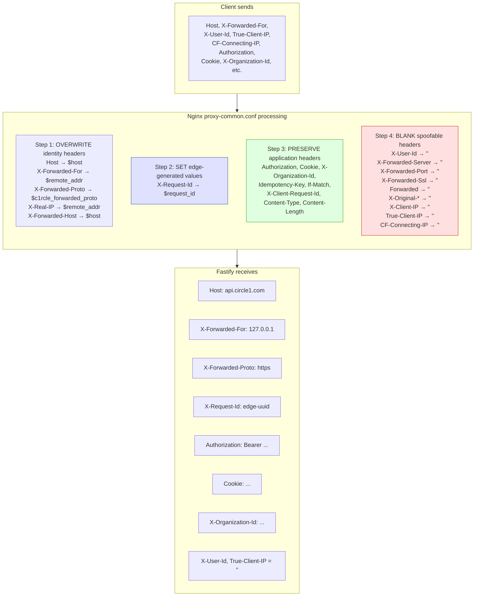
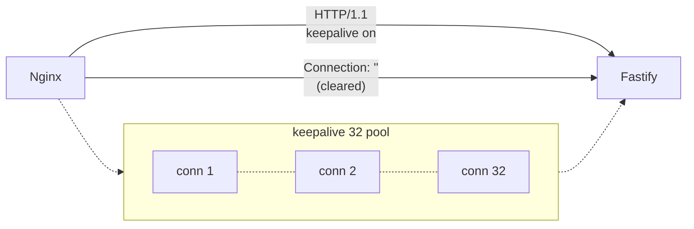
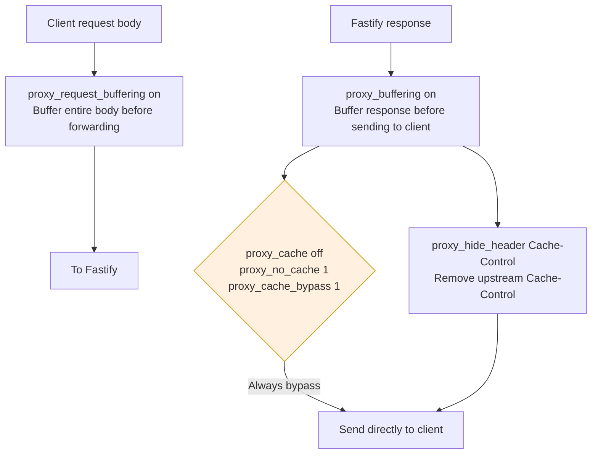
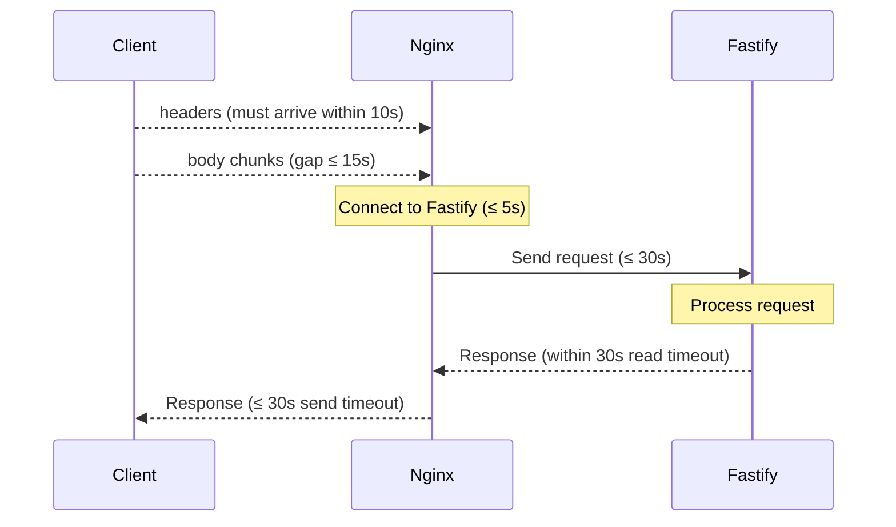
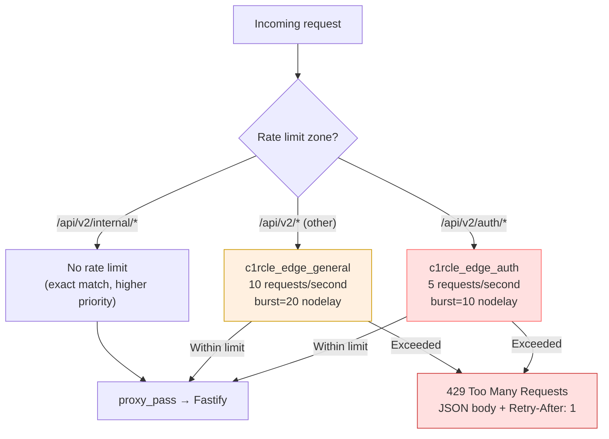
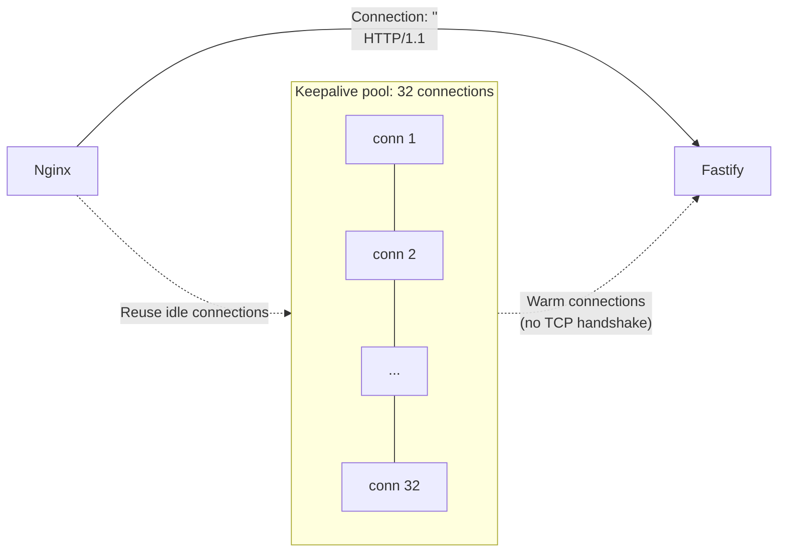
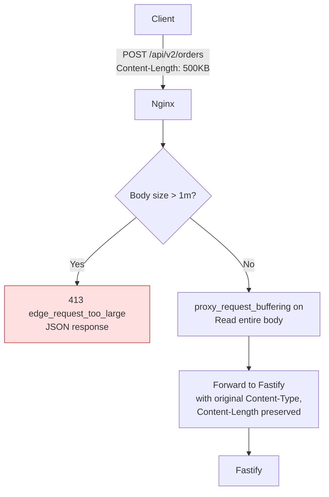

# Reverse Proxy

> **Last verified:** `69687f7` — 2026-09-09 — run `bash docs/nginx/regenerate.sh` to refresh

This document covers how Nginx acts as a reverse proxy for the Fastify gateway:
header forwarding, smuggling prevention, request-ID generation, and the
proxy-common.conf configuration.

---

## Header Forwarding Model

Nginx uses a **clean-slate** approach: every identity header is overwritten
from a known-good source. Client-supplied identity headers are never trusted.



---

## HTTP Version and Connection Handling

```nginx
proxy_http_version 1.1;
proxy_set_header Connection "";
```

Nginx uses **HTTP/1.1** to the upstream and clears the `Connection` header
to enable keepalive. The `keepalive 32` directive on the upstream block
maintains a pool of 32 idle connections to Fastify, avoiding TCP handshake
overhead on every request.



---

## Proxy Buffering and Caching

```nginx
proxy_request_buffering on;
proxy_buffering on;
proxy_cache off;
proxy_no_cache 1;
proxy_cache_bypass 1;
proxy_hide_header Cache-Control;
```



**Why this matters:**
- `proxy_request_buffering on`: Nginx reads the full request body before
  forwarding — prevents slow-client attacks
- `proxy_cache off` + `proxy_no_cache 1`: Nginx never caches API responses;
  application-level caching is Fastify's responsibility
- `proxy_hide_header Cache-Control`: Strips Fastify's Cache-Control before it
  reaches the client; the edge adds its own `Cache-Control: no-store` on
  error responses

---

## Timeouts

| Directive | Value | Purpose |
|---|---|---|
| `proxy_connect_timeout` | 5s | Max time to establish TCP connection to Fastify |
| `proxy_send_timeout` | 30s | Max time to send request body to Fastify |
| `proxy_read_timeout` | 30s | Max time to wait for Fastify response |
| `client_header_timeout` | 10s | Max time to receive request headers from client |
| `client_body_timeout` | 15s | Max time between body chunks from client |
| `send_timeout` | 30s | Max time to send response to client |
| `keepalive_timeout` | 65s | Idle keepalive connection timeout |



---

## Rate Limiting at the Edge

Rate limits are applied at the Nginx level, before traffic reaches Fastify.
This protects the application from burst traffic and slow-client attacks.



**Connection limit:** `limit_conn c1rcle_edge_connections 100` — max 100
concurrent connections per client IP.

**Key properties:**
- Rate keys are `$binary_remote_addr` (socket peer IP)
- `nodelay` means burst requests are served immediately, not queued
- These are **edge protections**, not business quotas or per-user limits
- Tune with measured traffic before production rollout

---

## Keepalive Configuration

```nginx
upstream c1rcle_fastify {
    server 127.0.0.1:8080;  # or ${FASTIFY_UPSTREAM} in templates
    keepalive 32;
}
```



**Why 32:** Conservative starting point for one Fastify instance. Increase
only when measured concurrency justifies it. Each idle connection consumes
a file descriptor and a small amount of memory on both sides.

---

## Request Body Handling



- `client_max_body_size 1m` — hard limit at the edge
- Request body is buffered before forwarding (prevents slow-client attacks)
- `Content-Type` and `Content-Length` are forwarded to Fastify
- No streaming/chunked transfer to the upstream

---

## proxy_redirect and proxy_pass

```nginx
proxy_redirect off;
proxy_pass http://c1rcle_fastify;
```

- `proxy_redirect off`: Nginx does not rewrite `Location` headers in
  Fastify responses — the gateway is responsible for its own redirects
- `proxy_pass http://c1rcle_fastify`: Proxies to the upstream block defined
  in the server block or template

---

## Edge Error Generation

When Nginx cannot reach Fastify or Fastify returns an error status, Nginx
generates structured JSON responses. These are defined in
`deploy/nginx/snippets/api-locations.conf`.

```mermaid
flowchart TD
  ProxyPass[proxy_pass → Fastify] --> UpstreamCheck{Upstream reachable?}
  UpstreamCheck -->|No| E502["502 edge_upstream_unavailable"]
  UpstreamCheck -->|Yes| ResponseCheck{Response status?}
  ResponseCheck -->|503| E503["503 edge_upstream_unavailable"]
  ResponseCheck -->|504 (timeout)| E504["504 edge_upstream_timeout"]
  ResponseCheck -->|2xx/4xx| Success[Pass to client]

  BodyCheck{Client body > 1m?} -->|Yes| E413["413 edge_request_too_large"]
  RateCheck{Rate limit exceeded?} -->|Yes| E429["429 edge_rate_limited"]

  E502 --> JSONResp["{<br/>  status: 502,<br/>  code: 'edge_upstream_unavailable',<br/>  message: '...',<br/>  requestId: '$request_id'<br/>}"]
  E503 --> JSONResp
  E504 --> JSONResp
  E413 --> JSONResp
  E429 --> JSONResp

  style JSONResp fill:#ffe0e0,stroke:#c33
```

All edge errors include:
- `X-Request-Id` header
- `Cache-Control: no-store` (via security-headers.conf)
- `X-Content-Type-Options: nosniff`
- `Referrer-Policy: no-referrer`
