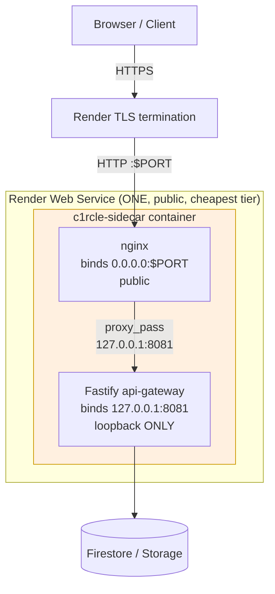

# Sidecar Deployment (Option A — interim, budget-tier)

> **Status:** Implemented, locally verified, and deployed to Render from
> `staging` as the interim API edge.
> **Last verified:** `a908dbe` — 2026-09-10 — run `bash docs/nginx/regenerate.sh` to refresh
>
> Companion docs: [`deployment.md`](./deployment.md) (the real two-service SOTA
> topology this is an interim substitute for), [`sota-architecture.md`](./sota-architecture.md)
> (the invariants this document explains why we are temporarily NOT meeting),
> [`issues-and-gaps.md`](./issues-and-gaps.md) (tracks this as a known,
> deliberate gap — see item "Sidecar in use instead of two-service").

---

## Decision Record

**Decision:** Deploy nginx + Fastify in ONE Render Web Service (a same-container
sidecar) as the interim staging topology, instead of the real two-service
topology (`circle-v2-edge-staging` Web Service + `circle-v2-backend-staging`
Private Service) described in [`deployment.md`](./deployment.md) and
[`sota-architecture.md`](./sota-architecture.md).

**Why:** Render's Private Service — required for the real two-service
topology, because that is what makes Fastify genuinely unreachable from the
public internet — is **not available on Render's free tier**. It requires at
least the Starter paid plan. The team does not yet have that paid plan
provisioned. The two-service topology's code, config, and docs are already
built and merged to `staging` (PRs #24, #25, #26, #27) and are NOT being
changed or reverted — they are simply not deployable yet without the paid
tier. This document describes what runs *instead*, temporarily.

**Three options were considered** (recorded here so the reasoning survives —
an agent or a future engineer re-deciding this should not have to redo the
analysis):

| Option | Isolation | Cost | Switch-back effort |
|---|---|---|---|
| **A — same-container sidecar (chosen)** | Fastify has no public port at all — network-level unreachability, same guarantee as the real topology, just inside one container instead of two | Free tier | None — the real topology's files are untouched; switching is a deploy-target change, not a code change |
| B — two public Web Services + shared-secret header | Fastify's port IS internet-reachable; isolation depends on an app-level secret check never having a bug | Free tier (both services) | Requires writing new middleware now, then *deliberately removing it* later — an extra step that is easy to half-do |
| Real two-service (Private Service) | Strongest — Fastify has no public port, enforced by the platform's network layer, not application code | Requires Render paid plan | N/A — this is the target we switch back to |

**Why A over B, specifically:** B trades network-level isolation for
app-level isolation. A single bug — a wrong constant-time comparison, the
secret logged somewhere, the check accidentally skipped on one route, the
secret committed once and rotated late — fully exposes the backend to the
whole internet with no App backstop, because plugins/rate-limit.ts and
`TRUSTED_PROXY_CIDRS` are the *fallback* not the primary boundary. A's
Fastify process is not listening on any interface a request from outside the
container could ever reach, independent of application code correctness.
That property degrades gracefully (a bug in the proxy config is still
contained to one container) where B's degrades catastrophically (a bug is a
direct backend compromise). A also requires zero new application code — B
requires new Fastify middleware that must later be correctly and completely
removed, which is a second opportunity for the exact kind of mistake this
decision is trying to avoid.

**This is explicitly temporary.** The moment a paid Render plan (or
equivalent Private Service capability on any platform) is available, switch
to the real topology — see [§ Switching TO the real topology](#switching-to-the-real-two-service-sota-topology) below. Do not
let "it works" become a reason to defer that switch indefinitely; re-raise it
at the next infra/budget review if it has not happened.

---

## For AI Agents Reading This

- **Source of truth:** `deploy/docker/Dockerfile.sidecar` and
  `deploy/docker/sidecar-entrypoint.sh` — not this document. Cross-check
  before acting, same rule as every other file in `docs/nginx/`.
- **This is not a fork of the nginx config.** `Dockerfile.sidecar` copies the
  exact same `deploy/nginx/nginx.conf`, `deploy/nginx/snippets/`, and
  `deploy/nginx/templates/{staging,production}.conf.template` that
  `deploy/docker/Dockerfile.nginx` uses, and reuses
  `deploy/docker/nginx-entrypoint.sh` unmodified. The only sidecar-specific
  file is `sidecar-entrypoint.sh`, which starts Fastify internally, waits for
  it to be healthy, then sets `FASTIFY_UPSTREAM=127.0.0.1:<port>` and calls
  the same nginx entrypoint every other topology uses. **Never fork the nginx
  templates for the sidecar** — if a config change is needed, make it once in
  `deploy/nginx/`, and it applies to all three topologies (sidecar, api-only
  two-service, full-edge two-service) automatically.
- **`full-edge` topology (`NGINX_TOPOLOGY=full-edge`, BFF server blocks) has
  no sidecar equivalent** and is out of scope for this document — the
  sidecar only ever runs the `api-only` template. Full-edge requires the
  frontend BFF apps to be deployed as their own services regardless of
  whether Fastify is sidecared or not; that is unrelated to this decision.
- **If asked to "deploy nginx" or "fix the nginx deployment" and Render's
  paid plan status is unknown**, ask — don't assume the sidecar is still the
  right answer. Check whether `TRUSTED_PROXY_CIDRS` or a `circle-v2-backend-staging`
  Private Service already exists on Render before building sidecar
  infrastructure that may already be obsolete.

---

## Architecture



**What this achieves:** Fastify is not published on any Docker port, not
bound to `0.0.0.0`, and not reachable from outside the container by any
means — the same "backend has no public exposure" guarantee the real
two-service topology provides, just enforced by `127.0.0.1` binding inside
one container instead of by Render's private network between two containers.

**What this does NOT achieve** (the gap vs. the real topology):
- No process isolation — a container-escape or resource-exhaustion bug in
  either process can affect the other; they share a filesystem, PID
  namespace, and cgroup.
- No independent scaling, deploys, or restarts of nginx vs. Fastify.
- No Render-platform-enforced network boundary — the boundary is
  `127.0.0.1` binding in application code (`sidecar-entrypoint.sh`), which is
  simpler and harder to misconfigure than B's secret-header approach, but is
  still enforced one layer below the platform network, not by it.

---

## Files

| File | Role |
|---|---|
| [`deploy/docker/Dockerfile.sidecar`](../../deploy/docker/Dockerfile.sidecar) | Single image: Fastify build stages (identical to root `Dockerfile`) + Debian `nginx` package installed in the runtime stage. One non-root user (`app`, uid 1001) runs both processes. |
| [`deploy/docker/sidecar-entrypoint.sh`](../../deploy/docker/sidecar-entrypoint.sh) | Starts Fastify on `127.0.0.1:$SIDECAR_FASTIFY_PORT` (default 8081), polls its health endpoint, then sets `FASTIFY_UPSTREAM` and runs the shared `nginx-entrypoint.sh`. Traps `TERM`/`INT` to shut both processes down; exits (letting Render restart the container) if either process dies unexpectedly. |
| `deploy/nginx/*` | **Unmodified, shared** with every other topology — see "For AI Agents" above. |
| `deploy/docker/nginx-entrypoint.sh` | **Unmodified, shared.** |

**Root Directory / Build Context on Render:** repository root (`.`), same as
every other service. **Dockerfile Path:** `deploy/docker/Dockerfile.sidecar`.

---

## Environment Variables

One Render Web Service, one set of env vars — the nginx-side and
Fastify-side variables both apply to the same service:

| Variable | Value | Notes |
|---|---|---|
| `PORT` | (omit — Render injects it) | nginx's public listener; `sidecar-entrypoint.sh` doesn't touch this directly, `nginx-entrypoint.sh` picks it up the same way it does in every topology |
| `SIDECAR_FASTIFY_PORT` | `8081` (default, rarely needs setting) | Internal-only loopback port between nginx and Fastify inside the container |
| `NGINX_PROFILE` | `staging` | Same meaning as the two-service topology |
| `NGINX_SERVER_NAME` | your Render URL or custom domain | Same meaning as the two-service topology |
| `NGINX_FORWARDED_PROTO` | `https` | Same meaning as the two-service topology |
| `NGINX_READINESS_ALLOWLIST_LINES` | real CIDRs | Same meaning as the two-service topology |
| `NODE_ENV` | `production` | **Not `staging`** — see the correction in [`deployment.md`](./deployment.md); the schema (`apps/api-gateway/src/config/index.ts`) only accepts `development \| test \| production` |
| `STORAGE_DRIVER` | `firestore` | Same as the real topology |
| `FIRESTORE_PROJECT_ID`, `FIREBASE_CLIENT_EMAIL`, `FIREBASE_PRIVATE_KEY`, `FIREBASE_STORAGE_BUCKET` | secrets | Same as the real topology |
| `BETTER_AUTH_SECRET` | secret, 32+ chars | Same as the real topology |
| `BETTER_AUTH_URL`, `PUBLIC_API_URL` | `https://<this service's Render URL>` | **Point at the ONE sidecar service's own URL** — there is no separate nginx URL to point at, unlike the two-service topology |
| `ALLOWED_ORIGINS` | `https://<frontend domain>` | Same as the real topology |
| `EMAIL_OTP_SECRET` | secret | Required in production, same as the real topology |
| `TRUSTED_PROXY_CIDRS` | `127.0.0.1/32` | **Different from the two-service topology.** nginx and Fastify are on loopback inside the same container, so the trusted peer is always `127.0.0.1`, never a Render private-network CIDR. Using a real private-network CIDR here would be wrong for this topology and either too permissive or a no-op. |
| `LOG_LEVEL` | `info` | Same as the real topology |

---

## Local Verification (already run once — reproduce before every deploy)

```bash
tar --exclude='node_modules' --exclude='.git' --exclude='.turbo' \
    --exclude='dist' --exclude='coverage' -cf - . \
  | docker build -f deploy/docker/Dockerfile.sidecar -t c1rcle-sidecar:local -
```

(The `tar |` pipe form is a Windows/Git-Bash workaround for a Docker Desktop
file-walker bug on certain pnpm symlinks — `docker build -f deploy/docker/Dockerfile.sidecar -t c1rcle-sidecar:local .` works directly on Linux/CI.)

```bash
docker run --detach --rm --name c1rcle-sidecar-test \
  --publish 18090:8080 \
  --env PORT=8080 --env STORAGE_DRIVER=memory --env NODE_ENV=test \
  --env TRUSTED_PROXY_CIDRS=127.0.0.0/8 --env BUILD_SHA=sidecar-test \
  --env NGINX_PROFILE=staging --env NGINX_SERVER_NAME=localhost \
  --env 'NGINX_READINESS_ALLOWLIST_LINES=127.0.0.1/32 1;' \
  --env NGINX_FORWARDED_PROTO=http \
  c1rcle-sidecar:local

curl -s http://localhost:18090/api/v2/internal/health
# {"ok":true,"uptimeMs":...} — through nginx, as expected

curl -s --max-time 3 http://localhost:8081/api/v2/internal/health
# connection refused/timeout — Fastify is NOT published on the host at all,
# confirming no external exposure even for local testing

docker stop -t 10 c1rcle-sidecar-test
# should stop within a few seconds (graceful trap), not hang until the 10s kill
```

**Verified locally 2026-09-10:** image builds clean, runs as non-root (`docker
inspect --format='{{.Config.User}}'` → `app`), health check through nginx
returns 200 with `X-Request-Id`/security headers, Fastify unreachable
directly, graceful shutdown completes well under the stop timeout. Not yet
verified locally: the paid two-service topology.

**Verified on Render 2026-09-10:** `/api/v2/internal/health` returned 200
through Nginx, `X-Request-Id` correlation was present, and
`/api/v2/internal/version` reported build `ee9fad9`. The deployed service is
the sidecar topology; this does not prove the paid two-service target.

---

## Deploying (Render, one service)

1. Dashboard → New → **Web Service** (not Private Service — the whole point
   of this topology is not needing one).
2. Root Directory: repo root. Dockerfile Path:
   `deploy/docker/Dockerfile.sidecar`. Branch: `staging`. Region: Singapore.
3. Health check path: `/api/v2/internal/health`.
4. Set every env var from [§ Environment Variables](#environment-variables) above.
5. Deploy. Watch the build logs for both `[sidecar] Fastify healthy. Starting
   nginx...` and Render's own healthcheck going green.
6. Point the frontend's `NEXT_PUBLIC_API_BASE_URL` at this one service's
   Render URL.

No `node deploy/staging/validate-environment.mjs` run is documented for this
topology yet — that script was written for the two-service env contract
(`FASTIFY_UPSTREAM` as a service DNS name, `TRUSTED_PROXY_CIDRS` as a private
CIDR). Running it against sidecar env vars will likely misfire on
`TRUSTED_PROXY_CIDRS=127.0.0.1/32` looking like a suspiciously narrow value —
that's correct for this topology, not a validation bug to "fix" by widening
it.

---

## Switching TO the real two-service (SOTA) topology

Do this the moment a paid Render plan is available. Nothing about the
sidecar needs to be migrated or ported — the real topology's code has been
sitting on `staging` unused since PR #24/#27 merged.

1. Follow [`deployment.md`](./deployment.md) § Step-by-Step Deployment from
   Step 1, unmodified — create `circle-v2-backend-staging` (Private Service)
   and `circle-v2-edge-staging` (Web Service) as two new Render services.
2. Set env vars per that document's tables — note `TRUSTED_PROXY_CIDRS`
   becomes the real private-network CIDR again (not `127.0.0.1/32`),
   `FASTIFY_UPSTREAM` becomes `circle-v2-backend-staging:8080` (not
   `127.0.0.1:8081`), and `PUBLIC_API_URL`/`BETTER_AUTH_URL` point at the
   nginx service's URL, not the (now-retired) single sidecar service's URL.
3. Verify both new services are healthy end-to-end (smoke + security tests
   per `deployment.md`).
4. Update the frontend's `NEXT_PUBLIC_API_BASE_URL` to the new nginx edge
   service's URL.
5. **Only after the new topology is verified working**, delete/suspend the
   sidecar Render service (`c1rcle-sidecar` or whatever it was named). Do not
   delete it first — an overlap window with both running is safer than a gap
   with neither.
6. Update `docs/nginx/issues-and-gaps.md` to remove the "sidecar in use"
   entry and `docs/nginx/README.md`'s status matrix if it was updated to
   reflect sidecar-in-production.

## Switching FROM the real topology back to the sidecar

Only do this if the paid plan lapses or budget is cut — this is a downgrade,
not a normal operation:

1. Deploy `Dockerfile.sidecar` as a new Web Service (steps above).
2. Verify it end-to-end (steps above).
3. Repoint the frontend's `NEXT_PUBLIC_API_BASE_URL` at the sidecar
   service's URL.
4. Suspend (don't immediately delete) `circle-v2-edge-staging` and
   `circle-v2-backend-staging` — keep them available to switch back again
   without rebuilding from scratch, unless the paid plan is being cancelled
   for good.

---

## Known Limitations (tracked, not blockers for this interim tier)

| Limitation | Why it's acceptable here | Revisit when |
|---|---|---|
| No process isolation between nginx and Fastify | Both are our own trusted code; the risk this accepts is a compromise of one affecting the other, not external exposure | Paid plan available — switch to real topology |
| Single point of failure/restart for both processes | Matches the current live single-Fastify-only Render deployment's risk profile (no regression) | Same |
| No independent nginx/Fastify scaling | Sidecar targets staging/interim traffic, not production load | Same |
| `sidecar-entrypoint.sh`'s shutdown does not distinguish a deliberate `docker stop` from a Fastify crash — either way it tears down the whole container | Render restarts the container either way; acceptable for staging | If this becomes a production topology (it should not) |
