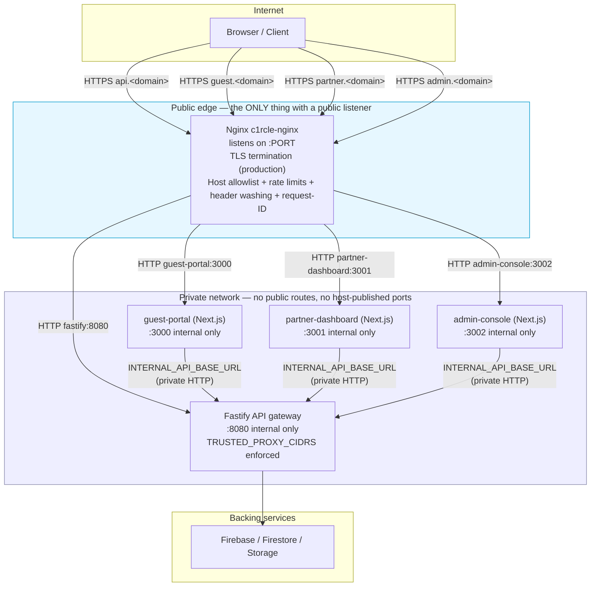
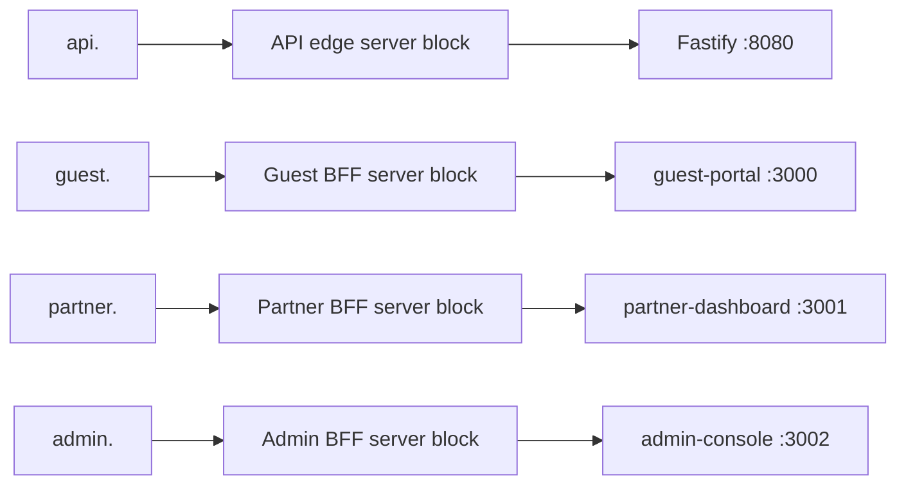
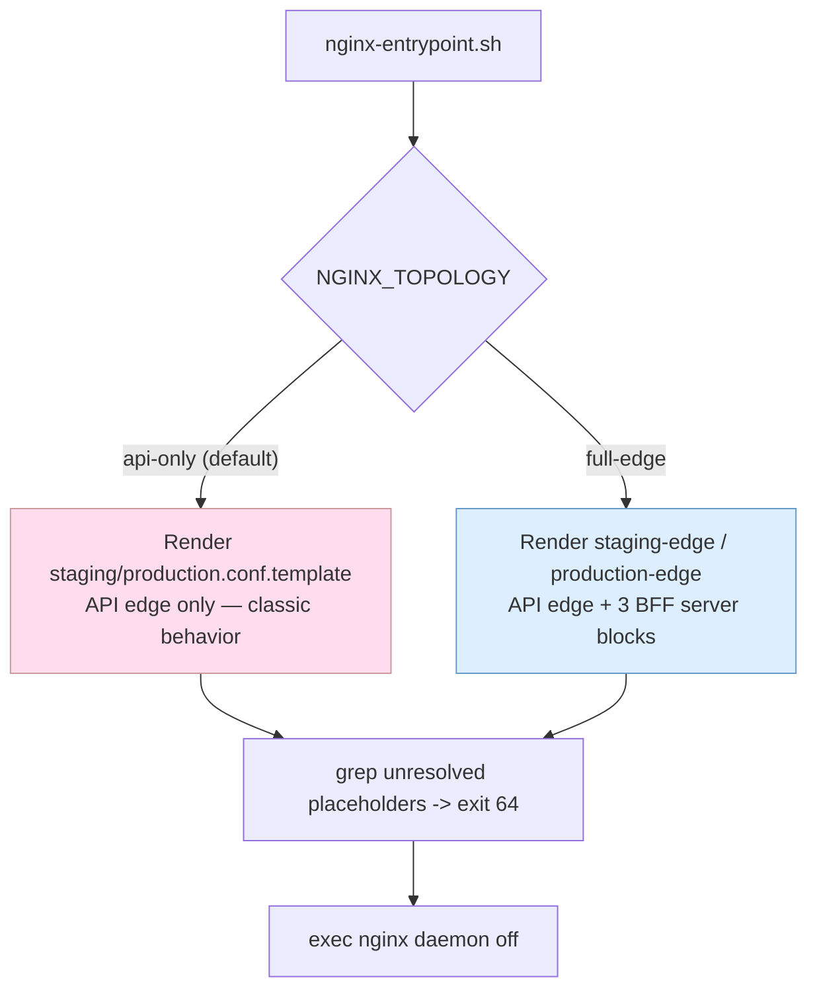
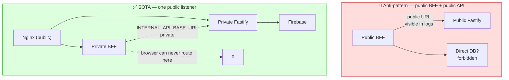
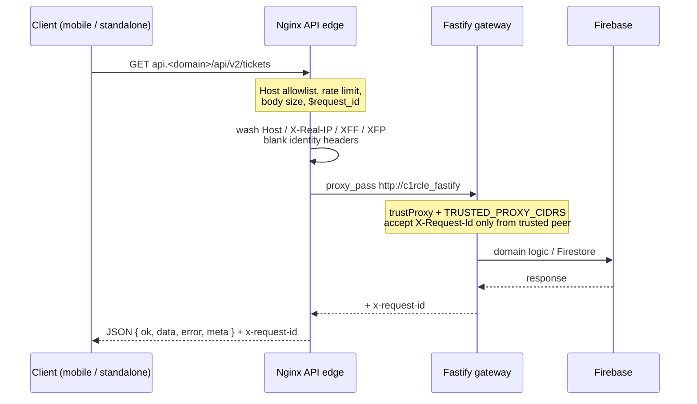
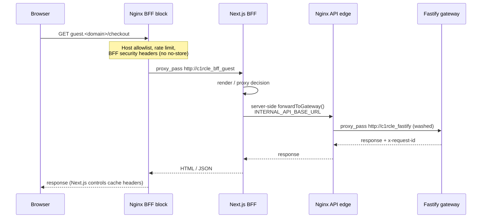
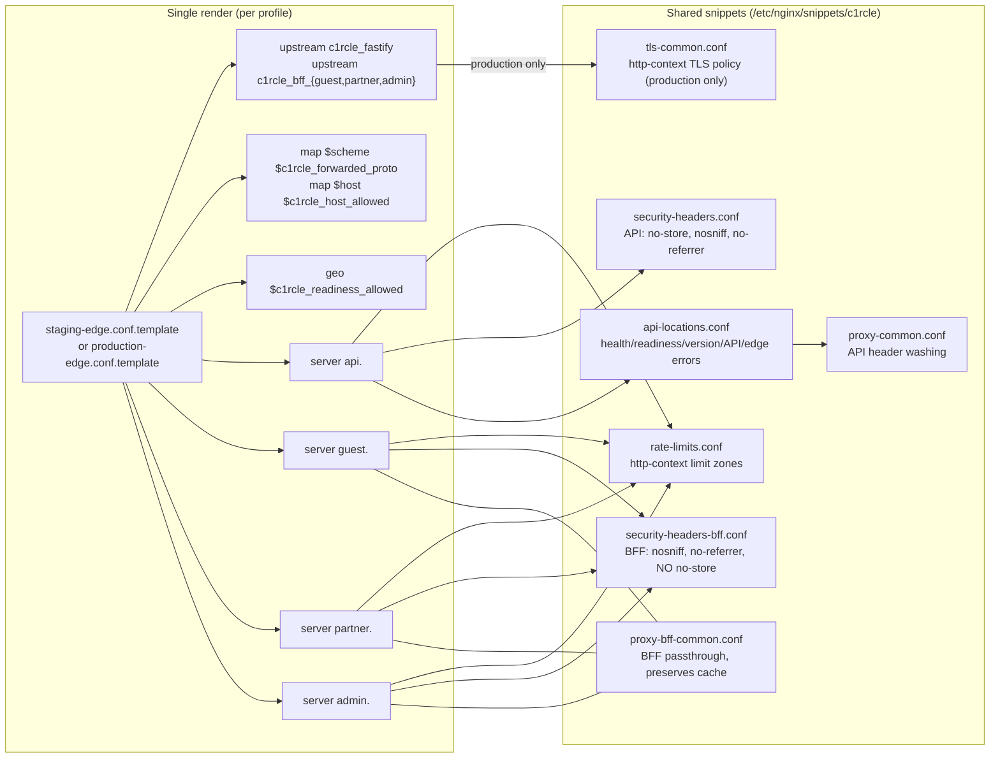
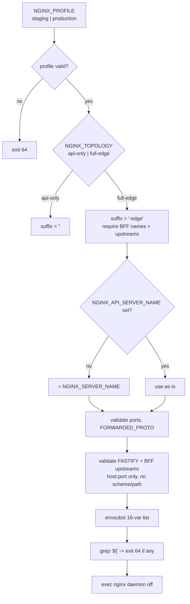
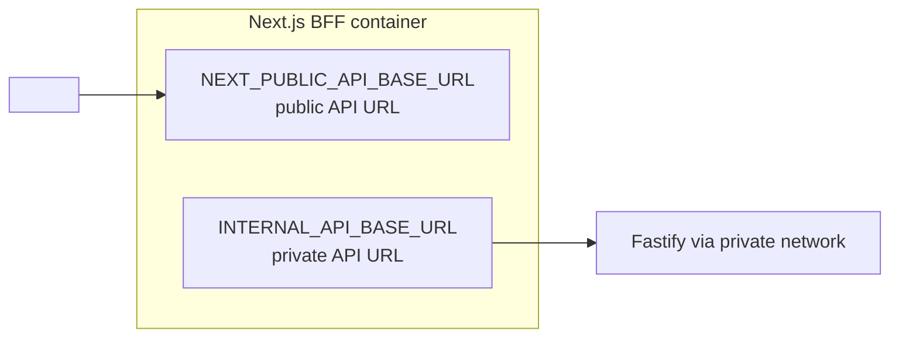

# C1RCLE Nginx — SOTA Architecture Blueprint

> **Status:** Definitive reference for the full-edge topology.
> **Last verified:** `69687f7` — 2026-09-09 — run `bash docs/nginx/regenerate.sh` to refresh
>
> Companion docs: [`deployment.md`](./deployment.md) (run it), [`migration-plan.md`](./migration-plan.md) (get there), [`architecture.md`](./architecture.md) (API edge detail).

This document is the single source of truth for **how the Circle1 network
edge is supposed to look**. It describes the target topology — the *full-edge*
profile — and the rules that make it correct. If a diagram here disagrees with
a config file, **the config file is the immediate source of truth and this
document must be corrected** (it is documentation, never authority).

---

## 1. Core Invariants (do not regress)

These rules are load-bearing. Every change to `deploy/nginx/`, the BFF proxy
layers, or the Fastify trust model must keep them intact.

| # | Invariant | Owned by |
|---|---|---|
| SOTA-1 | **Nginx is the only public listener.** The Fastify gateway and every Next.js BFF have no publicly routed hostname and no host-published port. All inbound traffic traverses Nginx. | `deploy/nginx/templates/*-edge.conf.template` |
| SOTA-2 | **The browser physically cannot reach the private network.** Nginx sits *between* the internet and Fastify. The BFF calls Nginx "as if it were the internet"; Nginx forwards to Fastify inside the private network. Nginx is **not** between the BFF and Fastify. | topology in §2 |
| SOTA-3 | **No backend URL visible to users or logs.** The only hostnames a browser ever resolves are the deployment-owned public names (`api.`, `guest.`, `partner.`, `admin.`). Private service DNS names never leave the private network, never enter the DOM, and never appear in any client-visible error body. | `proxy-bff-common.conf`, error responses |
| SOTA-4 | **No direct database access from frontend code.** Every data call goes Browser → Nginx → BFF and/or → Fastify. Next.js `app/api/*` routes are web helpers / BFF proxies only, never Firestore admin access. | C1RCLE-FRONTEND route rules |
| SOTA-5 | **The BFF needs two API base URLs.** `NEXT_PUBLIC_API_BASE_URL` = the public URL the *browser* may talk to (also the CSP `connect-src` value). `INTERNAL_API_BASE_URL` = the private URL the *server* uses when the BFF proxies a request to Fastify. They are different values by design. | C1RCLE-FRONTEND env |
| SOTA-6 | **Forwarded headers are washed at the edge, never invented downstream.** Nginx overwrites `Host`, `X-Real-IP`, `X-Forwarded-For`, `X-Forwarded-Proto` and blanks identity-carrier headers. Fastify only trusts `X-Forwarded-For` from peers inside `TRUSTED_PROXY_CIDRS` and rejects `0.0.0.0/0`. | `proxy-common.conf`, `apps/api-gateway/src/config/index.ts` |
| SOTA-7 | **CSRF/cookie boundary is at the BFF, not Nginx.** By the time a request reaches Nginx it carries proxy headers, no cookies for Nginx to interpret. | BFF middleware |
| SOTA-8 | **Templates embed no environment.** No domains, no certificate paths, no CIDR allowlists inside `deploy/nginx/templates/*`. Deployment provides every value at container start via env vars. | `nginx-entrypoint.sh` |

---

## 2. Target Topology (full-edge)

### 2.1 Container + network view

### 2.2 Hostname / routing table

Deployment-owned names. The *patterns* are documented here; the concrete
values live in the deployment env, never in templates.

### 2.3 Two topologies, one entrypoint

`api-only` is the default and is byte-for-byte the pre-SOTA behavior — the SOTA
work adds a *second* render path; it never alters the first.

---

## 3. Why Nginx Is the Only Public Listener

Rationale in one paragraph: every machine the public can reach is an attack
surface and every backend URL that leaks into browser JS, HTML, or logs
becomes a target for direct probing. Confining public exposure to a single
Nginx edge means: (a) one place to terminate TLS, (b) one place to validate
host + rate-limit before app code runs, (c) Fastify can demand
`TRUSTED_PROXY_CIDRS` with confidence, (d) BFF → Fastify hops ride the private
network where a client-side compromise exposes no backend coordinates.

---

## 4. Request Flows (per service)

### 4.1 Browser → API edge → Fastify (direct API client, mobile app)

### 4.2 Browser → BFF → API edge → Fastify (guest/partner/admin pages)

> Read BFF → Fastify traffic as "the BFF calls Nginx the way a client on the
> internet would". The Nginx API edge applies the *same* rate limits and header
> washing to BFF-originated calls as to any client — no second trusts edge.

---

## 5. Nginx Config Map (full-edge)

### 5.1 Why BFF security headers differ

`security-headers.conf` (API blocks) sends `Cache-Control: no-store` because
every API response is private/personal. The BFF serves HTML and static assets;
Next.js owns caching per route and for `_next/static`. Forcing `no-store` at the
edge would destroy BFF asset caching — so `security-headers-bff.conf` sends
only `X-Content-Type-Options: nosniff` and `Referrer-Policy: no-referrer`, and
**HSTS only in the production HTTPS profile**.

### 5.2 Why BFF passthrough ("proxy-bff-common.conf") differs from API

`proxy-common.conf` (API) sets `Cache-Control: no-store` and routes through
five named locations (health, readiness, version, API, errors). The BFF block
is one catch-all `location /` that: preserves upstream `Cache-Control`;
carries the same identity-header washing (blank `X-User-Id`,
`X-Forwarded-Server`, `True-Client-IP`, `CF-Connecting-IP`, …); sends
`Cookie`/`Content-Type`/`Accept` through; uses `proxy_next_upstream off`,
`proxy_cache off`, and 5s/60s/60s body/header/connect timeouts; passes
`X-Request-Id` end-to-end; and fails with structured JSON
`{ status, code, message, requestId }` on 502/504.

### 5.3 Template file inventory

| File | Topology | Notes |
|---|---|---|
| `templates/staging.conf.template` | api-only | unchanged, backward-compatible |
| `templates/production.conf.template` | api-only | unchanged, backward-compatible |
| `templates/staging-edge.conf.template` | full-edge | HTTP-only, staging env contract |
| `templates/production-edge.conf.template` | full-edge | TLS + HSTS + HTTP→HTTPS redirect |
| `snippets/proxy-bff-common.conf` | both | BFF passthrough policy |
| `snippets/security-headers-bff.conf` | both | BFF header set (no no-store) |
| `snippets/tls-common.conf` | production | http-context TLS policy |

One file is rendered per profile (not one file per server block). This is
required because nginx allows exactly one `map`/`geo` block per variable at
`http` level — separating BFF blocks into their own rendered file would
duplicate the `$c1rcle_host_allowed` map, a **hard nginx error**.

---

## 6. Entrypoint Contract (`nginx-entrypoint.sh`)

Env contract summary (full list in [`deployment.md`](./deployment.md)):

| Variable | api-only | full-edge | Example |
|---|---|---|---|
| `NGINX_TOPOLOGY` | `api-only` (default) | `full-edge` | `full-edge` |
| `FASTIFY_UPSTREAM` | required | required | `fastify:8080` |
| `BFF_GUEST_UPSTREAM` | ignored | required | `guest-portal:3000` |
| `BFF_PARTNER_UPSTREAM` | ignored | required | `partner-dashboard:3001` |
| `BFF_ADMIN_UPSTREAM` | ignored | required | `admin-console:3002` |
| `NGINX_SERVER_NAME` | required | required (falls back to API name) | `api.c1rcle.app` |
| `NGINX_API_SERVER_NAME` | ignored | optional (defaults to `NGINX_SERVER_NAME`) | `api.c1rcle.app` |
| `NGINX_GUEST_SERVER_NAME` | ignored | required | `guest.c1rcle.app` |
| `NGINX_PARTNER_SERVER_NAME` | ignored | required | `partner.c1rcle.app` |
| `NGINX_ADMIN_SERVER_NAME` | ignored | required | `admin.c1rcle.app` |
| `NGINX_FORWARDED_PROTO` | required | required (staging) / implied `https` (production) | `https` |
| `NGINX_HTTP_PORT` / `NGINX_HTTPS_PORT` | req/— | required | `8080` / `8443` |
| `NGINX_TLS_CERTIFICATE` / `_KEY` | — | required (production) | `/run/secrets/…` |
| `NGINX_READINESS_ALLOWLIST_LINES` | required | required | `10.0.0.0/8 1;` |

---

## 7. BFF Env Model (C1RCLE-FRONTEND)

- **`NEXT_PUBLIC_API_BASE_URL`** — the browser-visible API origin
  (`https://api.<domain>`). It is also the CSP `connect-src` value in
  `partner-dashboard/src/proxy.ts`. Because it is `NEXT_PUBLIC_*` it is inlined
  into client bundles by Next.js — it **cannot** be a private name.
- **`INTERNAL_API_BASE_URL`** — used by server-side code (e.g.
  `forwardToGateway('/api/v2/…')` in
  `partner-dashboard/src/lib/bff/auth-proxy.ts`) to reach Fastify inside the
  private network. It is never inlined into client bundles and never appears in
  HTML/JS served to the browser.

Today BFFs point `NEXT_PUBLIC_API_BASE_URL` at the gateway
(`http://localhost:8080` in dev), and 3.5.x-era `app/api/proxy` routes call the
public API URL. The SOTA split is exactly: public URL for the browser, private
URL for the server (see [`migration-plan.md`](./migration-plan.md) §2).

---

## 8. Failure Modes & Preserved Behavior

| Failure | Behavior | How it's preserved |
|---|---|---|
| Fastify down | Nginx API block returns structured 502/503 JSON | `api-locations.conf` error_page |
| A BFF down | That BFF's block returns `bff_upstream_unavailable` JSON with `requestId` | per-BFF error_page in edge templates |
| Bad host on :PORT | `return 444` (connection closed) | `$c1rcle_host_allowed` map |
| Rate limit | 429 JSON | `rate-limits.conf` + `limit_req_status 429` |
| Upstream slow | 504 JSON | proxy timeouts + error_page |
| Unresolved template var | container refuses to start (`exit 64`) | post-envsubst grep |
| Duplicate map/geo | never happens (one rendered file) | single-file render discipline |

---

## 9. For AI Agents Reading This

- **Verification order:** this doc → `deploy/nginx/**` → `apps/api-gateway/src/**`
  → `C1RCLE-FRONTEND/apps/*/src`. The graph in `.code-review-graph/` narrows
  scope; the source wins every argument.
- **Before editing:** confirm which topology a change targets. `api-only`
  changes must not touch shared template files' `api-only` output; `full-edge`
  changes must not regress `api-only` defaults.
- **Never embed** domains, cert paths, or CIDRs in templates. Extend the
  entrypoint env contract (and this doc) instead.
- **Never add a second `map $host` or `geo $host` block** across rendered
  files — nginx errors on duplicates for the same variable.
- **Never force `Cache-Control: no-store`** on BFF server blocks — that is a
  Next.js responsibility.
- Range of truth: every claim above is derived from
  `deploy/nginx/`, `deploy/docker/nginx-entrypoint.sh`,
  `deploy/docker/Dockerfile.nginx`, and the C1RCLE-FRONTEND BFF sources.