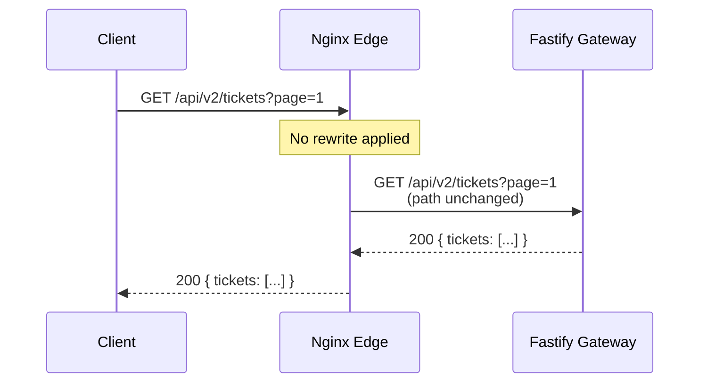
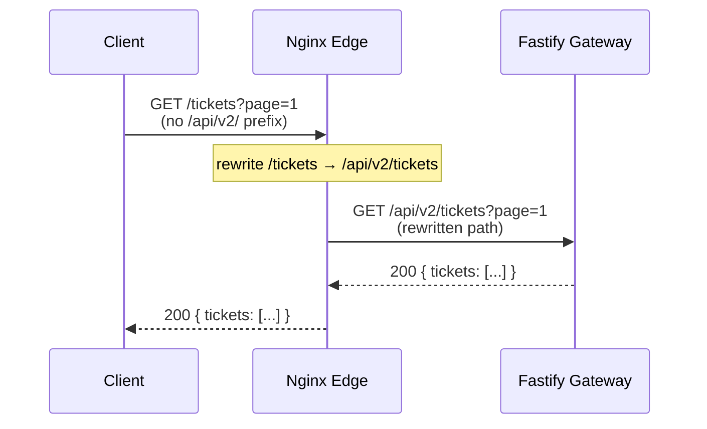
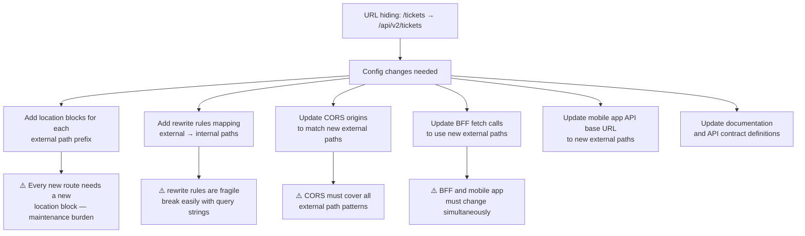
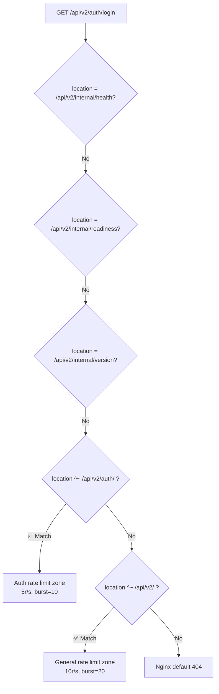
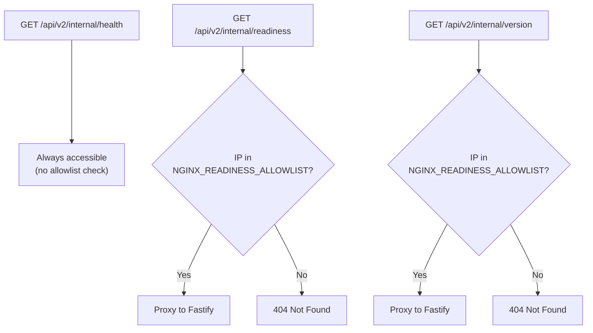

# URL Hiding and Rerouting

> **Last verified:** `69687f7` — 2026-09-09 — run `bash docs/nginx/regenerate.sh` to refresh

## Status: NOT Implemented

URL hiding (path rewriting, URL masking) is **not implemented**. Nginx proxies
`/api/v2/*` requests to Fastify as-is with no path transformation. The external
URL and internal URL are identical.

---

## Current Behavior: No Path Transformation



**What the client sees:** `/api/v2/tickets?page=1`
**What Fastify receives:** `/api/v2/tickets?page=1`

There is no difference. The `/api/v2/` prefix is the real internal route.
Nginx does not strip, add, or transform it.

---

## What URL Hiding Would Look Like (Future)

If we wanted to hide the `/api/v2/` prefix from external URLs:



**This is NOT implemented.** The config would require:

```nginx
# NOT currently in the codebase — hypothetical
location ^~ /tickets {
    rewrite ^/tickets(.*)$ /api/v2/tickets$1 break;
    proxy_pass http://c1rcle_fastify;
}
```

---

## What URL Hiding Would Require



---

## Why Not Implemented

| Reason | Explanation |
|---|---|
| **No external API consumers yet** | The API is consumed by the BFF (server-side) and mobile app — both can use the full path |
| **Maintenance burden** | Every new route requires a matching Nginx location block |
| **Fragile rewrites** | `rewrite` directives break with edge cases (query strings, trailing slashes, encoded characters) |
| **BFF already abstracts** | The Next.js BFF already hides the backend from the browser — `/api/app/*` routes in the BFF call Fastify internally |
| **Security through obscurity** | Hiding the prefix provides no real security benefit; rate limiting and auth are the real protections |

---

## Current Location Matching Order

Nginx evaluates locations in this order. The path `/api/v2/` is always part
of the external URL:



**Priority order:**
1. Exact match (`= /api/v2/internal/health`) — highest priority
2. Prefix with `^~` (`^~ /api/v2/auth/`) — no regex check after match
3. Prefix with `^~` (`^~ /api/v2/`) — catches remaining API routes
4. Default — Nginx 404

**No catch-all route exists.** Requests not matching `/api/v2/*` get Nginx's
default 404 response (not the structured JSON error format).

---

## Admin Routes Behind Nginx

The internal routes (`/api/v2/internal/*`) are behind Nginx but gated:



**Key property:** Readiness and version endpoints are **gated by IP**, not just
path. This prevents deployment metadata from being publicly visible, even
though the path itself is known.

---

## Summary

| Feature | Status | Complexity |
|---|---|---|
| Path proxying (as-is) | ✅ Implemented | Trivial |
| URL hiding (prefix strip) | ❌ Not implemented | Medium — location blocks + rewrites + CORS + client changes |
| Path rewriting (transform) | ❌ Not implemented | High — fragile, maintenance-heavy |
| Admin route gating (IP) | ✅ Implemented | Low — geo map in templates |
| Catch-all error handling | ✅ Implemented | Low — error_page directives |
