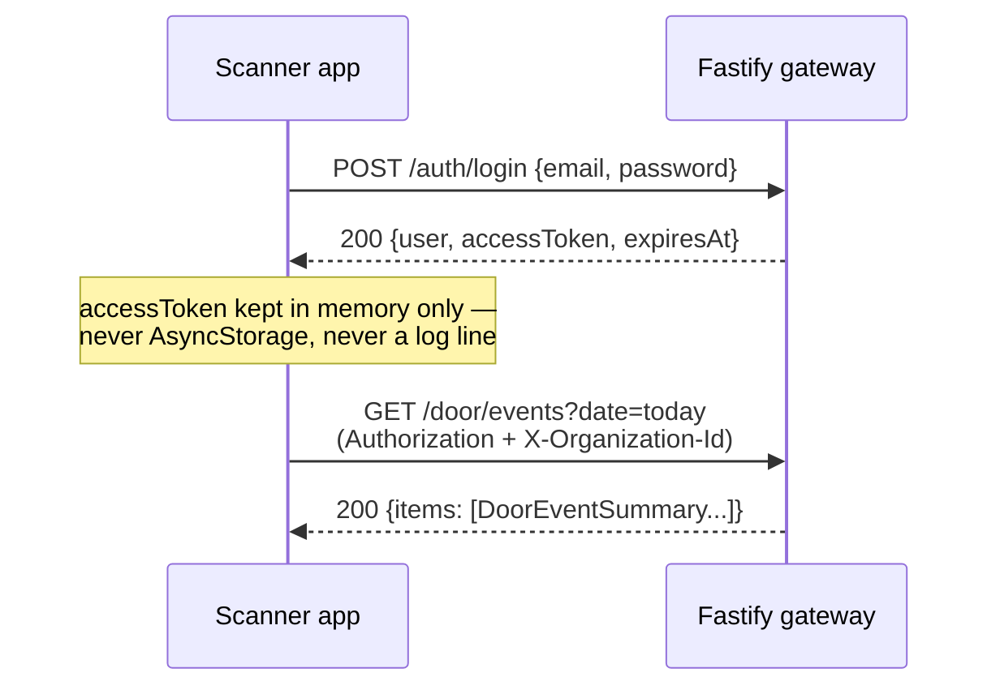
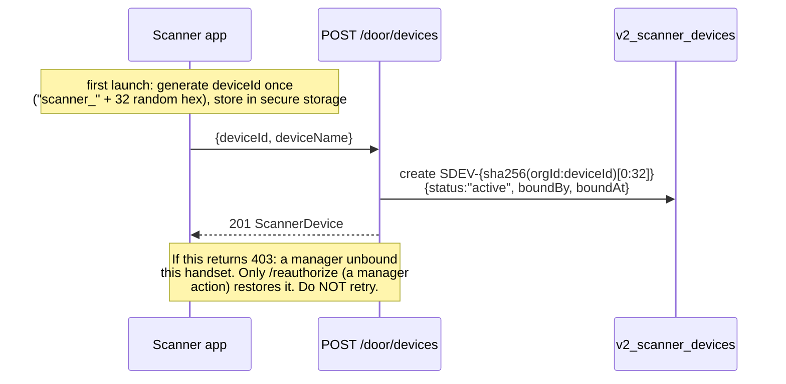
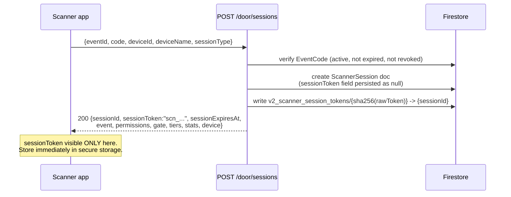
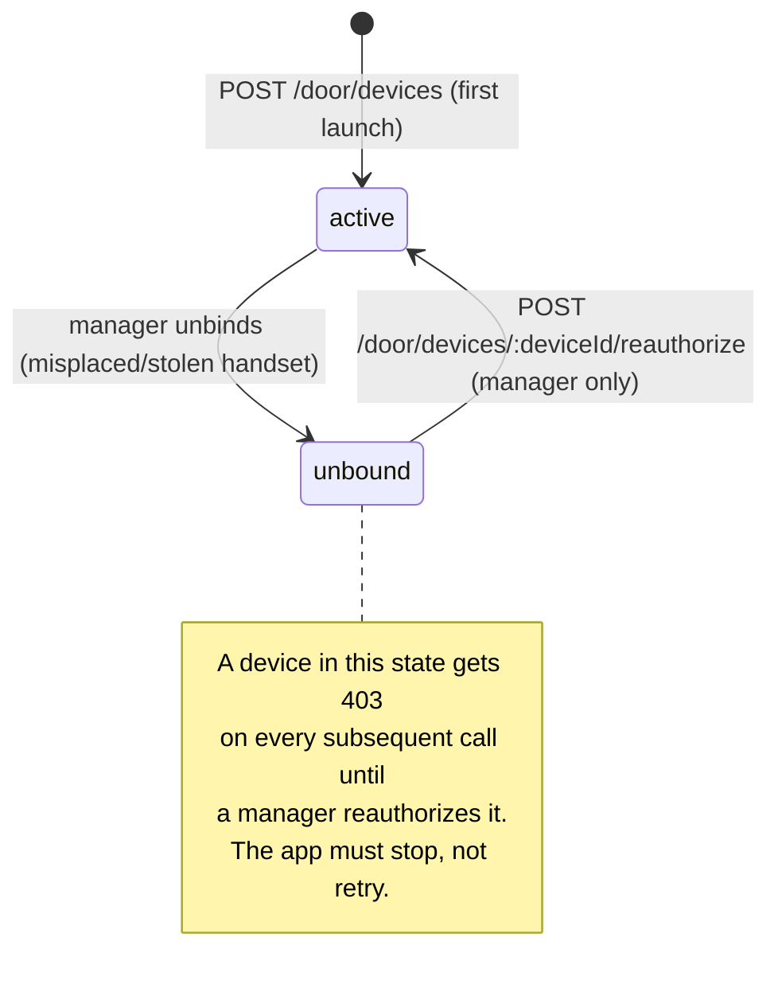

<!--
agent-metadata:
  doc: scanner-app/01-auth-pairing
  kind: service
  department: door-operations
  flow: login-pairing-session
  purpose: Staff login, device pairing/reauthorize/unbind, door-code -> scanner-session redemption.
  diagrams: [D1-login-events-sequence, D2-device-register-sequence, D3-session-redeem-sequence, D4-device-lifecycle-state]
  agent-readability: Mermaid + tables; H1->H2 skeleton per README section 4.
-->

# Scanner App — Auth, Pairing & Session Redemption

## 1. Overview

Three independent credentials gate every door-app call (full detail in
[`README.md`](README.md) §3 and [`sota-architecture.md`](sota-architecture.md)
§1 SOTA-3/§3): a 7-day staff session, a permanent per-handset device
identity, and a 12-hour scanner session redeemed from a door code. This doc
covers the three routes that establish them, in the order a fresh install
actually calls them.

**Why three, not one:** a stolen handset with a valid staff login should
not automatically be a working scanner (needs the device to be paired);
pairing a device should not by itself let it scan (needs a shift's door
code); and a door code redeemed once should not work forever (12h expiry).
Each credential closes a different theft/misuse scenario.

## 2. Business flow E2E

**Diagram D1 — login + today's events.**

`date=today` resolves in IST — a 1am shift is still working the previous
night's event. Drafts and cancelled events are excluded.

**Diagram D2 — device registration (first launch only).**

**Diagram D3 — redeem a door code into a scanner session.**

## 3. Stack

| Layer | File |
|---|---|
| Route | `apps/api-gateway/src/routes/v2/door/event-code-routes.ts` (code mint/list/revoke, manager-only) |
| Route | `apps/api-gateway/src/routes/v2/door/scanner-routes.ts` (`/door/devices*`, `/door/sessions`) |
| Service | `packages/core/src/application/scanner/scanner-service.ts` |
| Domain | `packages/core/src/domain/models/scanner-device.ts`, `event-code.ts` (also defines `ScannerSession`) |
| Firestore | `firestore-scanner-device-repository.ts`, and the `EventCode`/`ScannerSession` repositories (event-code.ts's collections) |
| Collections | `v2_scanner_devices`, `v2_event_codes`, `v2_scanner_sessions`, `v2_scanner_session_tokens` |
| Contract | `docs/api-contracts/scanner-app.md` §5 "Flow 1 — Log in and start a shift" |

## 4. Code logic

**Diagram D4 — `ScannerDevice.status` lifecycle.**

`SESSION_TTL_MS` = 12 hours, computed at redemption time
(`expiresAt = now + 12h`). Permissions on the returned session are derived
from the redeemed `EventCode.type`:

| Code type | canScan | canDoorEntry | canWalkIn | canCharge |
|---|---|---|---|---|
| `full` | ✅ | ✅ | ✅ | ❌ |
| `scan_only` | ✅ | ❌ | ✅ | ❌ |
| `charge` | ❌ | ❌ | ❌ | ✅ |

The app must drive tab visibility from this `permissions` object, never
from a role string — the server enforces it regardless (SOTA-6).

## 5. Methods reference

| Endpoint | Purpose | Rate-limit class | Idempotent | Credential(s) |
|---|---|---|---|---|
| `POST /auth/login` | Staff sign-in | — | no | none (issues the staff credential) |
| `GET /door/events?date=` | Today's/a date's events at this venue | `AUTH_READ` 240/min | n/a (read) | staff |
| `POST /door/devices` | Register this handset (first launch) | `STANDARD_COMMAND` 60/min | no — repeat call re-binds | staff |
| `POST /door/devices/:deviceId/reauthorize` | Manager restores an unbound handset | `SENSITIVE_COMMAND` 10/min | no | staff (manager-tier) |
| `POST /door/sessions` | Redeem a door code → scanner session | `SENSITIVE_COMMAND` 10/min | no — a fat-fingered retry burns the 10/min budget, debounce the submit button | staff + `deviceId` |

## 6. Verification

Backend: `pnpm --filter api-gateway test -- scanner-routes` (device
register/reauthorize/unbind + session redemption cases already covered by
the 906+ suite referenced in `sota-architecture.md`).

Frontend manual click-through (once built, Phase 1 per
[`06-v1-vs-v2-and-rollout.md`](06-v1-vs-v2-and-rollout.md)): fresh install
→ login → pairing screen fires `POST /door/devices` exactly once → verify
`deviceId`/device credential land in secure storage, never `AsyncStorage`
→ redeem a real staging door code → verify the tab shell renders exactly
the tabs the redeemed `permissions` allow.
