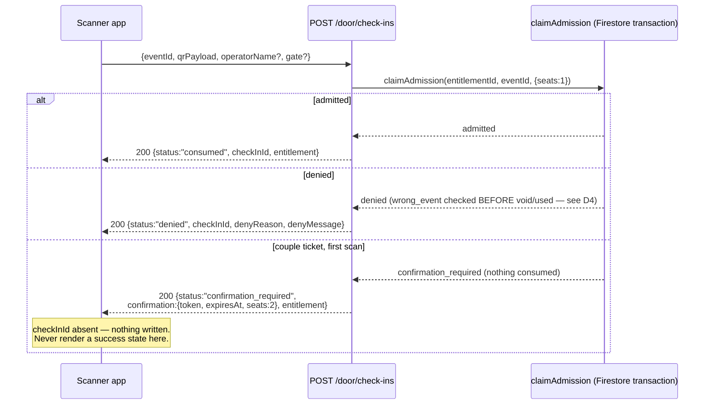
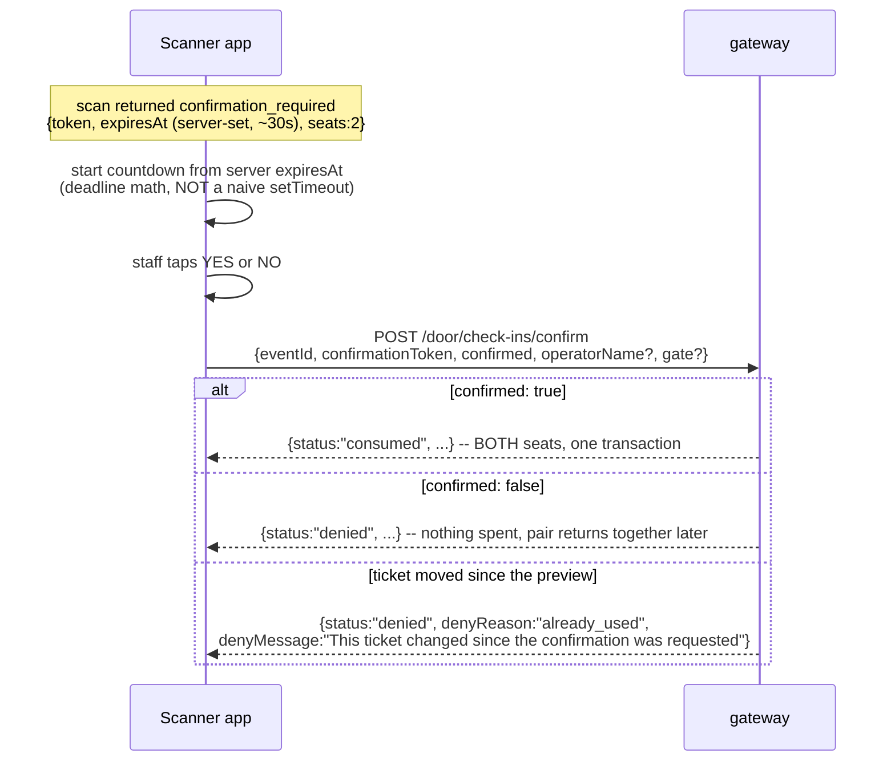
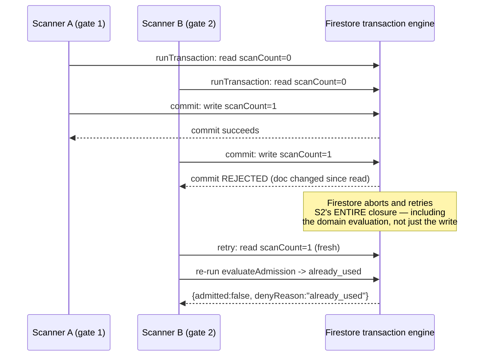
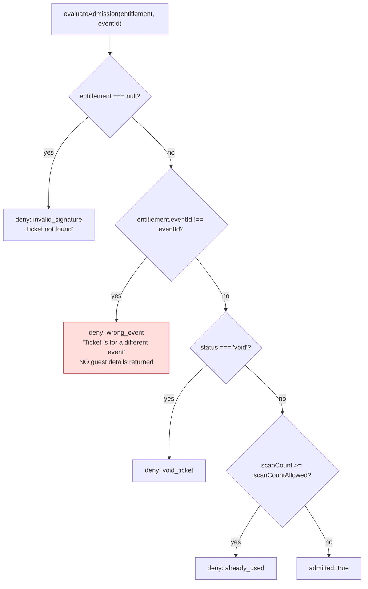

<!--
agent-metadata:
  doc: scanner-app/02-scan-admission
  kind: service
  department: door-operations
  flow: scan-admission
  purpose: Camera scan, claimAdmission transaction, couple-ticket two-step confirm, offline-deny.
  diagrams: [D1-scan-decision-sequence, D2-couple-confirm-sequence, D3-concurrent-double-scan-sequence, D4-evaluateAdmission-flowchart]
  agent-readability: Mermaid + tables; H1->H2 skeleton per README section 4.
-->

# Scanner App — Scan & Admission

## 1. Overview

This is the one place a ticket's seat is ever spent. Every guarantee here
rests on a single primitive, `claimAdmission`, which both the real scan
path and the read-only preview path (`/verify`, `/lookup`) call through the
same pure domain function — so a preview can never disagree with what a
real scan would do (`sota-architecture.md` §6).

## 2. Business flow E2E

**Diagram D1 — a scan, all three outcomes.**

**Always 200 on a decision** — a refused guest is a normal outcome to
render, not an HTTP error.

**Diagram D2 — couple-ticket two-step confirm.**

A couple ticket admits two people who must walk through together —
consuming one seat before staff confirm the second guest is present would
strand that guest outside holding a half-used ticket.

## 3. Stack

| Layer | File |
|---|---|
| Route | `apps/api-gateway/src/routes/v2/door/scanner-routes.ts` (`/door/check-ins`, `/verify`, `/confirm`, `/lookup`) |
| Service | `packages/core/src/application/scanner/scanner-service.ts` |
| Domain | `packages/core/src/domain/models/entitlement.ts` (`evaluateAdmission`, `admitSeats`, `scanEntitlement`), `scan-ledger.ts` |
| Firestore | `firestore-entitlement-repository.ts` (`claimAdmission`) |
| Collections | `v2_entitlements`, `v2_scan_ledger` |
| Contract | `docs/api-contracts/scanner-app.md` §6–7 |

## 4. Code logic

**Diagram D3 — concurrent double-scan is structurally impossible, not just unlikely.**

**Diagram D4 — `evaluateAdmission`'s ordered, fail-closed checks.**

**Why `wrong_event` is checked before `void`/`already_used` (SOTA-4):** a
ticket presented at the wrong club must never leak anything about its own
state. If the checks ran in the other order, a scanner at venue B could
enumerate whether a venue-A ticket exists, is valid, refunded, or used, just
by watching which deny reason comes back.

`admitSeats` adds two more guards on top of `evaluateAdmission` before
committing seats, both `already_used` on failure:
1. **Staleness guard** — if the confirm call's `expectedScansUsed` doesn't
   match the entitlement's current `scanCount`, something changed between
   the preview and the confirm.
2. **Overflow guard** — `scanCount + seats > scanCountAllowed` fails the
   whole claim; a couple ticket is admitted all-or-nothing, never partially.

## 5. Methods reference

| Endpoint | Purpose | Rate-limit class | Idempotent | Credential(s) |
|---|---|---|---|---|
| `POST /door/check-ins` | The real admission — may consume a seat | `SCANNER_COMMAND` 300/min | no (each call is a distinct attempt, logged regardless) | staff + session |
| `POST /door/check-ins/verify` | Read-only preview — spends nothing | `SCANNER_COMMAND` 300/min | n/a (read) | staff + session |
| `GET /door/lookup` | Manual code/ID lookup fallback | `SCANNER_COMMAND` 300/min | n/a (read) | staff + session |
| `POST /door/check-ins/confirm` | Couple-ticket second step | `SCANNER_COMMAND` 300/min | no — token is single-use, expires ~30s | staff + session |

## 6. Deny-reason reference

| `denyReason` | What staff should see |
|---|---|
| `already_used` | "Already scanned" — show `scansUsed`/`scansAllowed` |
| `void_ticket` | "Ticket cancelled or refunded" |
| `wrong_event` | "Ticket is for a different event" — no guest details, ever |
| `invalid_signature` | "QR not recognised" |
| `expired`, `device_invalid`, `capacity_exceeded`, `wrong_gate`, `offline_expired`, `override_required`, `promoter_not_authorized` | Fall back to server's `denyMessage` |

## 7. Offline

**Absolute rule, no diagram needed:** losing connectivity denies entry.
There is no offline admission queue in the standard app. On a network
failure show "Scanner offline — entry denied until connectivity returns"
and store nothing to replay. `GET /door/offline-manifest` /
`POST /door/offline-sync` exist only for venues that explicitly opt into
pre-authorized offline mode — the standard app never calls them.

## 8. Verification

Backend: `pnpm --filter api-gateway test -- scanner-routes` and
`packages/core/src/domain/admission.test.ts` (includes the concurrent
double-admission pin test). Scenario coverage:
`apps/api-gateway/scenarios/business-flows.test.ts`'s "guest purchase +
door check-in + finance settlement" exercises a real HTTP scan end to end.

Frontend manual click-through (once built): scan a valid single ticket →
admitted + haptic. Scan a couple ticket → confirm modal with live countdown
from the server's own `expiresAt` → confirm before expiry → verify the real
`/confirm` network call fires. Scan an already-used ticket → distinct
message with `scansUsed`/`scansAllowed`. Airplane-mode mid-scan → immediate
offline-deny message, no hang.
