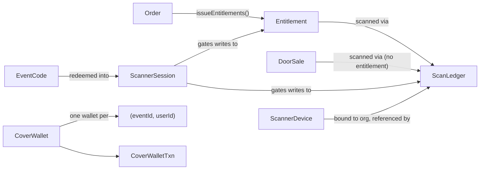
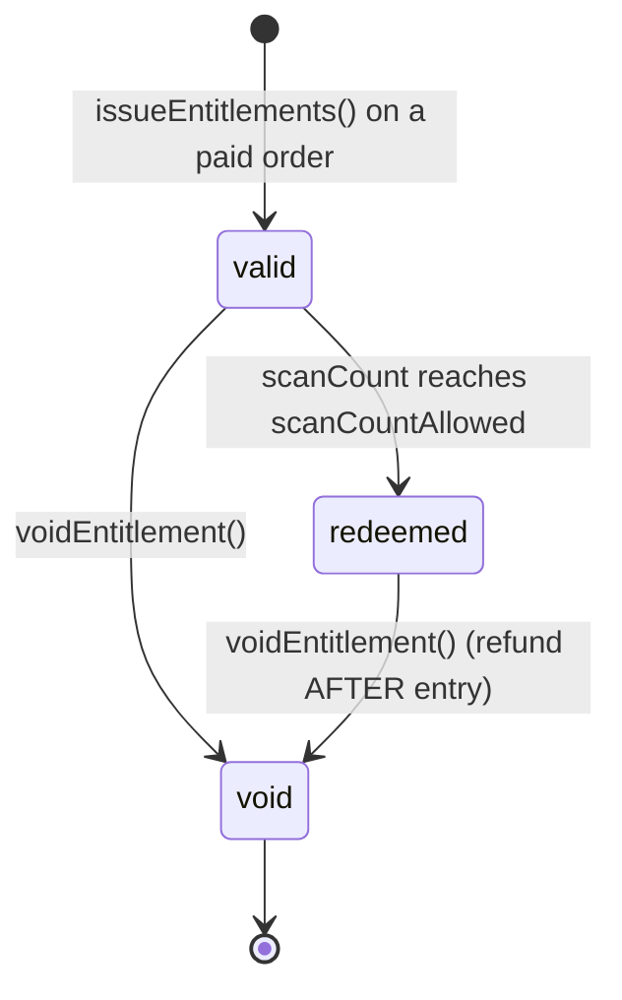
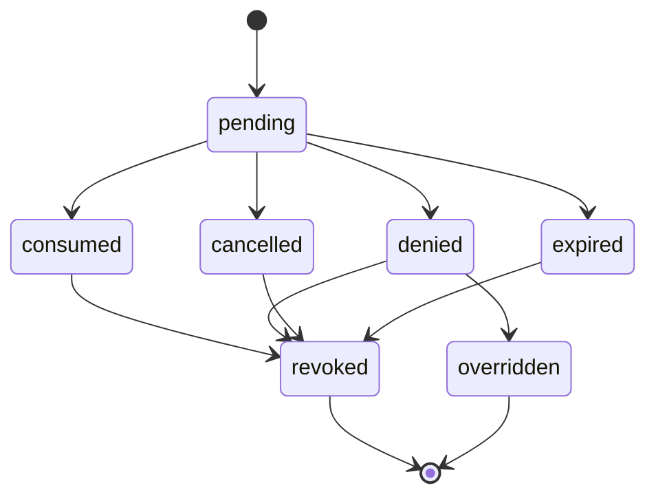
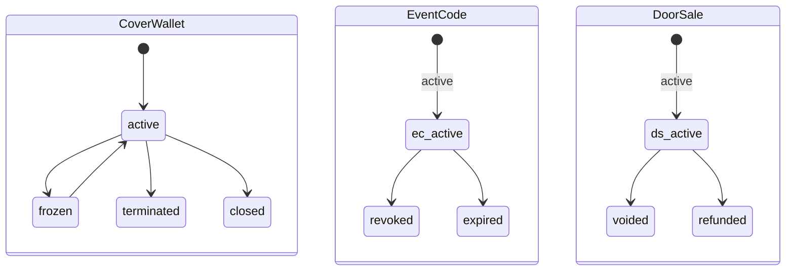

<!--
agent-metadata:
  doc: scanner-app/03-data-model
  kind: reference
  department: door-operations
  flow: data-model
  purpose: Every Firestore collection/field/id-scheme for the door-scanning system, plus state machines.
  diagrams: [D1-scanner-device, D2-scan-ledger, D3-event-code-session, D4-cover-wallet, D5-entitlement, D6-door-sale, D7-collection-relationships, D8-state-machines]
  agent-readability: Mermaid + tables; H1->H2 skeleton per README section 4.
-->

# Scanner App — Data Model

## 1. Overview

Seven domain models, all extending `VersionedEntity`
(`version: number, createdAt, updatedAt`), spread across eleven Firestore
collections. Every field below is transcribed directly from
`packages/core/src/domain/models/*.ts` — nothing here is inferred. This is
the detail layer behind `sota-architecture.md` §4; that doc's prose
explanations aren't repeated here, only the field tables and diagrams.

## 2. Business flow E2E

Not applicable to this doc in the usual sense — see
[`01-auth-pairing.md`](01-auth-pairing.md) and
[`02-scan-admission.md`](02-scan-admission.md) for the flows that write to
these collections. This doc is the reference the other flow docs point back
to.

## 3. Stack

| Model | Domain file | Firestore adapter |
|---|---|---|
| `ScannerDevice` | `domain/models/scanner-device.ts` | `infrastructure/firestore/firestore-scanner-device-repository.ts` |
| `ScanLedger` | `domain/models/scan-ledger.ts` | matching `*-scan-ledger-repository.ts` |
| `EventCode` / `ScannerSession` | `domain/models/event-code.ts` (both types) | matching repositories |
| `CoverWallet` / `CoverWalletTxn` | `domain/models/cover-wallet.ts` | matching repositories (transaction logic lives here — see README §6.2) |
| `Entitlement` | `domain/models/entitlement.ts` | `firestore-entitlement-repository.ts` (`claimAdmission`) |
| `DoorSale` | `domain/models/door-sale.ts` | matching repositories |

## 4. Code logic — field tables

### 4.1 `ScannerDevice`

Collection `v2_scanner_devices`. Doc id `SDEV-{sha256(organizationId:deviceId)[0:32]}` — deterministic, reconstructed at lookup, never queried by secondary index.

| Field | Type | Purpose / constraint |
|---|---|---|
| `organizationId` | `EntityId` | tenant |
| `venueId` | `EntityId \| null` | |
| `deviceId` | `string` | opaque, client-generated, stable for life of install |
| `deviceName` | `string` | human label |
| `status` | `'active' \| 'unbound'` | |
| `boundBy`, `boundAt` | `EntityId`, `string` | |
| `unboundAt`, `unboundReason` | `string \| null` | |
| `lastSeenAt` | `string` | heartbeat liveness |
| `lastEventId`, `lastGate` | `EntityId \| null`, `string \| null` | |
| `scanCount` | `number` | feeds abuse detection ("this phone denies everything") |
| `lastScanAt`, `lastScanResult` | `string \| null` | |

### 4.2 `ScanLedger`

Collection `v2_scan_ledger`. Doc id `SCAN-{sha256(eventId:entitlementId:ts:randomBytes)[0:32]}` — random, not deterministic (append-only per attempt).

| Field | Type | Purpose |
|---|---|---|
| `eventId`, `organizationId`, `venueId` | ids | |
| `entitlementId` | `EntityId \| null` | ticket scanned, if any |
| `doorSaleId` | `EntityId \| null` | for walk-in/dine-in with no entitlement |
| `entryType`, `tierName`, `tierId` | | point-in-time snapshot, not a live join |
| `operatorUid`, `operatorName`, `operatorRole` | | |
| `gate`, `deviceId`, `deviceName` | | |
| `deviceBound` | `boolean` | |
| `status` | `ScanLedgerStatus` | 7-value, see §5 |
| `denyReason`, `denyMessage` | | |
| `guestName`, `guestEmail`, `guestPhone` | | |
| `scannedAt` | `string` | |
| `admittedCount` | `number` | people admitted by this scan (2 for a confirmed couple) |
| `scanCountUsed`, `scanCountAllowed` | `number \| null` | |
| `isOffline`, `syncedAt`, `offlineDeviceId` | | opt-in offline mode only |
| `overriddenBy`, `overrideReason` | `string \| null` | non-null only when `status==='overridden'` |

`ScanDenyReason` = `invalid_signature | already_used | expired | wrong_event | device_invalid | void_ticket | capacity_exceeded | wrong_gate | offline_expired | override_required | promoter_not_authorized`.

**Required composite indexes** (threat-model §3.7 — prescribed, **not
committed** as `firestore.indexes.json` anywhere in this repo, see README
§6.4):

```
eventId↑, isOffline↑, scannedAt↑
eventId↑, entitlementId↑
eventId↑, scannedAt↓
organizationId↑, scannedAt↓
deviceId↑, scannedAt↓
operatorUid↑, scannedAt↓
eventId↑, status↑
entitlementId↑, status↑
```

### 4.3 `EventCode` + `ScannerSession`

Collections `v2_event_codes`; `v2_scanner_sessions` + lookup
`v2_scanner_session_tokens`. `EventCode` doc id `CODE-{randomBytes(16).hex}`.
`ScannerSession` doc id `SESS-{randomBytes(16).hex}`; token lookup doc id
`SHA-256(sessionToken)` → `{sessionId}`.

**`EventCode`**

| Field | Type | Purpose |
|---|---|---|
| `code` | `string` | `C1R-XXXXXXXX`, CSPRNG, 30-symbol unambiguous alphabet |
| `eventId`, `organizationId`, `venueId` | ids | |
| `type` | `'full' \| 'scan_only' \| 'charge'` | determines redeemed session's permissions |
| `gate` | `string \| null` | |
| `createdBy`, `createdByName` | | |
| `status` | `'active' \| 'revoked' \| 'expired'` | |
| `revokedAt`, `revokedReason`, `expiresAt` | | |
| `stats` | `{scansCount, doorEntriesCount, doorRevenue, lastUsedAt, activeSessions}` | owned by this doc, updated via `FieldValue.increment` |
| `maxDevices` | `number` | default 5 |
| `allowReuse` | `boolean` | default false |

**`ScannerSession`**

| Field | Type | Purpose |
|---|---|---|
| `sessionToken` | `string \| null` | **always persisted null** — raw value only in the one-time creation response |
| `codeId`, `eventId` | ids | |
| `organizationId` | `EntityId` | the event code's owner org, not the redeeming staff member's own org |
| `venueId` | `EntityId \| null` | |
| `type` | `'staff' \| 'device'` | |
| `deviceId`, `deviceName` | `string \| null` | |
| `expiresAt` | `string` | `now + 12h` |
| `lastUsedAt`, `revokedAt`, `revokedReason` | `string \| null` | |
| `permissions` | `{canScan, canDoorEntry, canWalkIn, canCharge}` | derived from `EventCode.type` |
| `createdBy`, `createdByName` | | |

`cleanupExpired()` is an explicit batch sweep (not Firestore native TTL).

### 4.4 `CoverWallet` + `CoverWalletTxn`

Collections `v2_cover_wallets`, `v2_cover_wallet_by_event_user` (lookup),
`v2_cover_wallet_txns`, `v2_cover_wallet_idempotency`,
`v2_cover_wallet_reconciliations`.

`CoverWallet` id `CW-{sha256(eventId:userId:ts:randomBytes)[0:32]}`; lookup
doc id `{eventId}|{userId}`.

| Field | Type | Purpose |
|---|---|---|
| `userId`, `eventId`, `organizationId`, `venueId` | ids | |
| `balance` | `number` (paise) | invariant: never negative |
| `openingBalance`, `totalCredits`, `totalDebits`, `totalRefunds` | `number` | |
| `status` | `'active' \| 'frozen' \| 'terminated' \| 'closed'` | `frozen` reversible only to/from `active` |
| `terminatedAt` | `string \| null` | next-day 05:00 IST once balance hits 0 |
| `terminationReason` | `string \| null` | e.g. `'balance_depleted'` |
| `lastTxnAt`, `lastCreditAt`, `lastDebitAt` | `string \| null` | |
| `metadata` | `Record<string, unknown>` | |
| `rules` | `{presetItems, minChargePaise, maxChargePaise, showBalanceToGuest}` | price always server-side |

`CoverWalletTxn` id `` `txn-${walletId}-${Date.now()}` `` — **flagged: no
random component, unlike every other id in this document** (README §6.3).

| Field | Type | Purpose |
|---|---|---|
| `walletId`, `eventId`, `organizationId`, `venueId`, `userId` | ids | |
| `type` | `'credit' \| 'debit' \| 'refund' \| 'adjustment'` | |
| `amount` | `number` (paise, signed) | |
| `balanceAfter` | `number` | |
| `status` | `'pending' \| 'committed' \| 'failed' \| 'reversed'` | |
| `idempotencyKey` | `string` | doc id in the idempotency collection is this key itself |
| `referenceId`, `referenceType` | | |
| `deviceId`, `operatorUid`, `operatorName` | | |
| `description`, `failureReason`, `processedAt` | | |

### 4.5 `Entitlement`

Collection `v2_entitlements`. Doc id `ENT-{sha256(orderId:tierId:index)[0:32]}` — deterministic, so a duplicate fulfilment confirmation is a storage-layer no-op.

| Field | Type | Purpose / constraint |
|---|---|---|
| `orderId`, `eventId`, `organizationId`, `tierId` | ids | |
| `tierName` | `string` | |
| `userId` | `EntityId \| null` | null for guest checkout |
| `holderName` | `string` | |
| `status` | `'valid' \| 'redeemed' \| 'void'` | **not** a 5-value enum — see §5 |
| `scanCountAllowed` | `number` | 1 normal, 2 couple |
| `scanCount` | `number` | |
| `scannedAt` | `string[]` | audit trail, newest last |

QR payload is deliberately not stored — it must be short-lived and
authorized at read time.

### 4.6 `DoorSale`

Collections `v2_door_sales` + `v2_door_sale_idempotency`. Doc id
`` `DS-${venueId}-${Date.now()}-${random36}` `` — **flagged alongside
`CoverWalletTxn`** as not following the hash/CSPRNG family (README §6.3),
though it does include a random component unlike the wallet-txn id.

| Field | Type | Purpose |
|---|---|---|
| `eventId`, `organizationId`, `venueId` | ids | |
| `category` | `'walkin' \| 'dinein'` | |
| `guestName`, `guestPhone`, `guestAge`, `gender`, `guestEmail` | | |
| `totalGuests`, `tableNumber`, `gate` | | |
| `paymentMode` | `'cash' \| 'card' \| 'upi' \| 'other'` | |
| `amountPaise` | `number` | |
| `paymentStatus` | `'collected' \| 'pending' \| 'failed'` | |
| `paymentRef` | | |
| `createdBy`, `createdByName` | | |
| `status` | `'active' \| 'voided' \| 'refunded'` | |
| `voidedAt`, `voidedBy`, `voidReason` | | |
| `refundedAmountPaise`, `refundedAt`, `refundedBy` | | |
| `idempotencyKey` | `string` | |

**Diagram D7 — collection relationships.**



## 5. State machines

**Diagram D8a — `Entitlement.status`.**



**Diagram D8b — `ScanLedgerStatus`** (a different aggregate — the attempt, not the ticket).



**Diagram D8c — `CoverWallet.status` / `EventCode.status` / `DoorSale.status`.**



## 6. Methods reference

Not applicable — see [`01-auth-pairing.md`](01-auth-pairing.md) §5 and
[`02-scan-admission.md`](02-scan-admission.md) §5 for endpoint tables. This
doc covers storage, not transport.

## 7. Verification

`pnpm --filter core test -- entitlement scanner-device event-code
cover-wallet door-sale` — domain model unit tests (`admission.test.ts`,
`scanner-device.test.ts`, `id-length.test.ts` guarding the 64-char cap that
motivated the hash-derived id scheme in the first place).
