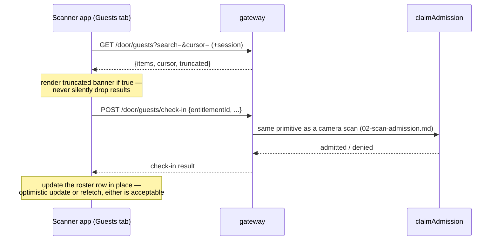
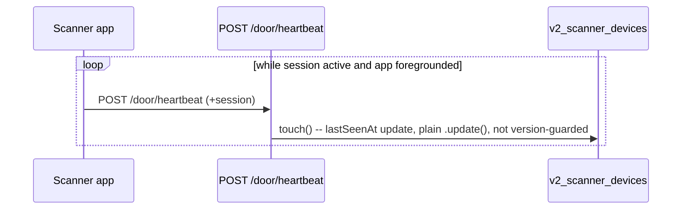
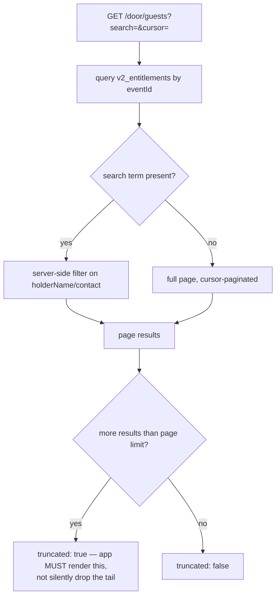
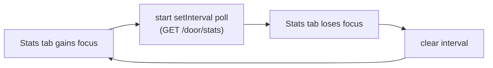

<!--
agent-metadata:
  doc: scanner-app/04-guest-roster-stats
  kind: service
  department: door-operations
  flow: roster-stats-heartbeat
  purpose: Guest roster search/pagination, manual check-in, stats, heartbeat.
  diagrams: [D1-roster-search-flowchart, D2-manual-checkin-sequence, D3-stats-poll-lifecycle, D4-heartbeat-sequence]
  agent-readability: Mermaid + tables; H1->H2 skeleton per README section 4.
-->

# Scanner App — Guest Roster, Stats & Heartbeat

## 1. Overview

Three read-oriented flows a shift runs continuously, not just once at
login: looking up a guest by name/phone when the QR won't scan, watching
occupancy against capacity, and the device proving it's still alive. All
three are Phase 1 scope per
[`06-v1-vs-v2-and-rollout.md`](06-v1-vs-v2-and-rollout.md) — unlike the
money surfaces in [`05-cover-wallet-door-sales.md`](05-cover-wallet-door-sales.md),
these are needed to run a door at all.

**Where v1 got this wrong:** v1's guest list fetched once and filtered
entirely client-side — fine for a few dozen guests, silently wrong at
capacity for a real venue. v2's contract mandates server-side search,
pagination, and a `truncated` flag the app must render, not hide.

## 2. Business flow E2E

**Diagram D2 — manual check-in from the roster.**

**Diagram D4 — heartbeat while the app is foregrounded.**

Whether heartbeats should continue while the app is *backgrounded* is an
open question to resolve against the live contract before implementing —
don't assume either answer (see the Phase 0 note in
[`06-v1-vs-v2-and-rollout.md`](06-v1-vs-v2-and-rollout.md)).

## 3. Stack

| Layer | File |
|---|---|
| Route | `apps/api-gateway/src/routes/v2/door/door-ops-routes.ts` (`/door/guests*`, shift-open composition) |
| Route | `apps/api-gateway/src/routes/v2/phase5-routes.ts` (`GET /door/stats`) |
| Route | `apps/api-gateway/src/routes/v2/door/scanner-routes.ts` (`/door/heartbeat`) |
| Service | `packages/core/src/application/door/door-ops-service.ts`, `door-stats-service.ts` |
| Domain | `entitlement.ts` (roster is read from tickets, not the ledger — see §4) |
| Collections | `v2_entitlements`, `v2_scan_ledger`, `v2_scanner_devices` |
| Contract | `docs/api-contracts/scanner-app.md` §9 (occupancy/stats fields) |

## 4. Code logic

**Diagram D1 — roster read pipeline.**

Roster is built from `Entitlement` records, not from `ScanLedger` — the
ledger is an attempt log (one row per scan, successful or denied,
per `02-scan-admission.md` §7), not a guest list; joining the roster
against it would double-count multi-attempt guests.

**Stats occupancy fields** (from the contract, §9):

| Field | Type | Note |
|---|---|---|
| `inside` | `number` | people admitted — a couple ticket counts as 2 |
| `capacity` | `number \| null` | **nullable** |
| `remaining` | `number \| null` | null whenever `capacity` is null |
| `prebooked` | `number` | came in on a ticket bought in advance |

**Diagram D3 — stats poll lifecycle (Phase 1; SSE is Phase 4).**

## 5. Methods reference

| Endpoint | Purpose | Rate-limit class | Idempotent | Credential(s) |
|---|---|---|---|---|
| `GET /door/guests` | Search/paginate the roster | `AUTH_READ` 240/min | n/a (read) | staff + session |
| `POST /door/guests/check-in` | Manual admission, no camera | `STANDARD_COMMAND` 60/min | no (each call is a distinct attempt) | staff + session |
| `GET /door/stats` | Occupancy/revenue snapshot | `AUTH_READ` 240/min | n/a (read) | staff + session |
| `POST /door/heartbeat` | Liveness ping | `SCANNER_COMMAND` 300/min | n/a | staff + session |

## 6. Verification

Backend: `pnpm --filter api-gateway test -- door-ops-routes
door-stats-stream`. Frontend manual click-through (once built): search a
partial name and confirm the query fires server-side (check request params
against the contract, not a client-side filter); force a result set past
one page and confirm the `truncated` banner renders; manually check in a
guest and confirm the roster row updates without a full page reload; leave
the stats tab and confirm polling stops (check network log), return and
confirm it resumes; leave the app foregrounded past one heartbeat interval
and confirm `/door/heartbeat` fires on schedule.
