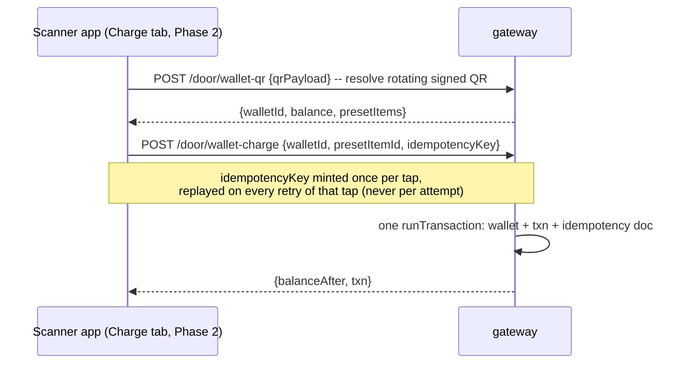
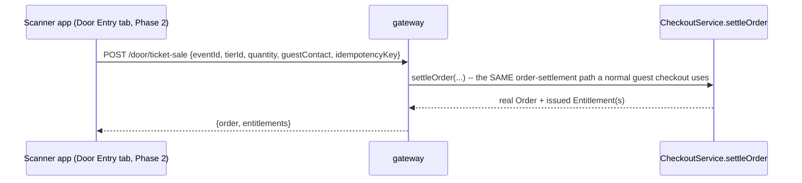
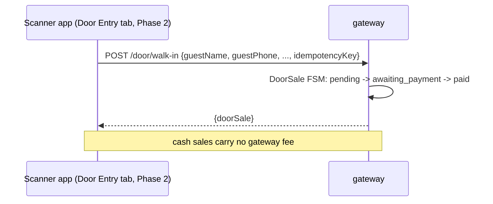
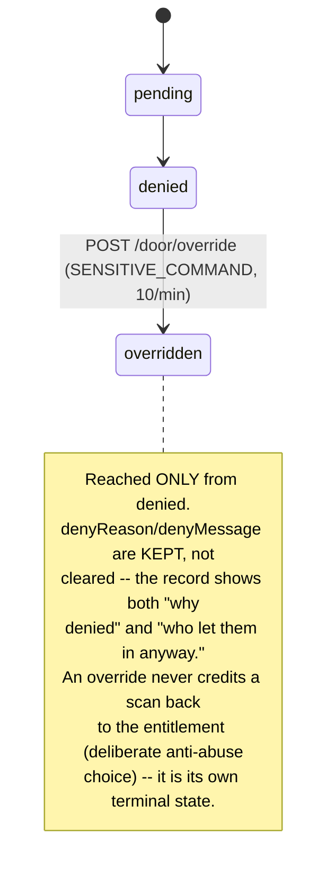

<!--
agent-metadata:
  doc: scanner-app/05-cover-wallet-door-sales
  kind: service
  department: door-operations
  flow: money-and-escalation
  purpose: Cover-wallet charging, paid ticket-sale, walk-in/dine-in, staff-deny/override -- backend-complete, frontend-deferred.
  diagrams: [D1-wallet-charge-sequence, D2-ticket-sale-sequence, D3-walkin-dinein-sequence, D4-override-staffdeny-state]
  agent-readability: Mermaid + tables; H1->H2 skeleton per README section 4.
-->

# Scanner App — Cover-Wallet, Door Sales & Escalation (Phase 2/3)

## 1. Overview

Every flow in this doc is backend-complete and tested, and **zero of them
have a v1 precedent** (`06-v1-vs-v2-and-rollout.md` §"real gaps"). They are
deliberately excluded from the Phase 1 frontend build — Phase 1 proves the
core auth/session/scan model works before the app takes on money-handling
and manager-escalation surfaces, per the phase table in
[`06-v1-vs-v2-and-rollout.md`](06-v1-vs-v2-and-rollout.md).

## 2. Business flow E2E

**Diagram D1 — cover-wallet charge.**

The client never sends a raw `amountPaise` — only a `presetItemId` the
server resolves to a server-defined price (`sota-architecture.md` SOTA-10).
The QR itself rotates and is signed under a `wallet:`/`cw:` prefix (D-027);
minting a *guest's* wallet QR is owner-only, not staff-mintable — this was
one of the two real security holes D-029 found and fixed.

**Diagram D2 — paid ticket-sale.**

This is a real order through the shared checkout path, not a separate
door-only ledger — a walk-up paid sale and an online purchase produce the
identical `Order`/`Entitlement` shape downstream.

**Diagram D3 — walk-in / dine-in (headcount, no tier pricing).**

## 3. Stack

| Layer | File |
|---|---|
| Route | `apps/api-gateway/src/routes/v2/door/cover-wallet-routes.ts` |
| Route | `apps/api-gateway/src/routes/v2/door/door-sale-routes.ts` |
| Service | `packages/core/src/application/door/door-ticket-sale-service.ts`, `door-service.ts` |
| Service | **no dedicated cover-wallet service file** — logic lives in the `CoverWallet` domain model + its Firestore repository's transaction methods (README §6.2) |
| Domain | `cover-wallet.ts`, `door-sale.ts` |
| Collections | `v2_cover_wallets`, `v2_cover_wallet_txns`, `v2_cover_wallet_idempotency`; `v2_door_sales`, `v2_door_sale_idempotency` |
| Contract | `docs/api-contracts/scanner-app.md` (wallet/sale sections) |

## 4. Code logic

**Diagram D4 — staff-deny / override state.**

`POST /door/staff-deny` writes a `denied` ledger row directly (staff
manually refusing someone who never presented a scannable ticket, e.g. a
banned patron) — a different entry point into the same `ScanLedgerStatus`
machine documented in [`03-data-model.md`](03-data-model.md) §5.

## 5. Methods reference

| Endpoint | Purpose | Rate-limit class | Idempotent | Credential(s) |
|---|---|---|---|---|
| `POST /door/wallet-qr` | Resolve a rotating signed wallet QR | `SCANNER_COMMAND` 300/min | n/a (read) | staff + session (`canCharge`) |
| `POST /door/wallet-charge` | Debit a preset-priced item | `SCANNER_COMMAND` 300/min | **yes**, `+idem` | staff + session (`canCharge`) |
| `POST /door/ticket-sale` | Walk-up paid sale, real order | `STANDARD_COMMAND` 60/min | **yes**, `+idem` | staff + session (`canWalkIn`) |
| `POST /door/walk-in` | Headcount walk-in, no ticket tier | `STANDARD_COMMAND` 60/min | **yes**, `+idem` | staff + session (`canWalkIn`) |
| `POST /door/dine-in` | Headcount dine-in | `STANDARD_COMMAND` 60/min | **yes**, `+idem` | staff + session (`canWalkIn`) |
| `POST /door/staff-deny` | Manual refusal, no scan | `SCANNER_COMMAND` 300/min | no | staff + session |
| `POST /door/override` | Manager overrides a prior denial | `SENSITIVE_COMMAND` 10/min | no | staff + session |

## 6. Verification

Backend: `pnpm --filter api-gateway test -- cover-wallet-routes
door-sale-routes door-commerce-routes`. No frontend verification yet —
these flows have no UI until Phase 2/3 of
[`06-v1-vs-v2-and-rollout.md`](06-v1-vs-v2-and-rollout.md). When that phase
starts, the idempotency-key discipline (one key per tap, replayed on
retry — never a new key per network attempt) needs an actual double-tap-
under-flaky-network test before shipping, not just a code review.
