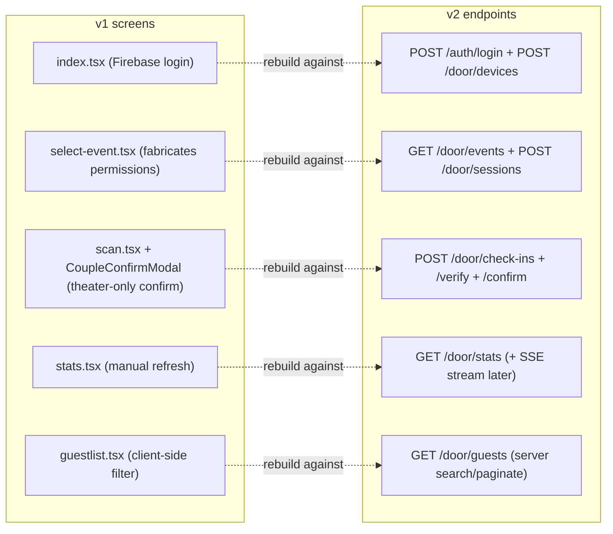
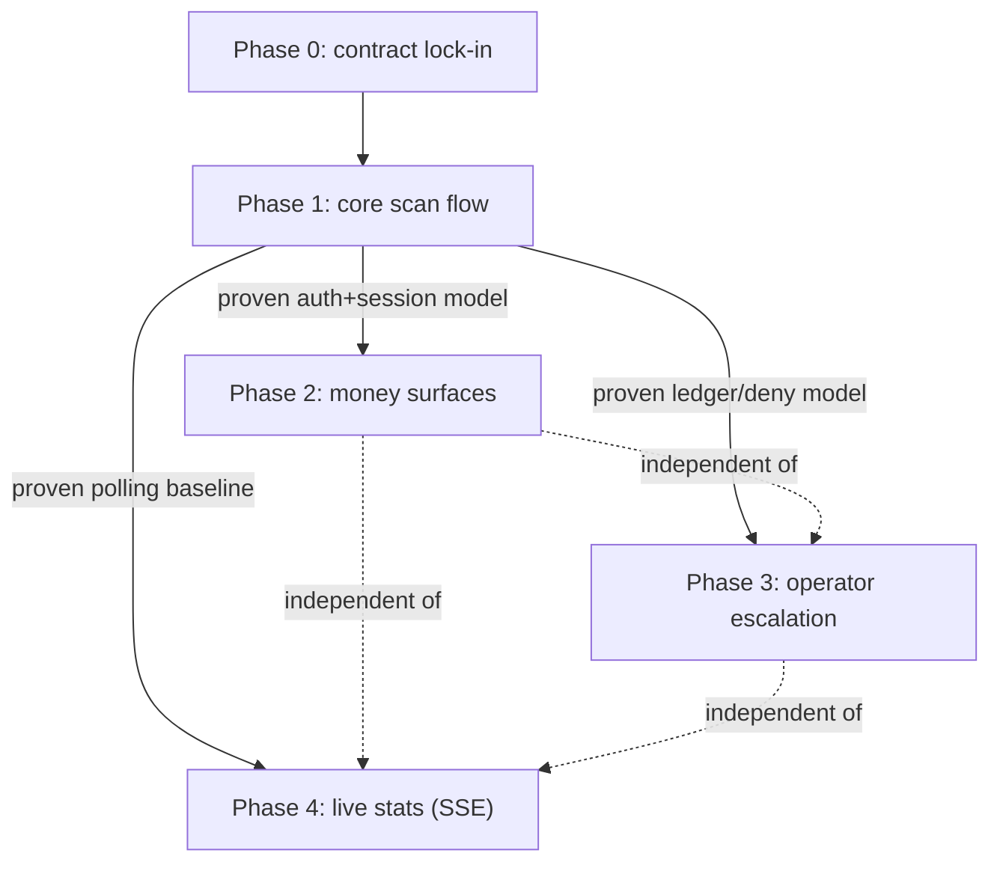

<!--
agent-metadata:
  doc: scanner-app/06-v1-vs-v2-and-rollout
  kind: reference
  department: door-operations
  flow: rollout-plan
  purpose: V1 gap analysis and the phased frontend rollout plan.
  diagrams: [D1-v1-screen-to-v2-endpoint-map, D2-phase-dependency-flowchart]
  agent-readability: Mermaid + tables; H1->H2 skeleton per README section 4.
-->

# Scanner App — V1 vs V2 & Phased Rollout

## 1. Overview

v1 (`thec1rcle/apps/scanner-app`, Expo 52/RN 0.76) is a visual reference
only — its 4-tab layout, dark theme, `expo-camera` QR scan, and haptics are
worth keeping the *feel* of. None of its auth, session, or data-fetching
code is reusable: it predates every invariant in `sota-architecture.md` §1
and has zero `@c1rcle/*` shared-package dependencies to inherit either way.
There is currently **no v2 scanner-app frontend anywhere** in this
workspace — this doc is the bridge from "backend is done" to "here is the
order the frontend gets built in."

## 2. Business flow E2E

Not applicable in the sequence-diagram sense — this doc is a comparison
table and a roadmap, not a request flow.

## 3. Stack

Not applicable — see the other five docs in this folder for the actual
route/service/domain/collection stacks. This doc's job is deciding *when*
each of those gets a frontend consumer.

## 4. Code logic

**Diagram D1 — v1 screen → v2 endpoint mapping.**

### Cleanly mappable (v1 has a rough equivalent, needs full rebuild against the new contract)

| V1 | V2 |
|---|---|
| Login screen | `POST /auth/login` (v1 uses Firebase directly + a custom `/scan/staff-login` — v2 wants direct credentials against the gateway, no Firebase) |
| Event selection | `GET /door/events?date=today` |
| Scan screen/camera | `POST /door/check-ins` (+ `/verify`/`/lookup` for preview) |
| Couple-ticket modal | `POST /door/check-ins/confirm` — v1's modal is UI theater, no real second API call, no 30s expiry; must be rebuilt for real |
| Stats screen | `GET /door/stats` (+ SSE `/door/stats/stream`, which v1 never had) |
| Guest list | `GET /door/guests` — v1's client-side filter/search is a real regression against the contract's server-side requirement |
| Walk-in/dine-in forms | `POST /door/walk-in` / `/dine-in` — entirely different legacy shapes, full rewrite |

### Real gaps — v1 has NO corresponding feature, must be built new

1. **Device identity & pairing** — no `deviceId` generation/registration/reauthorize/unbind flow at all.
2. **Scanner-session model** — v1 fabricates `permissions`/`tiers` client-side instead of redeeming a real session.
3. **Cover-wallet tab charging** — entirely absent.
4. **Paid ticket-sale flow** — v1's "Door Entry" is headcount-only, no tier/price selection.
5. **Staff-deny / override flows** — absent.
6. **Manual check-in from guest roster** — v1's roster is read-only.
7. **Heartbeat** — no liveness ping.
8. **Secure token storage** — `expo-secure-store` is installed in v1 but never imported; Firebase Auth's AsyncStorage persistence is the real (wrong) store.
9. **SSE stats stream** — React Native has no built-in `EventSource`; v1 has no streaming at all.

## 5. Methods reference — the phased rollout plan

| Phase | Endpoints covered | Why this ordering | Exit criteria |
|---|---|---|---|
| **0 — Contract lock-in** | none (reading only) | Confirm the open question on staff-token refresh for native (the contract's "refresh cookie is the durable credential" language is browser-flavored; RN has no cookie jar in that sense — confirm whether native gets a body-returned refresh token instead) before writing any auth code. Also confirm couple-confirm expiry window and backgrounded-heartbeat behavior against the live contract, not assumed. | Refresh mechanism, confirm-expiry, and heartbeat-while-backgrounded all confirmed with backend, in writing. |
| **1 — Core scan flow** | `/auth/login`, `/door/events`, `/door/devices`(+reauthorize/unbind), `/door/sessions`, `/door/check-ins`(+verify/confirm), `/door/lookup`, `/door/guests`(+check-in), `/door/stats` (polled), `/door/heartbeat` | A door must be able to run — login, pair, redeem, scan, confirm couples, see stats, search guests — before any money-handling surface exists. Converts v1's fabricated-permissions/theater-confirm/client-filter model into the real one. | Manual E2E script (pair → redeem → scan valid/couple/already-used → offline → recover → search roster → manual check-in → heartbeat observed) passes against real staging; every SOTA invariant in `sota-architecture.md` §1 re-checked against the finished app. |
| **2 — Money surfaces** | `/door/wallet-qr`, `/door/wallet-charge`, `/door/ticket-sale`, `/door/walk-in`, `/door/dine-in` | Highest-consequence flows (real money, idempotency-critical) — should land against an app whose core auth/session/scan model is already proven, not simultaneously with it. | Idempotency-key discipline verified with an actual double-tap test under simulated flaky network; preset-item-only charging verified (no client-supplied amount ever reaches the wire). |
| **3 — Operator escalation UI** | `/door/staff-deny`, `/door/override` | Lowest-frequency, highest-authority (`SENSITIVE_COMMAND`, 10/min) — their absence doesn't block running a door day-to-day. | Override correctly recorded as its own terminal `ScanLedgerStatus` state, never a rewrite of the original deny row. |
| **4 — Live stats** | `/door/stats/stream` (SSE) | Replaces Phase 1 polling once a fetch-based SSE reader is chosen and proven (RN has no native `EventSource`) — a UX upgrade, not new capability. | Stats update without a visible poll interval; D-028's connection-budget/heartbeat behavior respected client-side too. |
| **5 — Attendance reporting (backend gap, confirmed requirement)** | New: `GET /door/attendance-report` (or an admin-console-facing equivalent) | Retention is indefinite and attendance data (who entered, who didn't, when, how many) is a confirmed business requirement (`07-storage-sizing-caching.md` §5b) — but no endpoint returns this today; it only exists as raw joinable data across `Entitlement`/`ScanLedger`. Not a scanner-app screen — this is backend work, and likely an admin-console desk, not a door-device feature. | A single call returns entered/not-entered/timestamps/counts for an event without the caller hand-joining `GET /door/guests` and raw ledger queries. |

**Diagram D2 — why this order, as a dependency graph.**

Phases 2, 3, and 4 don't depend on each other — only on Phase 1 being
proven first — so they can be reordered or run in parallel by different
people once Phase 1 ships; the fixed constraint is Phase 1 being first, not
a fixed 1-2-3-4 sequence after that.

## 6. Verification

This doc's own exit criterion: every phase above gets its own PR-sized
scope once frontend work actually starts, following the `apps/scanner-app`
monorepo-scaffolding plan already agreed separately (tsconfig/eslint
variants, env ownership, CI gate updates — parked pending the promised UI
direction). No frontend code exists yet; this table is the order sprint
tickets get cut in when it does.
