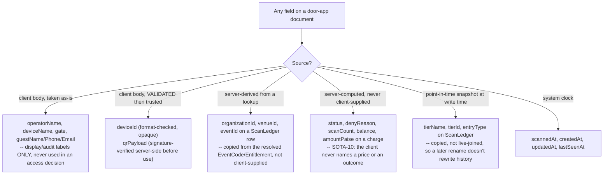
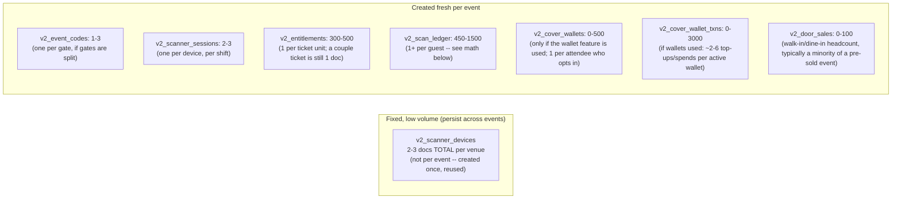
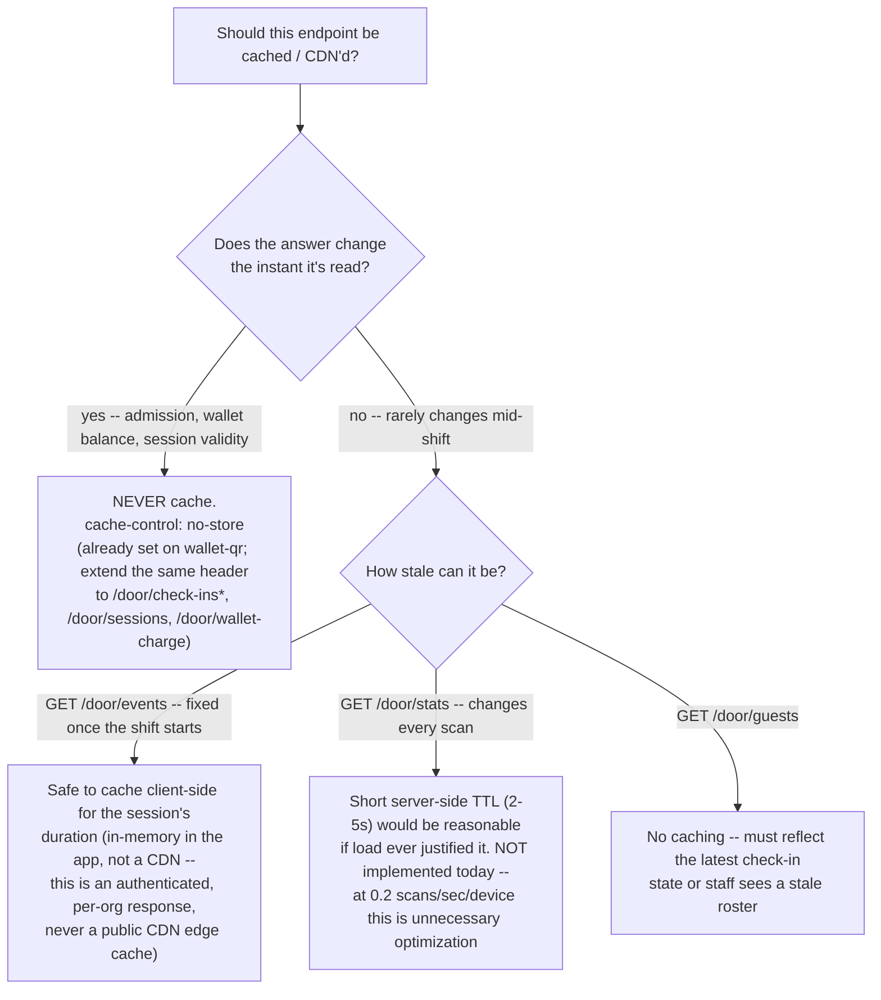
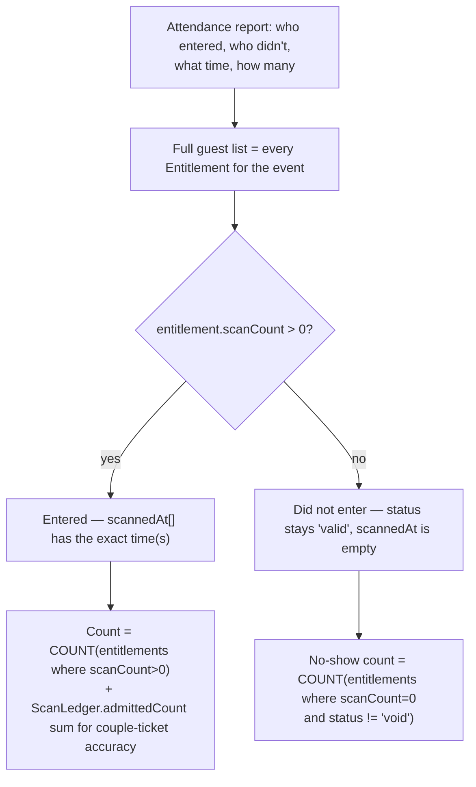

<!--
agent-metadata:
  doc: scanner-app/07-storage-sizing-caching
  kind: reference
  department: door-operations
  flow: capacity-planning
  purpose: Per-field provenance, volume/sizing math for a 300-500 guest event with 2-3 concurrent scanner devices, multi-device double-scan proof, and a caching/CDN recommendation.
  diagrams: [D1-field-provenance-flowchart, D2-multi-device-race-sequence, D3-volume-per-event-graph, D4-caching-decision-flowchart, D5-attendance-report-readiness-flowchart]
  agent-readability: Mermaid + tables; H1->H2 skeleton per README section 4.
  sources: [https://firebase.google.com/docs/firestore/transaction-data-contention, https://docs.cloud.google.com/firestore/native/docs/resolve-latency, https://loopyah.com/blog/tools/qr-code-ticketing-system]
-->

# Scanner App — Storage Sizing, Field Provenance & Caching

## 1. Overview

This doc answers three questions the rest of the folder doesn't: **where
does each field's value actually come from**, **how much data does one
event actually produce** (sized for the stated scale — 300-500 guests per
event, 2-3 scanner devices working the same door concurrently), and
**should any of this be cached or served through a CDN**. It also proves,
citing outside sources, that the existing `claimAdmission` design (already
documented in [`02-scan-admission.md`](02-scan-admission.md)) is the
correct mechanism for "the same guest can't be let in twice by two
different scanners" at this scale — not a gap needing new work.

## 2. Business flow E2E

**Diagram D2 — the exact scenario asked about: two devices, one guest, at the same moment.**

```mermaid
sequenceDiagram
  participant D1 as Device A (gate 1)
  participant D2 as Device B (gate 2)
  participant FS as Firestore (single entitlement doc)

  Note over D1,D2: Same guest's QR shown to both gates within the same second<br/>(twins, or staff waving someone to a second door)
  D1->>FS: runTransaction: read Entitlement, scanCount=0
  D2->>FS: runTransaction: read Entitlement, scanCount=0
  D1->>FS: commit write scanCount=1, status=redeemed
  FS-->>D1: COMMIT OK -> {status:"consumed"}
  D2->>FS: commit write scanCount=1
  FS-->>D2: COMMIT REJECTED (doc changed since D2's read)
  Note over FS: Firestore's pessimistic per-document lock model:<br/>whichever commit lands first wins; the loser's<br/>ENTIRE transaction closure retries automatically
  D2->>FS: retry: read scanCount=1 (fresh)
  D2->>FS: re-evaluate -> already_used
  FS-->>D2: {status:"denied", denyReason:"already_used"}
```

This is not a new mechanism to build — it is the same `claimAdmission`
transaction already fully implemented and tested
([`02-scan-admission.md`](02-scan-admission.md) §4 D3). The industry
pattern this matches (per the sourced research below) is exactly "server-
side validation with a locking transaction," the standard answer to
multi-device duplicate-scan risk in ticketing systems generally — not a
C1RCLE-specific invention.

**Why this is provably safe, cited:**
- Firestore transactions use a **pessimistic concurrency model on the
  server**: a read inside a transaction places a lock, and any concurrent
  write to that same document must wait or fail depending on commit order
  — "only one transaction will complete successfully while the other
  automatically fails" when two clients race the same document ([Firebase:
  Transaction serializability and isolation](https://firebase.google.com/docs/firestore/transaction-data-contention)).
- The specific failure mode industry sources warn about is **offline
  devices**, not concurrent-online devices: "two offline devices can each
  accept the same ticket until sync reconciles" ([QR Code Ticketing Systems
  Guide](https://loopyah.com/blog/tools/qr-code-ticketing-system)). This is
  exactly why `sota-architecture.md` SOTA-2 (offline = deny, no queue) is
  the correct call for this app, not an oversight — an offline queue would
  reintroduce the exact double-admission risk the online transaction
  already eliminates.
- At normal operating latency, Firestore transaction commits run in the
  tens-to-low-hundreds of milliseconds; problems only start when a single
  document is written **very** frequently in a short window ("data
  contention... from updating a single document too frequently" —
  [Resolve latency issues, Firestore](https://docs.cloud.google.com/firestore/native/docs/resolve-latency)).
  One entitlement is scanned once (or twice for a confirmed couple) per
  event, never repeatedly — this system structurally can't hit that
  contention pattern on a per-ticket basis.

## 3. Stack

Same files as [`02-scan-admission.md`](02-scan-admission.md) §3 — this doc
adds no new code, only sizing/caching analysis on top of it.

## 4. Code logic

### 4.1 Field provenance

**Diagram D1 — where a field's value actually comes from.**



| Field category | Example fields | Provenance rule |
|---|---|---|
| Client-supplied, display-only | `operatorName`, `deviceName`, `gate`, `guestName/Phone/Email` on a scan | Taken as-is; never used to grant or deny access — a typo here can't let someone in |
| Client-supplied, validated | `deviceId` | Format-checked (opaque, 16-128 chars) on register; once bound, trusted only because it's paired to a specific `organizationId` |
| Client-supplied, cryptographically checked | `qrPayload` | Verified against `MAGIC_TICKET_SECRET` server-side before any lookup happens — a forged payload never resolves to a real entitlement |
| Server-derived (copied from a resolved entity) | `organizationId`/`venueId`/`eventId` on `ScanLedger` | Read from the `Entitlement`/`EventCode` the scan resolved to, not trusted from the request |
| Server-computed | `status`, `denyReason`, `scanCount`, `balance`, any `amountPaise` on a charge | Never accepted from the client (SOTA-10 for price; the admission FSM for status) |
| Point-in-time snapshot | `tierName`, `tierId`, `entryType` on `ScanLedger` | Copied at scan time from the entitlement, deliberately not a live join — a tier rename after the fact doesn't rewrite the historical record |
| System clock | `scannedAt`, `createdAt`, `updatedAt`, `lastSeenAt` | Server's `Date.now()`/`new Date()` at write time, never client-supplied |

### 4.2 Volume per event — sized for 300-500 guests, 2-3 devices

**Diagram D3 — rough per-event document counts by collection.**



| Collection | Docs / event | Math |
|---|---|---|
| `v2_scanner_devices` | 2-3 (total, not per-event) | Registered once per handset, reused every shift — not a per-event cost at all |
| `v2_event_codes` | 1-3 | One code per gate if the venue splits entry by gate; one is enough for a single-door venue |
| `v2_scanner_sessions` | 2-3 | One redemption per device per shift (12h token, one shift usually fits in one token life) |
| `v2_entitlements` | 300-500 | 1:1 with ticket *units* sold, per SOTA-7 — a couple ticket is still one doc with `scanCountAllowed:2` |
| `v2_scan_ledger` | ~450-1,500 | **Not 1:1 with guests** — it's 1 row per scan *attempt*. Low estimate: every guest scans clean once (300-500 rows). Realistic estimate: ~20-30% of scans are a retry/re-scan/wrong-gate-then-right-gate/couple-ticket's two ledger entries (verify + confirm can each log), pushing this to 1.5-3x guest count |
| `v2_cover_wallets` | 0-500 | Only relevant if the venue runs the wallet feature (Phase 2, not built yet) — at most one per attendee |
| `v2_cover_wallet_txns` | 0-3,000 | If wallets are used: a typical attendee taps a bar tab 2-6 times a night |
| `v2_door_sales` | 0-100 | Walk-in/dine-in headcount sales — usually a small fraction of a pre-sold 300-500 person event, larger for a walk-up-heavy venue |

**Peak write rate (the number that actually matters for latency):** even
if all 500 guests arrive in a tight 15-minute door-opening rush split
across 2-3 devices, that's roughly 500 ÷ 900s ÷ 2.5 devices ≈ **0.2 scans
per second per device** — a new transaction every ~4-5 seconds on the
busiest device, nowhere near the write-frequency threshold where Firestore
documents its own contention warnings. **At this stated scale, latency is
not a design risk; no additional infrastructure (Redis lock, sharded
counters, etc.) is warranted.** Revisit this conclusion only if the real
target becomes thousands of guests through one door in minutes (a
different scale of problem than what was asked).

## 5. Methods reference — caching & CDN decision

**Diagram D4 — what, if anything, gets cached.**



| Endpoint | Cacheable? | Why / why not | CDN-appropriate? |
|---|---|---|---|
| `POST /door/check-ins`, `/confirm`, `/wallet-charge`, `/sessions` | **Never** | Each call changes state or must reflect the instant-current state; a cached "admitted" response served twice is a double-admission bug | No — these are authenticated, per-request-unique writes; a CDN edge has no business seeing them |
| `POST /door/wallet-qr` | **Never** (already enforced) | Rotating credential — the existing `cache-control: no-store` is correct and should be the template for the rest of this table's "never" row | No |
| `GET /door/events` | Session-lifetime, client-side only | The event list for tonight doesn't change mid-shift | No — per-org authenticated data, never belongs on a public CDN edge |
| `GET /door/stats` | Not cached today; a 2-5s server TTL *would* be safe if ever needed | Changes on every scan, but a few seconds of staleness on an occupancy counter is harmless | No |
| `GET /door/guests` | **No** | Staff needs the true current check-in state to avoid working from a stale roster | No |

**Overall recommendation: no CDN anywhere in this system, and no new
caching infrastructure at the stated 300-500-guest scale.** Every
door-app response is authenticated, per-organization, and either
security-critical (never cache) or already cheap enough at this volume
that caching would add complexity without a measurable benefit. If a
future requirement is "thousands of guests, dozens of devices, one
venue," revisit `GET /door/stats` first — it's the only endpoint on this
list where a short TTL would ever be worth the engineering cost.

## 5b. Retention & attendance reporting (confirmed with the user, not assumed)

**Confirmed assumptions:**
- **Retention: indefinite.** `v2_scan_ledger` and `v2_entitlements` are
  never purged — the business need is durable attendance data (who
  entered, who didn't, what time, how many), not a rolling window. No TTL,
  no archival-then-delete policy. This makes the missing composite indexes
  (§4.2 of [`03-data-model.md`](03-data-model.md)) **more** important over
  time, not less — a full scan of an ever-growing collection without the
  right index gets slower every event, not just at scale.
- **One event per venue at a time.** No concurrent-event multiplier on the
  volume math in §4.2 — the per-event estimates there are also the
  per-venue-per-night estimates; there's no scenario where two events'
  scan volume lands on one venue's devices simultaneously.

**Diagram D5 — what "who entered / who didn't / what time / how many"
actually requires, and whether it's already there.**



**The data to answer this already exists** — no new field or collection is
needed:

| Question | Answered by |
|---|---|
| Who entered | `Entitlement` where `scanCount > 0` (join `holderName`) |
| Who did not enter | `Entitlement` where `scanCount === 0` and `status !== 'void'` |
| What time each person entered | `Entitlement.scannedAt[]` (per-admission ISO timestamps) — or `ScanLedger.scannedAt` for the attempt-level record, including denied/duplicate attempts the entitlement-level view alone wouldn't show |
| How many entered, by tier / gate / device / hour | `ScanLedger` filtered by `status:'consumed'`, grouped by `tierName`/`gate`/`deviceId`/`scannedAt` — this needs the composite indexes already flagged as missing (§4.2 of `03-data-model.md`) to run efficiently once the ledger has thousands of rows across many events |

**Real gap, confirmed by grepping the door routes:** there is **no
dedicated attendance/no-show report endpoint** anywhere in
`apps/api-gateway/src/routes/v2/door/*` today. The underlying data
supports the report; nothing currently *returns* it as a single call — an
admin would have to compose it from `GET /door/guests` (entitlement-level)
and raw `ScanLedger` queries by hand. This is a genuine, currently-unbuilt
piece: a `GET /door/attendance-report` (or similar, likely admin-console-
facing rather than scanner-app-facing) that does the join in §5b's diagram
server-side. Not scoped into any phase in
[`06-v1-vs-v2-and-rollout.md`](06-v1-vs-v2-and-rollout.md) yet — worth its
own phase or a slot in Phase 1 given it's now a confirmed requirement, not
a nice-to-have.

## 6. Verification

No new code to verify — this doc's claims are checked against the actual
route code (`grep -rn "cache-control"` across
`apps/api-gateway/src/routes/v2/door/` — currently one hit, `wallet-qr`,
confirmed in §1) and against the volume math above. Re-run that grep
before trusting this doc's caching table if the door routes change.

## Sources

- [Transaction serializability and isolation — Firestore, Firebase](https://firebase.google.com/docs/firestore/transaction-data-contention)
- [Resolve latency issues — Firestore in Native mode, Google Cloud](https://docs.cloud.google.com/firestore/native/docs/resolve-latency)
- [QR Code Ticketing Systems Guide: How To Sell, Scan & Stop Fraud — Loopyah](https://loopyah.com/blog/tools/qr-code-ticketing-system)
