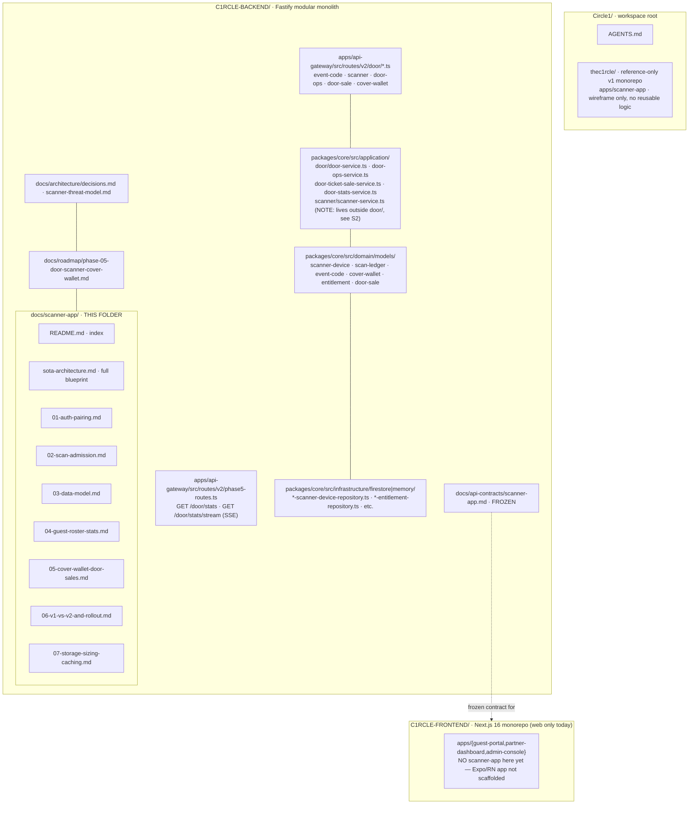
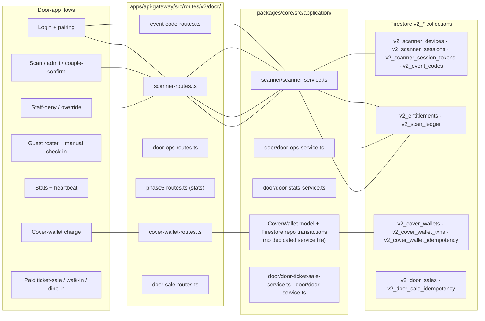
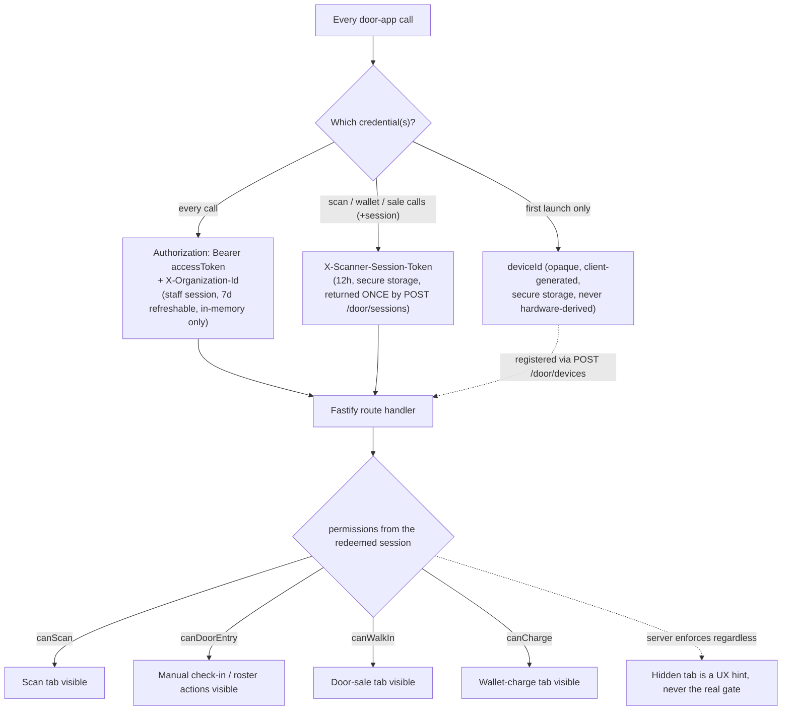

<!--
agent-metadata:
  doc: scanner-app/README
  kind: index
  department: door-operations
  purpose: Repo map, flow map, credential model, structural-deviation audit of Sagar's build, diagram inventory, agent-readability conventions, verification gates.
  diagrams: [D1-repo-structure, D2-flow-map, D3-credential-model]
  agent-readability: Mermaid (flowchart/sequence/state/class) + tables; every doc H1->H2 skeleton; metadata block above.
-->

# C1RCLE V2 — Scanner App · Door Operations Documentation (Index)

> **Living documentation** for the door-scanning system: the backend
> surface (`apps/api-gateway/src/routes/v2/door/*`, built by Sagar,
> branch `feat/scanner-app-backend`) and the frontend that will consume it
> (not yet built — no scaffold exists anywhere in this workspace as of this
> writing).
> Verified against live code 2026-09-23.
> Binding authority: `docs/architecture/decisions.md` (ADR D-025–D-029) →
> live code. Wire contract **FROZEN**: `docs/api-contracts/scanner-app.md`.
> Companion blueprint: [`sota-architecture.md`](sota-architecture.md) (full
> invariant/diagram/data-model reference — this README indexes the topic
> docs that break that blueprint into PR-sized units, same relationship as
> `docs/nginx/sota-architecture.md` to `docs/nginx/{architecture,deployment}.md`).

---

## 1. Repository structure — with every doc (diagrammed)

**Diagram D1 — repo tree, including this doc folder.**



**Structural note (this is the "not as required" audit):** the application
layer's actual file names are `door-service.ts`, `door-ops-service.ts`,
`door-ticket-sale-service.ts`, `door-stats-service.ts` under
`packages/core/src/application/door/` — **plus** a separate
`scanner-service.ts` under `packages/core/src/application/scanner/`
(a sibling directory, not inside `door/`). There is **no**
`cover-wallet-service.ts` file — cover-wallet business logic lives directly
in the `CoverWallet` domain model plus its Firestore repository's
transaction methods, called from the door routes/services rather than a
dedicated service file. See §6.3 for the full list of naming/location
deviations from what a first read of the route files would suggest.

---

## 2. Flow map — credential tiers, routes, services, storage

**Diagram D2 — flow → route files → core services → collections.**



| Flow | Route file(s) | Core service | Collections | Doc |
|---|---|---|---|---|
| Login + pairing | `event-code-routes.ts`, `scanner-routes.ts` (`/door/devices*`, `/door/sessions`) | `scanner-service.ts` | `v2_scanner_devices`, `v2_scanner_sessions`, `v2_scanner_session_tokens`, `v2_event_codes` | [`01-auth-pairing.md`](01-auth-pairing.md) |
| Scan / admit / couple-confirm | `scanner-routes.ts` (`/door/check-ins*`, `/door/lookup`) | `scanner-service.ts` → `Entitlement.admitSeats`/`claimAdmission` | `v2_entitlements`, `v2_scan_ledger` | [`02-scan-admission.md`](02-scan-admission.md) |
| Guest roster + manual check-in | `door-ops-routes.ts` | `door-ops-service.ts` | `v2_entitlements`, `v2_scan_ledger` | [`04-guest-roster-stats.md`](04-guest-roster-stats.md) |
| Stats + heartbeat | `phase5-routes.ts`, `scanner-routes.ts` (`/door/heartbeat`) | `door-stats-service.ts`, `scanner-service.ts` | reads across collections above | [`04-guest-roster-stats.md`](04-guest-roster-stats.md) |
| Cover-wallet charge | `cover-wallet-routes.ts` | `CoverWallet` model + repo (no dedicated service) | `v2_cover_wallets`, `v2_cover_wallet_txns`, `v2_cover_wallet_idempotency` | [`05-cover-wallet-door-sales.md`](05-cover-wallet-door-sales.md) |
| Paid ticket-sale / walk-in / dine-in | `door-sale-routes.ts` | `door-ticket-sale-service.ts`, `door-service.ts` | `v2_door_sales`, `v2_door_sale_idempotency` | [`05-cover-wallet-door-sales.md`](05-cover-wallet-door-sales.md) |
| Staff-deny / override | `scanner-routes.ts` (`/door/staff-deny`, `/door/override`) | `scanner-service.ts` | `v2_scan_ledger` (own terminal states) | [`05-cover-wallet-door-sales.md`](05-cover-wallet-door-sales.md) |

---

## 3. The credential model — one picture

**Diagram D3 — three credentials, one door.**



Full field-by-field detail for every model these credentials touch lives in
[`sota-architecture.md`](sota-architecture.md) §3–§4.

---

## 4. How to read each doc

Every topic doc in this folder follows the same H1→H2 skeleton (agent-greppable):

| Section | Contents |
|---|---|
| `## 1. Overview` | Flow, credential tier, why it exists |
| `## 2. Business flow E2E` | **Mermaid sequence diagram** + numbered human walkthrough |
| `## 3. Stack` | Layer table (route → service → domain → Firestore collection → contract) |
| `## 4. Code logic` | **Mermaid flowcharts/state diagrams** + explanations |
| `## 5. Methods reference` | Machine-readable tables: endpoint, purpose, rate-limit class, idempotent, credential(s) |
| `## 6. Verification` | Test commands + manual click-through hints |

| Doc | Covers |
|---|---|
| [`01-auth-pairing.md`](01-auth-pairing.md) | Staff login, device pairing/reauthorize/unbind, door-code → session redemption |
| [`02-scan-admission.md`](02-scan-admission.md) | Camera scan, `claimAdmission`, couple-ticket two-step confirm, offline-deny |
| [`03-data-model.md`](03-data-model.md) | Every Firestore collection/field/id-scheme, state machines |
| [`04-guest-roster-stats.md`](04-guest-roster-stats.md) | Guest roster search/pagination, manual check-in, stats, heartbeat |
| [`05-cover-wallet-door-sales.md`](05-cover-wallet-door-sales.md) | Cover-wallet charging, paid ticket-sale, walk-in/dine-in, staff-deny/override — all backend-complete, all deferred on the frontend |
| [`06-v1-vs-v2-and-rollout.md`](06-v1-vs-v2-and-rollout.md) | V1 gap analysis + the phased frontend rollout plan |
| [`07-storage-sizing-caching.md`](07-storage-sizing-caching.md) | Field provenance, per-event volume sizing (300-500 guests, 2-3 devices), multi-device double-scan proof (sourced), caching/CDN recommendation |

---

## 5. Diagram inventory

| Doc | Diagrams (D1…) |
|---|---|
| `README.md` | D1 repo structure · D2 flow map · D3 credential model |
| `sota-architecture.md` | 10 SOTA invariants + topology, bootstrap sequence, per-model data tables, 4 state diagrams, admission sequence (+ concurrency variant), 9 flow sequences, failure-mode table, phase table |
| `01-auth-pairing.md` | D1 login+events sequence · D2 device-register sequence · D3 session-redeem sequence · D4 device lifecycle state |
| `02-scan-admission.md` | D1 scan decision sequence · D2 couple-confirm sequence · D3 concurrent double-scan sequence · D4 `evaluateAdmission` flowchart |
| `03-data-model.md` | D1–D7 one ER-style field diagram per model · D8 collection relationship graph |
| `04-guest-roster-stats.md` | D1 roster search/paginate flowchart · D2 manual check-in sequence · D3 stats poll lifecycle · D4 heartbeat sequence |
| `05-cover-wallet-door-sales.md` | D1 wallet-charge sequence · D2 ticket-sale sequence · D3 walk-in/dine-in sequence · D4 override/staff-deny state diagram |
| `06-v1-vs-v2-and-rollout.md` | D1 v1 screen-to-v2-endpoint mapping · D2 phase-dependency flowchart |
| `07-storage-sizing-caching.md` | D1 field-provenance flowchart · D2 multi-device race sequence (sourced) · D3 per-event volume graph · D4 caching-decision flowchart |

---

## 6. Structural-deviation audit — Sagar's build vs. what a clean structure would look like

This section exists specifically to answer "is the current structure as
required" without guessing — every item below is a fact read directly from
the source, not an opinion about style.

### 6.1 Service-file location is split across two directories

`scanner-service.ts` lives at `packages/core/src/application/scanner/`,
while `door-ops-service.ts`, `door-service.ts`,
`door-ticket-sale-service.ts`, and `door-stats-service.ts` all live at
`packages/core/src/application/door/`. Both directories serve the same
"door operations" feature — a reader expecting one `door/` module to own
the whole feature will miss `scanner-service.ts` on first pass. This is a
real navigation cost, not a functional bug.

### 6.2 No dedicated cover-wallet service file

Every other money-adjacent flow (ticket-sale, walk-in/dine-in) has its own
named service file. Cover-wallet credit/debit/refund/adjustment logic
instead lives as transaction methods directly on the Firestore repository
(`firestore-cover-wallet-repository.ts` — the `runTransaction` block
wrapping wallet + txn + idempotency-doc writes). Functionally correct and
atomically sound (confirmed in `sota-architecture.md` §4.5), but it breaks
the route→service→domain layering pattern the rest of this codebase follows,
putting business rules in the infrastructure layer instead of the
application layer.

### 6.3 Two id schemes don't match the rest of the family

Every other id in this data model (`ScannerDevice`, `ScanLedger`,
`EventCode`, `ScannerSession`, `Entitlement`) is SHA-256-hash-derived or
CSPRNG-random specifically to avoid a real, previously-hit 64-char
opaque-id-cap bug. `DoorSale` (`` `DS-${venueId}-${Date.now()}-${random36}` ``)
and `CoverWalletTxn` (`` `txn-${walletId}-${Date.now()}` ``, no random
component at all) don't follow it. See `sota-architecture.md` SOTA-9 for
the full detail and the collision risk this specifically creates for
`CoverWalletTxn`.

### 6.4 No committed `firestore.indexes.json`

The threat-model doc prescribes 8 specific composite indexes for
`v2_scan_ledger` as a deployment checklist (`sota-architecture.md` §4.2) —
none of them are committed as deployable Firestore index configuration
anywhere in this repo. Whoever deploys this to a new environment has to
know to read the threat-model doc's prose and hand-create them; there is
no `firebase deploy --only firestore:indexes` path today.

### 6.5 What is genuinely fine (do not "fix" these)

The two-tier auth split (staff session vs. scanner session) living in
different modules is intentional and documented (ADR D-025/D-026), not a
deviation. The SSE-not-WebSocket choice for stats (D-028) is a deliberate,
reasoned decision, not a shortcut. The offline=deny design (no queue) is a
product decision, not a missing feature. None of these should be
"corrected" by a future contributor who hasn't read the ADRs.

---

## 7. Agent-readability conventions (applies to every file in this folder)

1. **Metadata block** — each file opens with an `<!-- agent-metadata: … -->`
   comment: `doc`, `department`/`flow`, `purpose`, `diagrams`.
2. **Mermaid, not ASCII** — all diagrams are fenced ` ```mermaid ` blocks.
3. **One skeleton** — the H1→H2 sections in §4 are identical order everywhere.
4. **Tables for facts** — routes, methods, rate-limit classes, field
   schemas are always tables, never prose lists.
5. **IDs on diagrams** — `**Diagram Dn — <caption>**` immediately above
   each block.
6. **Paths, not prose** — every code touchpoint is a repo-relative path.
7. **Flag deviations, don't silently normalize them** — §6 above is the
   model: state the fact, cite the file, don't rewrite history by
   pretending the structure is cleaner than it is.

---

## 8. Verification gates

```bash
# backend (from C1RCLE-BACKEND)
pnpm check                    # format → lint → typecheck → boundaries → test → build
pnpm --filter api-gateway test -- door       # scanner/door-specific suite
pnpm --filter api-gateway test:scenarios     # includes the door check-in E2E scenario

# frontend — not yet applicable; no apps/scanner-app exists yet.
# See 06-v1-vs-v2-and-rollout.md for the phase at which this section gets filled in.
```

Manual E2E click-through against real staging is documented per-flow in
each topic doc's §6, once the frontend exists (Phase 1 of the rollout
plan). Until then, verification is backend-only: the 906+ test suite and
the `business-flows.test.ts` scenario ("guest purchase + door check-in +
finance settlement") are the only executable proof of correctness.
