# C1RCLE Scanner App — SOTA Architecture Blueprint

> **Status:** Definitive reference for the door-scanning system (backend
> complete, frontend not yet built).
> **Last verified:** 2026-09-23, branch `feat/scanner-app-backend`.
>
> Companion docs: [`../api-contracts/scanner-app.md`](../api-contracts/scanner-app.md)
> (the frozen wire contract — talk to it if this doc and the code ever
> disagree, that one is closer to the code), [`../architecture/decisions.md`](../architecture/decisions.md)
> ADRs D-025 through D-029, [`../architecture/scanner-threat-model.md`](../architecture/scanner-threat-model.md)
> (full STRIDE-style threat model — §10 here is a summary, not a
> replacement).
>
> If this document and the code disagree, **the code wins** and this
> document must be corrected — same rule as `docs/nginx/sota-architecture.md`.

---

## 1. Core Invariants (do not regress)

| # | Invariant | Owned by |
|---|---|---|
| SOTA-1 | **A scan never spends a seat before the transaction commits.** Every admission decision is evaluated and written inside one Firestore transaction (`claimAdmission`); a denied scan touches nothing. | `firestore-entitlement-repository.ts` → `claimAdmission` |
| SOTA-2 | **Offline always denies.** There is no offline admission queue in the standard app. A network failure at the door shows "Scanner offline — entry denied until connectivity returns" and stores nothing to replay. | contract §"Offline"; app-side (not yet built) |
| SOTA-3 | **The raw scanner-session token is returned exactly once**, by `POST /door/sessions`. Every later read of that session reports `sessionToken: null` — the persisted document never carries the plaintext. | `ScannerSession` model + `v2_scanner_session_tokens` lookup collection |
| SOTA-4 | **Wrong-venue and non-existent answer identically.** A ticket belonging to another venue returns `wrong_event`/404, never a signal that lets a scanner enumerate another club's data. This check runs *before* the void/used checks. | `evaluateAdmission()` ordering in `entitlement.ts` |
| SOTA-5 | **Money calls are idempotent-key-gated, one key per user intent — not per network attempt.** The same key is replayed on every retry of one tap; a new key on retry double-bills. | contract §4; `v2_cover_wallet_idempotency`, `v2_door_sale_idempotency` |
| SOTA-6 | **Drive the UI from `permissions`, never from a role string.** The session response's `{canScan, canDoorEntry, canWalkIn, canCharge}` is the only legitimate gate for showing a tab — the server enforces it regardless, so a hidden button is a usability hint, never a permission. | contract §5; `SessionPermissions` |
| SOTA-7 | **One entitlement per ticket unit, not per admitted person.** A couple ticket is one `Entitlement` with `scanCountAllowed: 2`, never two entitlements — otherwise the pair could split and enter at different gates. | `entitlement.ts` module doc |
| SOTA-8 | **Every scan attempt is recorded, successful or denied — a deny never skips the ledger.** `ScanLedger` is append-only per *attempt*, not per admission; the ledger and the entitlement are two different aggregates that must never be conflated. | `scan-ledger.ts`; §7 below |
| SOTA-9 | **Every id in this family is hash-derived or CSPRNG-random, never a raw concatenation.** A readable `ENT-{orderId}-{tierId}-{index}` scheme once overflowed the platform's 64-char opaque-id cap on the *third* fulfilled order in one process — fixed by hashing. Two models (`DoorSale`, `CoverWalletTxn`) still don't follow this and are flagged as a live inconsistency, not corrected silently — see §5. | `entitlement.ts`, `scanner-device.ts`, `scan-ledger.ts` module comments |
| SOTA-10 | **The client never names a price.** Cover-wallet charges use only server-defined `presetItems`; a client-supplied `amountPaise` is never trusted. | `CoverWalletRules.presetItems`; threat-model §6 |

---

## 2. System Topology

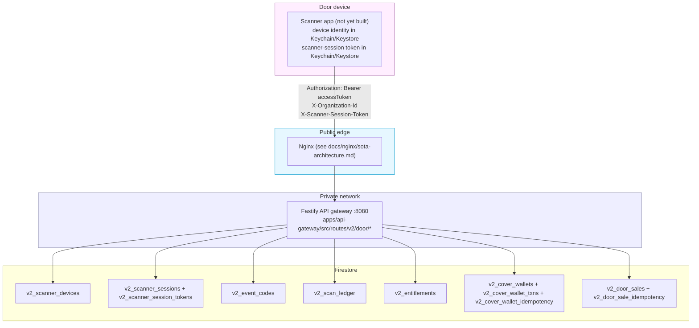

Every call from a door device carries the two device-facing credentials in
§3 side by side with the staff session — none is sufficient alone. Nginx's
role here is exactly what `docs/nginx/sota-architecture.md` already
describes (SOTA-1 through SOTA-8 of that doc); this document does not
repeat the edge topology, only the door-specific auth/data layer behind it.

---

## 3. The Three Credentials

| Credential | Header | Says | Lifetime | Storage |
|---|---|---|---|---|
| **Staff session** | `Authorization: Bearer <accessToken>` + `X-Organization-Id` | *Who* the operator is and which venue they act for | 7 days, refreshable | Access token in memory only — never `AsyncStorage`, never a file, never a log line |
| **Device identity** | body param `deviceId` on register/session calls | *Which physical handset* — opaque, client-generated once on first launch, never hardware-derived | Permanent until unbound | Secure storage (Keychain/Keystore via `expo-secure-store`) |
| **Scanner session** | `X-Scanner-Session-Token: <token>` | *Which device*, on *which shift*, at *which event*, with *which permissions* | 12 hours | Secure storage — the raw token is returned exactly once (SOTA-3) |

### Bootstrap sequence

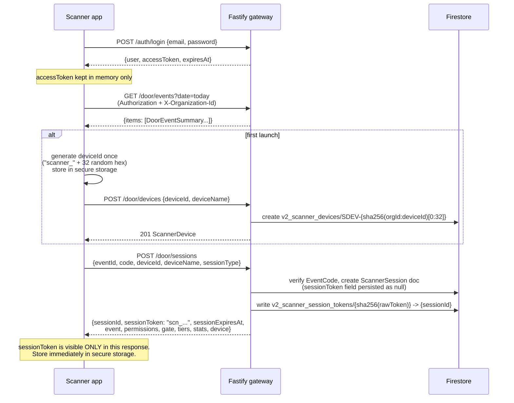

`POST /door/sessions` is deliberately a single round trip returning
"everything needed to run the shift" (event, permissions, gate, tiers,
opening stats) — the contract's own rationale is that a door phone on club
wifi may not get a second one.

If `POST /door/devices` ever returns 403, a manager unbound this handset
mid-install; only `POST /door/devices/:deviceId/reauthorize` (a manager
action, not something the app can self-serve) restores it — the app must
stop and tell staff to find a manager, never retry.

---

## 4. Data Model

Every field below is transcribed directly from
`packages/core/src/domain/models/*.ts`; nothing here is inferred. `id` and
`createdAt`/`updatedAt`/`version` are inherited from `VersionedEntity` and
omitted from each table below except where the id scheme is notable.

### 4.1 `ScannerDevice`

Collection: `v2_scanner_devices`. Doc id: `SDEV-{sha256(organizationId:deviceId)[0:32]}` — deterministic, so the id is *reconstructed* at lookup time, never queried by a secondary index.

| Field | Type | Purpose / constraint |
|---|---|---|
| `organizationId` | `EntityId` | tenant |
| `venueId` | `EntityId \| null` | |
| `deviceId` | `string` | opaque, client-generated, stable for the life of the install — never hardware-derived |
| `deviceName` | `string` | human label, e.g. "Gate iPad 1" |
| `status` | `'active' \| 'unbound'` | |
| `boundBy` | `EntityId` | who authorized this device |
| `boundAt` / `unboundAt` | `string` / `string \| null` | ISO |
| `unboundReason` | `string \| null` | |
| `lastSeenAt` | `string` | heartbeat liveness |
| `lastEventId`, `lastGate` | `EntityId \| null`, `string \| null` | |
| `scanCount` | `number` | rolling counter — feeds "this phone is denying everything" abuse detection |
| `lastScanAt`, `lastScanResult` | `string \| null`, `string \| null` | |

`touch()` (the heartbeat write) uses a plain `.update()`, not the shared
compare-and-set helper — liveness fields are advisory, not version-guarded.

### 4.2 `ScanLedger`

Collection: `v2_scan_ledger`. Doc id: `SCAN-{sha256(eventId:entitlementId:ts:randomBytes)[0:32]}` — random, **not** deterministic, because this collection is append-only per attempt (SOTA-8), not idempotent-per-outcome.

| Field | Type | Purpose |
|---|---|---|
| `eventId`, `organizationId`, `venueId` | ids | |
| `entitlementId` | `EntityId \| null` | the ticket scanned, if any |
| `doorSaleId` | `EntityId \| null` | for walk-in/dine-in sales with no entitlement |
| `entryType`, `tierName`, `tierId` | point-in-time snapshot | copied at scan time, not joined live — so a later tier rename doesn't rewrite history |
| `operatorUid`, `operatorName`, `operatorRole` | | who scanned |
| `gate`, `deviceId`, `deviceName` | | |
| `deviceBound` | `boolean` | was the device registered/bound at scan time |
| `status` | `ScanLedgerStatus` | see §5.2 |
| `denyReason`, `denyMessage` | `ScanDenyReason \| null`, `string \| null` | |
| `guestName`, `guestEmail`, `guestPhone` | `string \| null` | |
| `scannedAt` | `string` | |
| `admittedCount` | `number` | people admitted by *this* scan (2 for a confirmed couple) |
| `scanCountUsed`, `scanCountAllowed` | `number \| null` | |
| `isOffline`, `syncedAt`, `offlineDeviceId` | | for the opt-in pre-authorized offline mode the standard app doesn't use |
| `overriddenBy`, `overrideReason` | `string \| null` | non-null only when `status === 'overridden'` |

`ScanDenyReason` = `invalid_signature \| already_used \| expired \| wrong_event \| device_invalid \| void_ticket \| capacity_exceeded \| wrong_gate \| offline_expired \| override_required \| promoter_not_authorized`.

**Relationship to `Entitlement` (do not conflate these two aggregates):**
one ledger row is written per scan *attempt*, successful or denied. The
repository's own comment states duplicate-admission prevention is
deliberately *not* this collection's job — that's `claimAdmission`'s job
(§7). Two concurrent scans of one ticket each get their own ledger row;
`findByEventAndEntitlement` is documented as "a hint, never a lock." A
denied scan never touches the entitlement document at all.

Required composite indexes (per `docs/architecture/scanner-threat-model.md`
§3.7 — **prescribed, not yet committed as a deployable `firestore.indexes.json`
anywhere in this repo**, a real gap):

```
eventId↑, isOffline↑, scannedAt↑
eventId↑, entitlementId↑
eventId↑, scannedAt↓
organizationId↑, scannedAt↓
deviceId↑, scannedAt↓
operatorUid↑, scannedAt↓
eventId↑, status↑
entitlementId↑, status↑
```

### 4.3 `EventCode`

Collection: `v2_event_codes`. Doc id: `CODE-{randomBytes(16).hex}`.

| Field | Type | Purpose |
|---|---|---|
| `code` | `string` | human code `C1R-XXXXXXXX`, CSPRNG, 30-symbol unambiguous alphabet |
| `eventId`, `organizationId`, `venueId` | ids | |
| `type` | `'full' \| 'scan_only' \| 'charge'` | determines the redeemed session's `permissions` (§3 table) |
| `gate` | `string \| null` | optional gate restriction |
| `createdBy`, `createdByName` | | |
| `status` | `'active' \| 'revoked' \| 'expired'` | |
| `revokedAt`, `revokedReason` | | |
| `expiresAt` | `string \| null` | |
| `stats` | `{scansCount, doorEntriesCount, doorRevenue, lastUsedAt, activeSessions}` | updated via `FieldValue.increment`, owned by this doc — no separate stats collection |
| `maxDevices` | `number` | default 5 |
| `allowReuse` | `boolean` | default false |

### 4.4 `ScannerSession`

Collection: `v2_scanner_sessions` + a separate lookup collection
`v2_scanner_session_tokens`. Session doc id: `SESS-{randomBytes(16).hex}`.
Token lookup doc id: `SHA-256(sessionToken)` → `{sessionId}` — the
indirection exists *so the raw token is never itself a queryable field*
(SOTA-3).

| Field | Type | Purpose |
|---|---|---|
| `sessionToken` | `string \| null` | **always persisted as `null`** — the raw value exists only in the one-time creation response |
| `codeId`, `eventId` | ids | |
| `organizationId` | `EntityId` | the event code's owner org, not the redeeming staff member's own org |
| `venueId` | `EntityId \| null` | |
| `type` | `'staff' \| 'device'` | |
| `deviceId`, `deviceName` | `string \| null` | |
| `expiresAt` | `string` | `now + 12h` |
| `lastUsedAt` | `string \| null` | |
| `revokedAt`, `revokedReason` | `string \| null` | |
| `permissions` | `{canScan, canDoorEntry, canWalkIn, canCharge}` | derived from the redeemed code's `type` (§3 table) |
| `createdBy`, `createdByName` | | |

`cleanupExpired()` is a batch sweep marking `revokedAt`/
`revokedReason: 'expired'` — TTL-*style* cleanup implemented as an explicit
job, not Firestore's native TTL feature.

### 4.5 `CoverWallet` + `CoverWalletTxn`

Collections: `v2_cover_wallets`, `v2_cover_wallet_by_event_user` (lookup),
`v2_cover_wallet_txns`, `v2_cover_wallet_idempotency`,
`v2_cover_wallet_reconciliations`.

`CoverWallet` — id `CW-{sha256(eventId:userId:ts:randomBytes)[0:32]}`;
lookup doc id `{eventId}|{userId}` (duplicates `walletId` for reverse
lookup):

| Field | Type | Purpose |
|---|---|---|
| `userId`, `eventId`, `organizationId`, `venueId` | ids | |
| `balance` | `number` (paise) | invariant: never negative |
| `openingBalance`, `totalCredits`, `totalDebits`, `totalRefunds` | `number` | |
| `status` | `'active' \| 'frozen' \| 'terminated' \| 'closed'` | `frozen` is reversible only to/from `active` |
| `terminatedAt` | `string \| null` | next-day 05:00 local (IST, +05:30) once balance hits 0 |
| `terminationReason` | `string \| null` | e.g. `'balance_depleted'` |
| `lastTxnAt`, `lastCreditAt`, `lastDebitAt` | `string \| null` | |
| `metadata` | `Record<string, unknown>` | |
| `rules` | `{presetItems, minChargePaise, maxChargePaise, showBalanceToGuest}` | preset items are `{id, label, amountPaise, isAvailable}` — price is **always** server-side (SOTA-10) |

`CoverWalletTxn` — id `` `txn-${walletId}-${Date.now()}` `` — **flagged as
inconsistent with the id-scheme family** (SOTA-9): no random component, so
two transactions on the same wallet in the same millisecond could
theoretically collide. Every other id in this document's data model is
hash- or CSPRNG-derived specifically to prevent this class of bug.

| Field | Type | Purpose |
|---|---|---|
| `walletId`, `eventId`, `organizationId`, `venueId`, `userId` | ids | |
| `type` | `'credit' \| 'debit' \| 'refund' \| 'adjustment'` | |
| `amount` | `number` (paise, signed) | |
| `balanceAfter` | `number` | |
| `status` | `'pending' \| 'committed' \| 'failed' \| 'reversed'` | |
| `idempotencyKey` | `string` | doc id in `v2_cover_wallet_idempotency` is this key itself |
| `referenceId`, `referenceType` | | |
| `deviceId`, `operatorUid`, `operatorName` | | |
| `description`, `failureReason`, `processedAt` | | |

Credit/debit/refund/adjustment are all one `runTransaction` writing the
wallet, the txn, and the idempotency doc atomically.

### 4.6 `Entitlement`

Collection: `v2_entitlements`. Doc id: `ENT-{sha256(orderId:tierId:index)[0:32]}`
— deterministic on purpose (§4.6.1). See §1 SOTA-7 for the one-entitlement-
per-unit rule.

| Field | Type | Purpose / constraint |
|---|---|---|
| `orderId`, `eventId`, `organizationId`, `tierId` | ids | |
| `tierName` | `string` | |
| `userId` | `EntityId \| null` | null for a guest checkout with no account |
| `holderName` | `string` | name on the ticket, for door staff |
| `status` | `'valid' \| 'redeemed' \| 'void'` | see §5.1 — **not** a 5-value enum; confirm against source before drawing any diagram that assumes ISSUED/ACTIVE/CONSUMED/REVOKED/EXPIRED, which does not exist in this codebase |
| `scanCountAllowed` | `number` | 1 normal, 2 couple ticket |
| `scanCount` | `number` | |
| `scannedAt` | `string[]` | audit trail, newest last |

#### 4.6.1 Why the id is deterministic

Fulfilment runs from a payment confirmation, and confirmations arrive
*twice* (webhook and browser-redirect race). A random id would mint a
second set of tickets on the second confirmation; a deterministic one
collides with itself, so the retry is a storage-layer no-op. The QR
payload is deliberately **not** stored on the entitlement — what a guest
scans must be short-lived and authorized at read time, never a long-lived
code sitting in a database.

### 4.7 `DoorSale`

Collection: `v2_door_sales` + `v2_door_sale_idempotency`. Doc id:
`` `DS-${venueId}-${Date.now()}-${random36}` `` — **also flagged**
alongside `CoverWalletTxn` as not following the hash/CSPRNG id family
(SOTA-9), though it does at least include a random component unlike the
wallet-txn id.

| Field | Type | Purpose |
|---|---|---|
| `eventId`, `organizationId`, `venueId` | ids | |
| `category` | `'walkin' \| 'dinein'` | |
| `guestName`, `guestPhone`, `guestAge`, `gender`, `guestEmail` | | |
| `totalGuests`, `tableNumber`, `gate` | | |
| `paymentMode` | `'cash' \| 'card' \| 'upi' \| 'other'` | |
| `amountPaise` | `number` | |
| `paymentStatus` | `'collected' \| 'pending' \| 'failed'` | |
| `paymentRef` | | |
| `createdBy`, `createdByName` | | |
| `status` | `'active' \| 'voided' \| 'refunded'` | |
| `voidedAt`, `voidedBy`, `voidReason` | | |
| `refundedAmountPaise`, `refundedAt`, `refundedBy` | | |
| `idempotencyKey` | `string` | |

---

## 5. State Machines

### 5.1 `Entitlement.status`

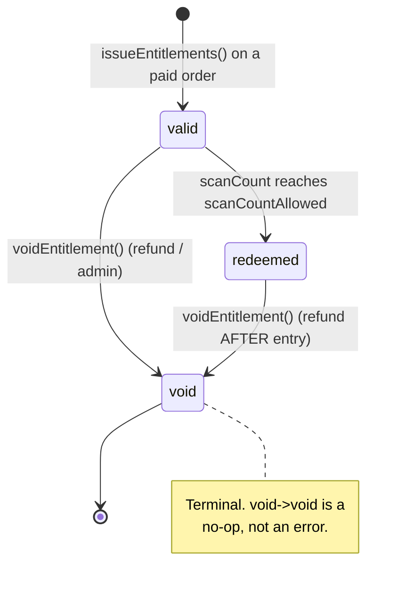

### 5.2 `ScanLedgerStatus` (a different aggregate — the attempt, not the ticket)

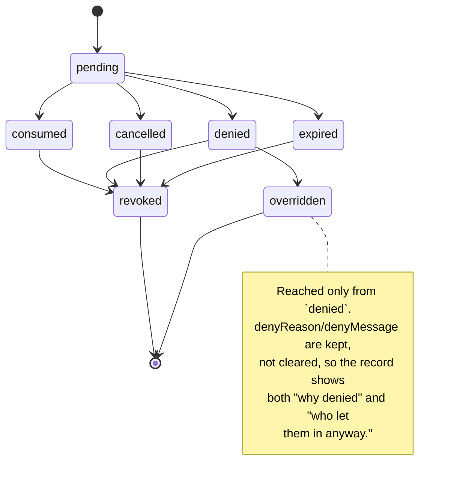

### 5.3 `CoverWallet.status`

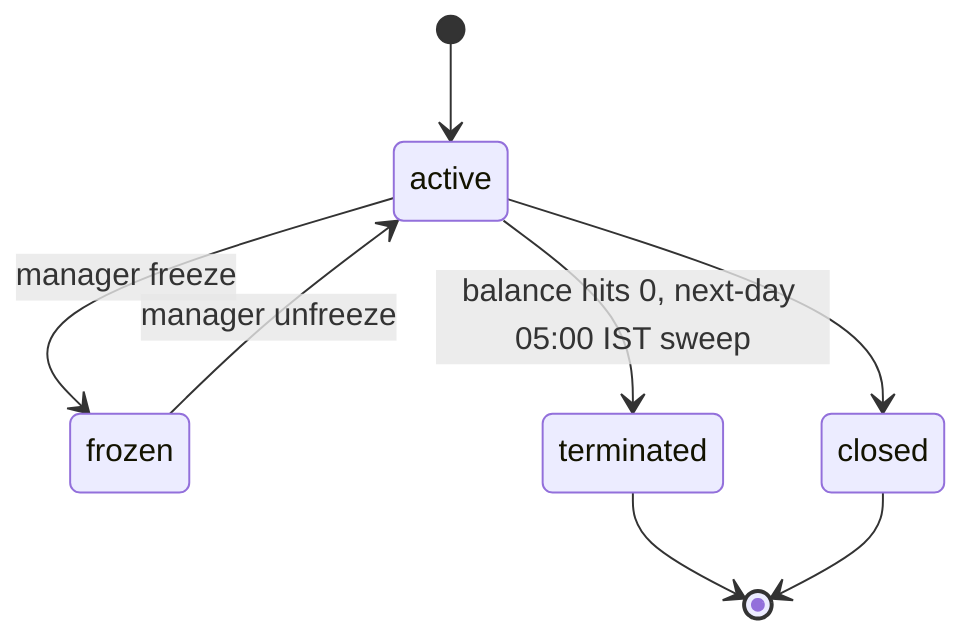

### 5.4 `EventCode.status` / `DoorSale.status`

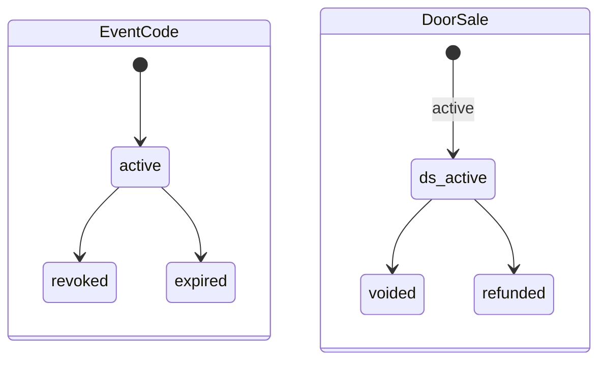

---

## 6. The Admission Primitive — `claimAdmission`

This is the one place a seat is ever spent. Both the Firestore adapter and
the in-memory test adapter call the identical pure `admitSeats`/
`evaluateAdmission` domain functions (`entitlement.ts`) — the transactional
path (a real door scan) and the read-only preview path
(`/door/check-ins/verify`, `/door/lookup`) can never disagree about what is
admissible, because they run the same code, not two implementations kept in
sync by hand.

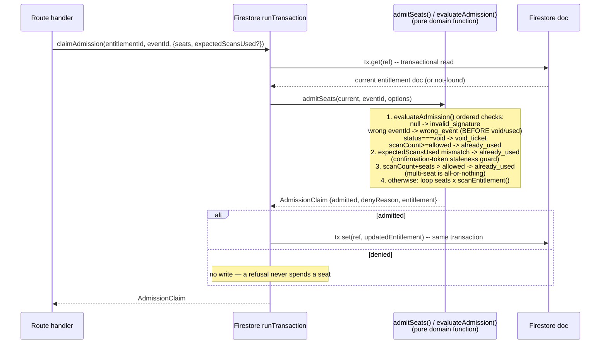

### Concurrent double-scan — why it's structurally impossible, not just unlikely

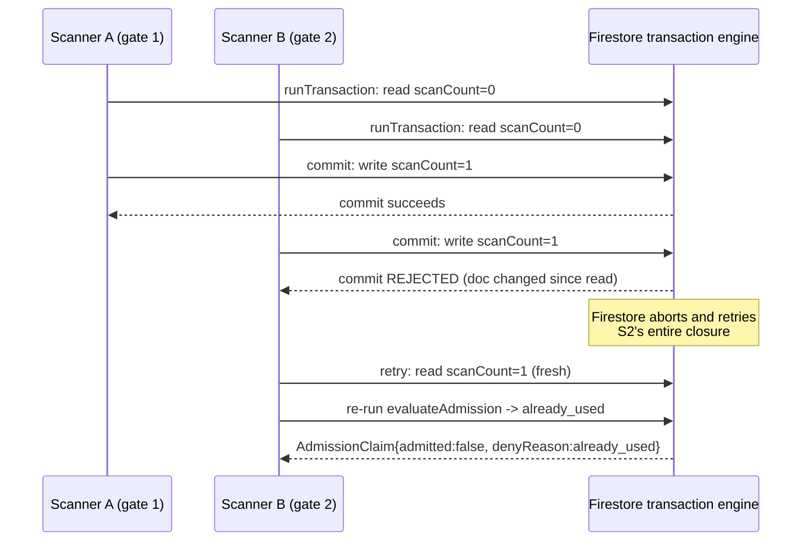

Firestore's `runTransaction` aborts and retries the whole closure —
including the domain evaluation, not just the write — whenever the
document changed between the transactional read and the commit attempt.
The loser's retry re-reads the now-incremented `scanCount` and is
deterministically denied. This is the same pattern D-015's compare-and-set
uses for `version`, applied here to admission counts.

---

## 7. Request Flows

Each flow below is annotated with its rate-limit class (§8) and idempotency
requirement (§9) straight from the contract.

### 7.1 Camera scan — admit / deny / confirmation-required

`SCANNER_COMMAND` (300/min) · **+session** · no idempotency key (reads are
naturally retry-safe; the transaction itself is what prevents double-spend)

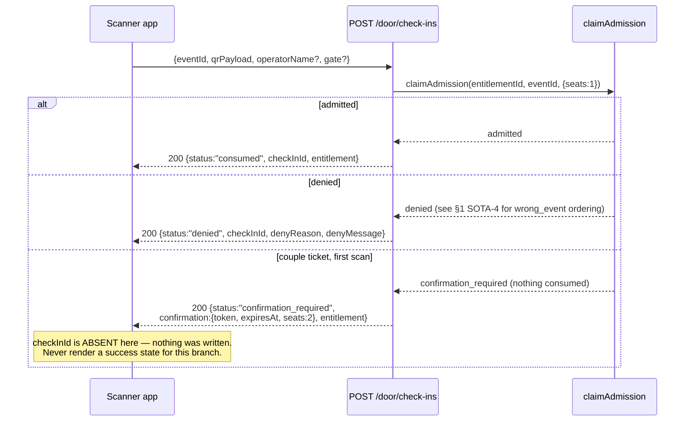

**Always 200 on a decision** — a refused guest is a normal outcome to
render, not an HTTP error.

### 7.2 Couple-ticket confirm (two-step)

`SCANNER_COMMAND` · **+session**

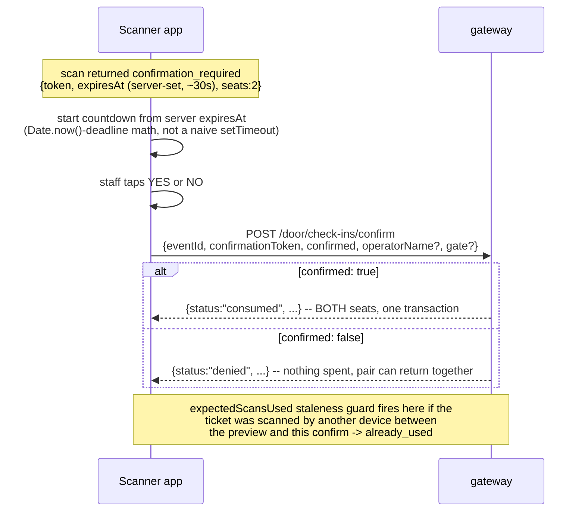

A couple ticket admits two people who must walk through together;
consuming a seat before staff confirm the second guest is present would
strand that guest outside holding a half-used ticket.

### 7.3 Offline

No diagram needed — the rule is absolute (SOTA-2): a network failure shows
"Scanner offline — entry denied until connectivity returns" and stores
nothing. `GET /door/offline-manifest` / `POST /door/offline-sync` exist for
venues that opt into pre-authorized offline mode; the standard app never
calls them.

### 7.4 Manual roster check-in

`STANDARD_COMMAND` (60/min)

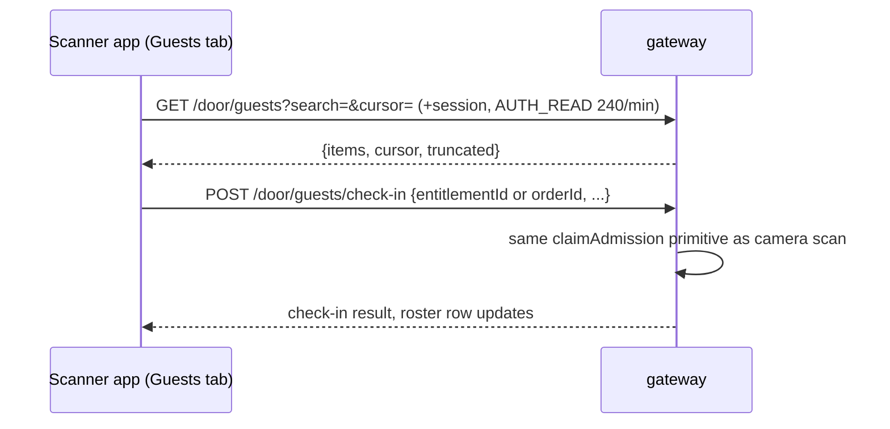

Search/pagination is server-side, with an explicit `truncated` flag the
app must render (a client-side-only filter, as v1 did, is a real
regression against this contract — see §11).

### 7.5 Heartbeat

`SCANNER_COMMAND` · **+session** · `POST /door/heartbeat` while a session is
active and the app is foregrounded — feeds `ScannerDevice.lastSeenAt` and
the abuse-detection `scanCount` rolling counter (§4.1).

### 7.6 Cover-wallet charge (deferred to a later frontend phase)

`SCANNER_COMMAND` · **+session +idem**

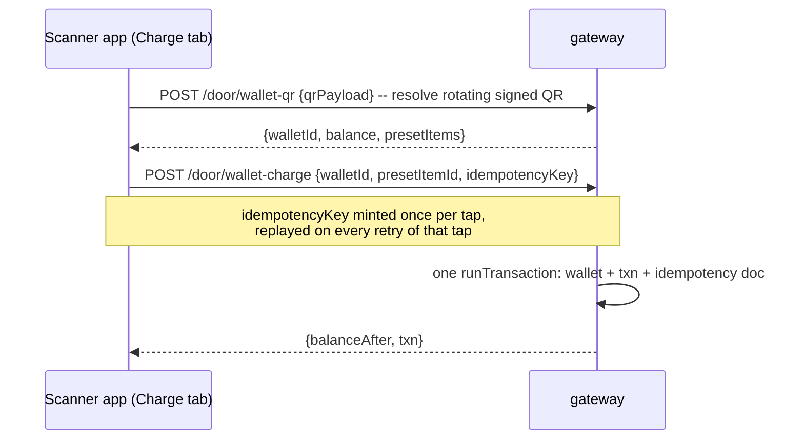

The client never sends a raw `amountPaise` — only a `presetItemId` the
server resolves to a server-defined price (SOTA-10).

### 7.7 Paid ticket-sale / walk-in / dine-in (deferred)

`STANDARD_COMMAND` (ticket-sale, walk-in, dine-in) — a real order through
the shared `settleOrder` path, not a separate ledger; `DoorSale` FSM is
`pending → awaiting_payment → paid`. Cash sales carry no gateway fee. Out
of scope for the Phase 1 frontend build (§12).

### 7.8 Staff-deny / override (deferred)

`SCANNER_COMMAND` (staff-deny) / `SENSITIVE_COMMAND` 10/min (override).
An override never credits a scan back to the entitlement — it is recorded
as its own `ScanLedgerStatus: 'overridden'` row reached only from `denied`,
never a rewrite of the original denial (§5.2). Out of scope for Phase 1.

### 7.9 Stats — poll now, SSE later

`GET /door/stats` (`AUTH_READ`, 240/min) is the Phase 1 mechanism (poll on
an interval, pause when the tab isn't focused). `GET /door/stats/stream`
(SSE) exists and is backend-complete but deferred on the frontend side —
React Native has no built-in `EventSource`, so it needs a fetch-based
reader or a polyfill library before it's worth adopting over polling.

---

## 8. Rate Limits

Sliding window, 60 seconds — from the contract, reproduced here because
every flow above cites one of these classes:

| Class | Limit | Applies to |
|---|---|---|
| `SCANNER_COMMAND` | 300/min | Scanning, lookup, confirm, staff-deny, wallet read/charge, heartbeat |
| `AUTH_READ` | 240/min | Reads: events, stats, guests, session, ticket QR |
| `STANDARD_COMMAND` | 60/min | Device register, offline sync, manual check-in, ticket sale, walk-in/dine-in |
| `SENSITIVE_COMMAND` | 10/min | Opening a shift, override, unbind, reauthorize, revoke |

`SENSITIVE_COMMAND` at 10/min is a UX trap if not handled: a fat-fingered
door code retried rapidly locks the device out for a minute. The app must
debounce the submit button and surface the `Retry-After` countdown, not
just show a generic error.

---

## 9. Idempotency

Calls marked `+idem` in the contract take a body `idempotencyKey`. **One
key per user intent, not per network attempt** — mint it when the user
taps the button, reuse the same key across every retry of that tap. A new
key on retry is a second charge. This governs `wallet-charge`,
`ticket-sale`, `walk-in`, `dine-in` — none of these are in the Phase 1
frontend scope (§12), but the rule must be designed in from the first line
of whichever module eventually owns those calls, not patched in after a
double-charge incident.

---

## 10. Failure Modes

| Failure | Behavior | How it's preserved |
|---|---|---|
| Staff access token expired | 401 | Refresh once (mechanism for native TBD — see open question in the rollout plan, §12); if refresh fails, back to login |
| Scanner session expired/invalid/revoked | 401 | Re-open the shift (redeem a new door code) |
| Device unbound by a manager | 403 | Stop scanning immediately. Tell staff to see a manager. **Never retry.** |
| Ticket belongs to another venue | 404 (not 403) | `evaluateAdmission`'s `wrong_event` check runs before any void/used check (SOTA-4) — never signals "exists but forbidden" |
| Conflicting state (e.g. override on a non-denied scan) | 409 | Refetch, show `message` |
| Malformed request body | 422 | App bug — log `requestId`, do not retry blindly |
| Rate limited | 429 + `Retry-After` | Debounce submit, show the countdown (§8) |
| Server error (≥500) | Generic retry on reads only | **Never retry a money call without its original idempotency key** (§9) |
| Network lost mid-scan | Immediate offline-deny message | No queue, no replay (SOTA-2) |
| Couple-confirm window expires | Client countdown clears state, "re-scan" prompt | Server independently rejects a late confirm via the `expectedScansUsed` staleness guard (§6) — client timer is UX, server check is the real gate |

---

## 11. Security Summary

Full detail lives in `docs/architecture/scanner-threat-model.md` — this is
a pointer, not a replacement.

**Secrets** (one key, four purposes, separated by prefix): `MAGIC_TICKET_SECRET`
signs/verifies QR payloads and wallet QRs; `BETTER_AUTH_SECRET` is the staff
session signing key; door codes are CSPRNG human strings (`C1R-XXXXXXXX`);
scanner session tokens are opaque, hashed at rest (SOTA-3).

**Ten design principles** (threat-model §6, verbatim intent): fail closed;
the client never names a price (SOTA-10); the client never names an
identity; decide-and-write happens in one transaction (§6); two credentials
are required for anything at a door (§3); a refusal answers identically to
an absence (SOTA-4); every refusal is recorded (SOTA-8); every read is
bound to a tenant; one writer owns each fact; the system says explicitly
what is *not* done rather than silently omitting it (this document's own
"deferred" callouts follow that same principle).

**Two real holes found and fixed** (D-029): unbind-then-reactivate was
reachable through the ungated `POST /door/devices` route — fixed by a
dedicated, `door.manage`-gated `/reauthorize` route. Staff could mint a
guest's wallet QR — fixed to owner-only minting.

**Accepted risks** (documented, not fixed): wrong_event vs invalid_signature
is a narrow enumeration channel; door-code lookup is not constant-time;
roster reads are ungated by a per-guest permission (gated at the session
level instead); rate limits are per-instance, not globally coordinated;
offline-manifest exists but the standard app doesn't use it; the stats
stream is currently poll-backed, not push.

---

## 12. V1 vs V2 — What The Old App Got Away With

v1 (`thec1rcle/apps/scanner-app`, Expo 52/RN 0.76) is a visual reference
only. None of its auth, session, or data-fetching code is reusable — it
predates every invariant in §1:

| V1 behavior | Why V2 cannot repeat it |
|---|---|
| Firebase Auth only, custom `/scan/staff-login`, tokens in AsyncStorage (`expo-secure-store` installed but never imported) | Contract mandates Keychain/Keystore for the scanner-session token (SOTA-3) and in-memory-only for the staff access token (§3) |
| Client fabricates `permissions: {canScan:true, canDoorEntry:true}` and `tiers: []` on event selection — no server-issued session at all | SOTA-6: permissions must come from the redeemed session, never invented client-side |
| Couple-ticket modal is UI theater — re-renders the already-fetched result, no real second API call, no timer, no expiry | §7.2's real two-step confirm with a server-issued `expiresAt` and a staleness guard is mandatory |
| Guest list fetched once, filtered/searched entirely client-side | Contract requires server-side search/pagination + a `truncated` flag (§7.4) |
| Network failure on scan falls through to a `__DEV__`-only simulated random result; production just throws | SOTA-2's exact offline-deny UX ("Scanner offline — entry denied until connectivity returns") replaces both the dev shortcut and the raw error |
| No device identity, no pairing, no reauthorize/unbind flow | §3's device-identity tier doesn't exist in v1 at all |
| No cover-wallet UI, no paid ticket-sale UI, no staff-deny/override UI, no heartbeat, no SSE/push | All backend-complete, all zero v1 precedent — see §12's phase table for when each lands |

What v1 *is* worth keeping: the 4-tab visual shape (Scan / Door Entry /
Stats / Guests), dark theme, `expo-camera` `CameraView` for QR, haptics on
scan result, pull-to-refresh, flash toggle — feel, not logic.

---

## 13. Phased Rollout Plan

| Phase | Endpoints covered | Why this ordering | Exit criteria |
|---|---|---|---|
| **0 — Contract lock-in** | none (reading only) | Confirm the open question on staff-token refresh for native (cookie-based per the contract's web-flavored wording, or a body-returned refresh token — RN has no cookie jar in the browser sense) before any auth code is written. | Refresh mechanism confirmed with backend; couple-confirm expiry window and backgrounded-heartbeat behavior confirmed against the live contract, not assumed. |
| **1 — Core scan flow** | `/auth/login`, `/door/events`, `/door/devices` (+reauthorize/unbind), `/door/sessions`, `/door/check-ins` (+`/verify`, `/confirm`), `/door/lookup`, `/door/guests` (+`/check-in`), `/door/stats` (polled), `/door/heartbeat` | A door must be able to run — login, pair, redeem, scan, confirm couples, see stats, search guests — before any money-handling surface exists. This is the phase that turns v1's fabricated-permissions/theater-confirm/client-filter model into the real one. | Manual E2E script (pair → redeem → scan valid/couple/already-used → go offline → recover → search roster → manual check-in → heartbeat observed) passes against real staging; every §1 invariant re-checked against the finished app. |
| **2 — Money surfaces** | `/door/wallet-qr`, `/door/wallet-charge`, `/door/ticket-sale`, `/door/walk-in`, `/door/dine-in` | Deferred past Phase 1 deliberately — these are the highest-consequence flows (real money, idempotency-critical) and should land against an app whose core auth/session/scan model is already proven in production, not simultaneously with it. | Idempotency-key discipline (§9) verified with an actual double-tap test on a flaky-network simulation; preset-item-only charging verified (no client-supplied amount reaches the wire). |
| **3 — Operator escalation UI** | `/door/staff-deny`, `/door/override` | Lowest-frequency, highest-authority actions (`SENSITIVE_COMMAND`, 10/min) — reasonable to build last since they're used far less often than a scan and their absence doesn't block running a door. | Override correctly recorded as its own terminal `ScanLedgerStatus` state, never a rewrite of the original deny row. |
| **4 — Live stats** | `/door/stats/stream` (SSE) | Replaces Phase 1's polling once a fetch-based SSE reader (RN has no native `EventSource`) is chosen and proven — a UX upgrade, not new capability. | Stats update without a visible poll interval; connection budget/heartbeat behavior from D-028 respected on the client side too. |

This table is the section that turns into actual sprint tickets once the
UI direction (promised for later) arrives — the phase *boundaries* are
fixed by this document's risk analysis; the UI decides only what each
phase's screens look like, not what order the phases happen in.

---

## 14. For AI Agents Reading This

- **Verification order:** this document → `packages/core/src/domain/models/*.ts`
  → `packages/core/src/infrastructure/firestore/*` → `apps/api-gateway/src/routes/v2/door/*`
  → `docs/api-contracts/scanner-app.md`. The contract doc is closer to the
  wire; the domain/infrastructure source is closer to storage; if any two
  of these disagree, read the actual code before trusting either document.
- **Never invent an offline admission queue.** SOTA-2 is absolute in the
  current contract — if a future requirement genuinely needs one, it is a
  new ADR and a new contract version, not a client-side workaround.
- **Never relax the `wrong_event`-before-`void`/`already_used` check
  ordering** in `evaluateAdmission()` — that ordering is the enumeration
  defense in SOTA-4, not an arbitrary sequence.
- **Never add a `firestore.indexes.json`** without cross-checking every
  entry against the exact 8-index list in §4.2 / threat-model §3.7 — a
  partially-wrong index file is worse than the current documented gap,
  because it looks authoritative.
- **Never treat `DoorSale`/`CoverWalletTxn`'s id scheme as the pattern to
  copy** for a new model — they are the two known outliers (SOTA-9), not
  the convention; every other id in this document is hash/CSPRNG-derived
  on purpose.
- **Don't build a 5-state entitlement diagram.** `EntitlementStatus` is
  `valid | redeemed | void`. The `ScanLedgerStatus` 7-state enum belongs to
  a different aggregate (the attempt, not the ticket) — confirm which one a
  requirement is actually about before modeling it.
- This document's own staleness marker: verified against branch
  `feat/scanner-app-backend` as of 2026-09-23. Re-verify against the
  contract doc's own "last verified" line before trusting either past that
  date.
